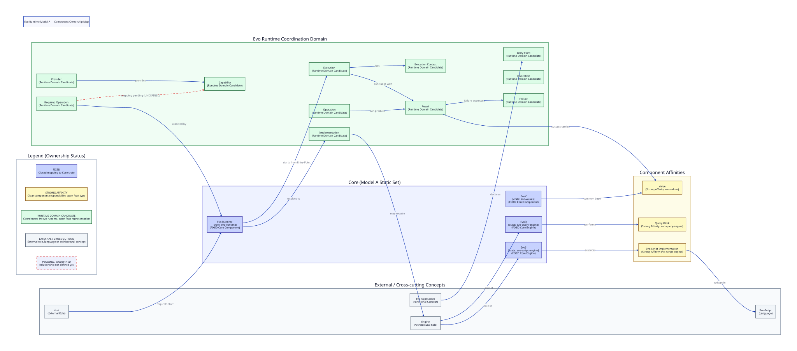

# Evo Runtime — Component Ownership Map

Status: TECHNICAL DESIGN NOTE — NOT CLOSED

This document initiates the Technical Data Model of Evo Runtime Model A. Its
purpose is to classify the architectural responsibility and component ownership
affinity of the 23 canonical terms defined in the functional
[DATA_DICTIONARY.md](../../functional/DATA_DICTIONARY.md) before deciding their
concrete Rust representations.

> [!IMPORTANT]
> **Component Ownership != Rust ownership**
>
> In this document, *ownership* refers strictly to architectural
> responsibility and component boundary affinity across crates and roles.
> It does **not** decide Rust data structures, memory allocation, ownership
> semantics (`owned` vs `borrowed`), references, lifetimes (`&'a`), smart
> pointers (`Arc`, `Box`, `Rc`), or trait definitions.

---

## Visual Ownership Map

---

## Canonical Terms Ownership Classification

The table below classifies all 23 canonical terms from the functional Data
Dictionary according to their component affinity and technical ownership
status:

| Term | Canonical Category | Component Affinity / Responsibility | Ownership Status | Notes |
| --- | --- | --- | --- | --- |
| **Evo Runtime** | Core Component | `evo-runtime` | FIXED | Platform coordinator of the Core; coordinates execution, resolution, and invocations. |
| **EvoV** | Core Component | `evo-values` | FIXED | Common Values and Outcomes base for the Evo Core; not an engine. |
| **EvoQ** | Core Component / Engine | `evo-query-engine` | FIXED | Base query engine of the Core; performs Query Work. |
| **EvoS** | Core Component / Engine | `evo-script-engine` | FIXED | Base engine for Evo-Script; executes Evo-Script Implementations. |
| **Value** | Data Concept | `evo-values` | FIXED | Valid data produced or transported across operations on common EvoV base; `Value != Failure`. |
| **Result** | Outcome Concept | `evo-values` | FIXED | Common outcome sum type of an operation or execution (`Result != Value`, `Result != Failure`). |
| **Failure** | Outcome Concept | `evo-values` | FIXED | Common outcome data type indicating uncompleted or failed work; `Failure != Value`. |
| **Core** | Architectural Concept | Cross-cutting (`evo-runtime`, `evo-values`, `evo-query-engine`, `evo-script-engine`) | EXTERNAL / CROSS-CUTTING | Static Model A foundation set; fixed composition without dynamic discovery. |
| **Host** | External Role | External boundary to Evo Runtime | EXTERNAL / CROSS-CUTTING | External caller requesting execution and receiving the final Result. |
| **Evo Application** | Functional Concept | External application domain | EXTERNAL / CROSS-CUTTING | Application declaring an Entry Point and participating in execution. |
| **Entry Point** | Functional Concept | Evo Runtime coordination domain | RUNTIME DOMAIN CANDIDATE | Initial execution entry point declared by the application. |
| **Execution** | Functional Concept | Evo Runtime coordination domain | RUNTIME DOMAIN CANDIDATE | Active work coordinated from Entry Point to finalization; lifecycle concept. |
| **Execution Context** | Functional Concept | Evo Runtime coordination domain | RUNTIME DOMAIN CANDIDATE | Context tracking operational continuity across activities; `Execution Context != Scope`. |
| **Invocation** | Functional Action | Evo Runtime coordination domain | RUNTIME DOMAIN CANDIDATE | Effective participation of an operation via an available implementation. |
| **Operation** | Functional Concept | Evo Runtime coordination domain | RUNTIME DOMAIN CANDIDATE | Functional unit of work required and invoked during execution. |
| **Required Operation** | Functional Requirement | Evo Runtime coordination domain | RUNTIME DOMAIN CANDIDATE | Operation requirement resolved by Evo Runtime to an implementation; `Required Operation != Capability`. |
| **Implementation** | Functional Concept | Evo Runtime coordination domain | RUNTIME DOMAIN CANDIDATE | Concrete realization satisfying a required operation; `Implementation != Engine`. |
| **Engine** | Architectural Role | Shared role (`evo-query-engine`, `evo-script-engine`) | EXTERNAL / CROSS-CUTTING | Specialized execution engine role; `EvoV != Engine`. |
| **Provider** | Architectural Role | Evo Runtime coordination domain | RUNTIME DOMAIN CANDIDATE | Component supplying one or more capabilities; `Provider != Capability`. |
| **Capability** | Functional Concept | Evo Runtime coordination domain | RUNTIME DOMAIN CANDIDATE | Discrete capability provided by a Provider; `Required Operation != Capability`. |
| **Evo-Script** | Language | External language domain | EXTERNAL / CROSS-CUTTING | Programming language executed via EvoS; `Evo-Script != EvoS`. |
| **Evo-Script Implementation** | Implementation Kind | EvoS / `evo-script-engine` | STRONG AFFINITY | Implementation written in Evo-Script executed by EvoS. |
| **Query Work** | Functional Work | EvoQ / `evo-query-engine` | STRONG AFFINITY | Functional query work performed by EvoQ. |

---

## Architectural Distinctions Preserved

The Component Ownership Map preserves the following canonical invariants:

- `Evo Runtime != Engine`
- `EvoV != Engine`
- `EvoQ = Engine`
- `EvoS = Engine`
- `Evo-Script != EvoS`
- `Required Operation != Implementation`
- `Required Operation != Capability`
- `Implementation != Engine`
- `Provider != Capability`
- `Capability != catalog / module / namespace / group`
- `Execution Context != Scope`
- `Value != Failure`
- `Result != Value`
- `Result != Failure`
- `Provider -> provides -> Capability`
- The technical mapping between `Required Operation` and `Capability` remains **UNDEFINED / PENDING**.

---

## What This Map Does Not Decide

This document deliberately does **not** decide:

1. Which concepts will become Rust `struct` definitions.
2. Which concepts will become Rust `enum` definitions.
3. Which concepts will become type aliases (`type`).
4. Which concepts will become function pointers (`fn(...)`).
5. Which concepts are purely behavioral and do not require data representations.
6. Memory ownership models (`owned` vs `borrowed`).
7. Reference lifetimes (`'a`) or smart pointers (`Arc`, `Rc`, `Box`).
8. Final technical cardinalities or field layouts.
9. Concrete function signatures (`pub fn`).
10. Definitions of Contracts, Requesters, Agents, or concrete Providers.
11. Sequence diagrams or technical interaction protocols.
12. Internal memory layout or design of `evo-values`.
13. Internal query planner, optimizer, or operator models of `evo-query-engine`.
14. Internal AST, parser, bytecode, or VM models of `evo-script-engine`.

---

## Next Technical Question

Once this Component Ownership Map is reviewed, the next step in the Technical
Data Model sequence will be:

**Step 2: Runtime Type Classification**

Addressing the foundational architectural question:
> *Which of the 9 Runtime Domain Candidates actually require a concrete technical type in `evo-runtime`?*

Followed by:
- Step 3: Type Relationship Diagram
- Step 4: Cardinality / Optionality Analysis
- Step 5: Struct / Enum / External Type Classification
- Step 6: Owned / Borrowed Model Design
- Step 7: Sequence Diagrams
- Step 8: Technical Mapping
- Step 9: Rust Implementation
