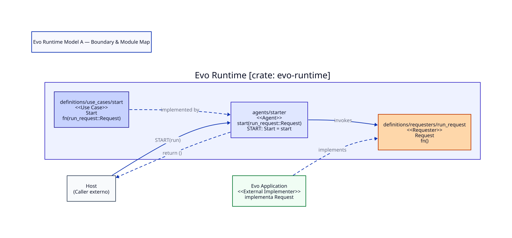

# Evo Runtime — Model A Boundary Map

Status: TECHNICAL MODEL CLOSED — IMPLEMENTATION DEFERRED

This document illustrates the minimal architectural boundary of Evo Runtime
Model A.

---

## 1. Minimal Boundary Architecture

In Model A, Evo Runtime defines a strictly minimal execution interface:
- **1 Use Case**: `Start` (provided by `evo-runtime`)
- **1 Requester**: `Run` (consumed from the `Evo Application`)
- **1 Outcome**: `Result` (defined by `evo-values`)

---

## 2. Visual Boundary Map



---

## 3. Flow of Execution

1. **Host Invocation**: The external caller invokes `Start`, supplying the
   application's executable `Run` requester function pointer (`Start(run)`).
2. **Runtime Execution**: Evo Runtime invokes `run()` and remains active on the
   call stack.
3. **Application Autonomy**: The application executes its internal logic directly
   with its own libraries, engines, and providers.
4. **Completion**: When `run()` finishes, it returns `Result`.
5. **Outcome Delivery**: `Start` returns the `Result` directly to the Host.

---

## 4. Technical Signatures

```rust
// definitions/requesters/run_request.rs
pub type Request = fn() -> Result;

// definitions/use_cases/start.rs
pub type Start = fn(run_request::Request) -> Result;
```

---

## References

- [DEFINITION_NAMING_CONVENTIONS.md](../DEFINITION_NAMING_CONVENTIONS.md)
- [EVO_RUNTIME_SPECIFICATION_v0.md](../../EVO_RUNTIME_SPECIFICATION_v0.md)
- [DATA_DICTIONARY.md](../../functional/DATA_DICTIONARY.md)
- [MODEL_A_FUNCTIONAL_COVERAGE.md](../../functional/MODEL_A_FUNCTIONAL_COVERAGE.md)
