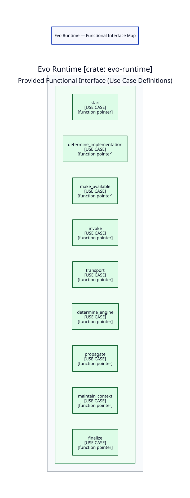

# Evo Runtime — Runtime Functional Interface Map

Status: TECHNICAL DESIGN NOTE — NOT CLOSED

This document identifies and formalizes the functional entry points provided by
Evo Runtime, derived from the functional Use Cases UC-001 through UC-009 of
Model A.

---

## 1. Purpose

The purpose of this map is to identify exclusively:
> *What are the functional entry point actions that Evo Runtime provides?*

In the Evo Runtime technical architecture:
- **Use Case**: represents a discrete action provided by the Runtime, declared
  as a typed **function pointer definition** under `definitions/use_cases/`.
- **Agent**: represents a concrete implementation of a Use Case, implemented as
  a regular function.
- **Contract**: represents a capability that the Runtime consumes from an
  external Provider.
- **Requester**: represents a request boundary where a consumer initiates an
  action.

The first nine functional Use Cases (UC-001..UC-009) constitute the **nine
provided functional entry points** of Evo Runtime.

---

## 2. Visual Functional Interface Map

> [!NOTE]
> This diagram exclusively identifies the functional entry points provided by
> Evo Runtime. It contains **zero relationship edges** (no call flow, no
> execution sequence, no dependencies). Relationship mapping belongs to
> subsequent technical design steps.

---

## 3. Functional-to-Technical Mapping

The table below maps the functional Use Cases to their canonical technical
actions, definition files, and function pointer types:

| Functional UC | Functional Action | Technical Action | Definition File | Function Pointer Type | Category / Role |
| --- | --- | --- | --- | --- | --- |
| **UC-001** | Start Evo Application | `start` | `definitions/use_cases/start.rs` | `Start` | Provided Functional Entry Point |
| **UC-002** | Resolve Required Operation | `determine_implementation` | `definitions/use_cases/determine_implementation.rs` | `DetermineImplementation` | Provided Functional Entry Point |
| **UC-003** | Make Implementation Available | `make_available` | `definitions/use_cases/make_available.rs` | `MakeAvailable` | Provided Functional Entry Point |
| **UC-004** | Invoke Operation | `invoke` | `definitions/use_cases/invoke.rs` | `Invoke` | Provided Functional Entry Point |
| **UC-005** | Transport Value | `transport` | `definitions/use_cases/transport.rs` | `Transport` | Provided Functional Entry Point |
| **UC-006** | Determine Engine for Implementation | `determine_engine` | `definitions/use_cases/determine_engine.rs` | `DetermineEngine` | Provided Functional Entry Point |
| **UC-007** | Propagate Failure | `propagate` | `definitions/use_cases/propagate.rs` | `Propagate` | Provided Functional Entry Point |
| **UC-008** | Maintain Execution Context | `maintain_context` | `definitions/use_cases/maintain_context.rs` | `MaintainContext` | Provided Functional Entry Point |
| **UC-009** | Finalize Execution | `finalize` | `definitions/use_cases/finalize.rs` | `Finalize` | Provided Functional Entry Point |

---

## 4. Naming Distinction: Determine vs Resolve

A strict architectural distinction is established between:
- **`determine`**: the functional responsibility and goal of the Use Case
  provided by the Runtime (e.g. `determine_implementation`, `determine_engine`).
- **`resolve`**: the internal resolution mechanism or strategy implemented by
  dedicated resolver components (`resolvers/`).

Accordingly, for UC-002:
- Functional Name: *Resolve Required Operation* (remains intact in functional docs)
- Technical Action / Use Case: `determine_implementation`
- Definition File: `definitions/use_cases/determine_implementation.rs`
- Type Name: `DetermineImplementation`

The identifier `resolve` is reserved for `resolvers/` and is **not** used as a
technical Use Case name.

---

## 5. Module Responsibility Unit

In Evo Runtime:
- A **Module** is a unit of technical responsibility.
- A **Use Case Module** declares exactly **one action definition** with single
  responsibility.
- Each file under `definitions/use_cases/` contains exactly one typed function
  pointer definition (`pub type Action = fn(...);`).

This architecture avoids monolithic interfaces, OO class hierarchies, trait
objects (`dyn`), and artificial generic abstractions.

---

## 6. What This Map Does Not Decide (Deferred Scope)

This document deliberately does **not** decide:

1. **UC-010 (Provide Capability)**: boundary analysis deferred to Provider/Contract phase.
2. **UC-011 (Execute Evo-Script Implementation)**: deferred to engine integration phase.
3. **UC-012 (Execute Query Work)**: deferred to query engine integration phase.
4. Definitions of `definitions/contracts/` or `definitions/requesters/`.
5. Concrete `agents/` subjects, modules, or file paths.
6. Concrete `providers/` implementations.
7. Concrete function signatures (`pub fn`), parameter lists, or return types.
8. Struct fields for `Context` or `Failure`.
9. Enum variant names for `Result`.
10. Call relationships, invocation sequences, or execution order between Use Cases.
11. Memory allocation, lifetimes (`'a`), or ownership models (`owned` vs `borrowed`).
12. Rust source code implementation.

---

## References

- [DEFINITION_NAMING_CONVENTIONS.md](../DEFINITION_NAMING_CONVENTIONS.md)
- [use-cases/README.md](../../functional/use-cases/README.md)
- [data-model/RUNTIME_TYPE_CLASSIFICATION.md](../data-model/RUNTIME_TYPE_CLASSIFICATION.md)
- [data-model/COMPONENT_OWNERSHIP_MAP.md](../data-model/COMPONENT_OWNERSHIP_MAP.md)
