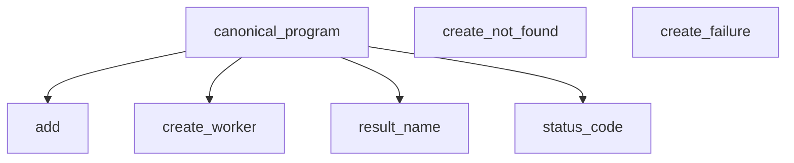

# Evo-Script Language Specification v0

Evo-Script v0 define formalmente el núcleo mínimo y autocontenido del lenguaje Evo-Script.

En esta versión:
- Un programa en Evo-Script v0 vive y se ejecuta dentro de un único archivo fuente `.efn`.
- `.efn` constituye el único artefacto fuente operativo del lenguaje en v0.
- Los conceptos de `struct` y `enum` forman parte del lenguaje como construcciones locales declaradas dentro del mismo archivo `.efn` que las utiliza.
- Cada archivo `.efn` contiene exactamente una función pública (`public fn`) y puede contener cero o más funciones privadas (`fn` o `private fn`).
- El propósito de la especificación v0 es consolidar y cerrar formalmente el núcleo computacional y semántico del lenguaje.

---

## Índice de contenidos

1. Propósito y alcance de Evo-Script v0
2. Archivo fuente .efn
3. Reglas léxicas
4. Identificadores y convenciones de nombres
5. Sistema de tipos
6. Literales y Values
7. Structs locales
8. Enums locales
9. Bindings inmutables con let
10. Expresiones y operadores
11. Conversión explícita
12. Expresión when
13. Functions
14. Function Calls
15. Pipelines
16. Evaluación y errores
17. Gramática consolidada de Evo-Script v0
18. Programa canónico autocontenido

---

## 1. Propósito y alcance de Evo-Script v0

Evo-Script v0 define el núcleo mínimo y autocontenido del lenguaje Evo-Script. El objetivo de esta versión es establecer de forma completa y precisa las reglas fundamentales necesarias para escribir, analizar y ejecutar un script Evo-Script.

Un programa en Evo-Script v0 se encuentra completamente contenido dentro de un único archivo `.efn`. El archivo `.efn` constituye la unidad completa del programa y puede contener:
- cero o más declaraciones `struct`;
- cero o más declaraciones `enum`;
- cero o más funciones privadas;
- exactamente una función pública.

La función pública constituye la única operación expuesta por el archivo y se declara siempre mediante la palabra clave `public fn`. No se utiliza `pub fn`.

Las funciones privadas pueden declararse de forma explícita mediante `private fn` o simplemente mediante `fn`. Toda función declarada únicamente mediante `fn` es una función privada.


### 1.1 Script autocontenido

Toda declaración propia de un programa Evo-Script v0 se encuentra dentro del mismo archivo `.efn`. El programa no requiere otros archivos fuente para definir sus structs, enums o funciones.

Las declaraciones `struct`, las declaraciones `enum` y las funciones auxiliares pertenecen al mismo programa y pueden ser utilizadas por las funciones del archivo de acuerdo con las reglas establecidas por esta especificación.

El archivo `.efn` constituye una unidad autocontenida de:
- análisis léxico;
- parsing;
- validación semántica;
- evaluación.


### 1.2 Modelo del lenguaje

Evo-Script v0 trabaja mediante Values y transformaciones.

Las funciones reciben Values mediante sus parámetros, realizan operaciones sobre ellos y producen un Value como resultado. Los Values son inmutables.

Las transformaciones pueden expresarse mediante:
- llamadas a funciones;
- pipelines.


### 1.3 Alcance del núcleo

Evo-Script v0 define formalmente los siguientes componentes del núcleo del lenguaje:
- tipos nativos;
- aliases de tipos;
- literales;
- Values;
- declaraciones `struct`;
- declaraciones `enum`;
- bindings inmutables mediante `let`;
- expresiones;
- operadores;
- conversiones explícitas;
- expresión `when`;
- funciones;
- llamadas a funciones;
- `return`;
- pipelines;
- reglas de evaluación;
- errores del lenguaje.


### 1.4 Criterio de definición completa

Evo-Script v0 se considera completamente definido cuando esta especificación permita implementar de forma determinista la totalidad de la cadena de procesamiento del lenguaje:

```text
source text
    ↓
lexer
    ↓
parser
    ↓
AST
    ↓
semantic analyzer
    ↓
evaluator
```

sin requerir decisiones adicionales sobre la sintaxis o la semántica del lenguaje. Este criterio formal establece el cierre técnico normativo de la especificación v0.

---

## 2. Archivo fuente .efn

Un archivo `.efn` representa un programa completo de Evo-Script v0. Su contenido está formado exclusivamente por declaraciones de nivel superior (`TopLevelDeclaration`).

Las declaraciones permitidas en un archivo `.efn` son:
- declaraciones `struct`;
- declaraciones `enum`;
- declaraciones de función (`fn`, `private fn`, `public fn`).

Un archivo `.efn` válido contiene:
- cero o más declaraciones `struct`;
- cero o más declaraciones `enum`;
- cero o más funciones privadas;
- exactamente una función pública.

Estructuralmente, un archivo `.efn` se compone de:

```text
.efn
├── struct      0..N
├── enum        0..N
├── private fn  0..N
└── public fn   exactamente 1
```

La única función pública constituye la operación expuesta por el programa.


### 2.1 Declaraciones de nivel superior

Únicamente las siguientes construcciones sintácticas pueden aparecer directamente en el nivel superior de un archivo `.efn`:
- `struct`
- `enum`
- `fn`
- `private fn`
- `public fn`

Los bindings, expresiones y sentencias propios del cuerpo de una función no pueden aparecer directamente en el nivel superior. Por consiguiente, no son válidos en el nivel superior del archivo:
- declaraciones de binding `let`;
- llamadas a funciones (`Function Calls`);
- pipelines (`|>`);
- sentencias `return`;
- expresiones ejecutables.

Ejemplo inválido:

```text
let int value = 10;

public fn calculate() -> int
{
    return value;
}
```

El programa anterior es inválido porque el binding `let` aparece en el nivel superior del archivo fuera del cuerpo de una función.


### 2.2 Orden de las declaraciones

Las declaraciones de nivel superior pueden escribirse en cualquier orden dentro del archivo `.efn`. El orden físico en el código fuente no determina si una declaración puede ser referenciada por otra declaración del mismo programa.

Antes de validar las referencias entre tipos y funciones, todas las declaraciones de nivel superior del archivo `.efn` deben ser reconocidas como pertenecientes al mismo programa.

Esto permite que una función invoque o haga referencia a otra función o tipo que aparezca posteriormente en el archivo:

```text
public fn calculate(int value) -> int
{
    return double(value);
}

fn double(int value) -> int
{
    return value * 2;
}
```

En este ejemplo válido, la posición posterior de la función `double` no impide que `calculate` pueda referenciarla e invocarla.


### 2.3 Función pública del programa

Todo archivo `.efn` válido debe contener exactamente una función declarada mediante `public fn`.

No puede existir un archivo `.efn` válido con:
- cero funciones públicas;
- más de una función pública.

La única función pública constituye la operación expuesta por el programa.

Ejemplo válido:

```text
fn double(int value) -> int
{
    return value * 2;
}

public fn calculate(int value) -> int
{
    return double(value);
}
```

Ejemplo inválido:

```text
public fn first() -> int
{
    return 1;
}

public fn second() -> int
{
    return 2;
}
```

El ejemplo anterior es inválido porque el archivo contiene más de una función pública.


### 2.4 Funciones privadas

Un archivo `.efn` puede contener cero o más funciones privadas.

Las siguientes dos formas de declaración son semánticamente equivalentes respecto a su visibilidad:

```text
fn calculate() -> int
{
    return 10;
}
```

y:

```text
private fn calculate() -> int
{
    return 10;
}
```

La palabra clave `private` hace explícita una visibilidad que ya está implícita cuando se utiliza únicamente la palabra clave `fn`. Por lo tanto:
- `fn` define una función privada.
- `private fn` define una función privada explícita.

La visibilidad pública se declara siempre de forma completa mediante `public fn`. No se utiliza ninguna abreviación como `pub`.


### 2.5 Estructura sintáctica general

La estructura sintáctica general de nivel superior de un archivo `.efn` se define como:

```text
SourceFile
    ::= TopLevelDeclaration* EndOfFile

TopLevelDeclaration
    ::= StructDeclaration
     |  EnumDeclaration
     |  FunctionDeclaration
```

Esta estructura sintáctica expresa las categorías de declaraciones que pueden existir directamente dentro del archivo fuente. Las reglas detalladas para `StructDeclaration`, `EnumDeclaration` y `FunctionDeclaration` se definen formalmente en sus respectivos capítulos.

Adicionalmente a la estructura sintáctica, se aplica la siguiente restricción semántica sobre `SourceFile`:

```text
cantidad de PublicFunctionDeclaration = 1
```

La gramática permite una secuencia de declaraciones de nivel superior, mientras que la regla de contener exactamente una función pública constituye una restricción semántica obligatoria sobre la validez del programa `SourceFile`.

---

## 3. Reglas léxicas

El análisis léxico transforma el contenido textual de un archivo `.efn` en una secuencia ordenada de tokens según la cadena de procesamiento:

```text
source text
    ↓
lexer
    ↓
tokens
```

El lexer reconoce las siguientes categorías léxicas:
- palabras reservadas (`Structural Keywords`);
- tokens literales reservados (`Boolean Literal Tokens`);
- nombres de tipos reservados (`Reserved Type Names`);
- identificadores (`Identifier`);
- literales (`BooleanLiteral`, `NumericLiteral`, `StringLiteral`);
- delimitadores;
- símbolos estructurales y operadores;
- comentarios;
- espacios en blanco (`whitespace`).

Los espacios en blanco y los comentarios participan en el análisis léxico como separadores y delimitadores, pero no producen tokens evaluables en la secuencia de salida entregada al parser.


### 3.1 Codificación del archivo fuente

Todo archivo `.efn` de Evo-Script v0 debe utilizar estrictamente codificación UTF-8 sin marca de orden de bytes (BOM).

Reglas normativas:
1. Un archivo que contenga secuencias de bytes que no representen texto UTF-8 válido es léxicamente inválido y produce un error léxico (`lexical error`).
2. La presencia de una marca de orden de bytes UTF-8 (BOM, secuencia de bytes `0xEF, 0xBB, 0xBF`) al inicio del archivo es inválida y produce un error léxico.
3. Caracteres Unicode arbitrarios pueden existir válidamente dentro de construcciones léxicas cuya gramática lo permita expresamente, en particular dentro de cadenas de texto (`StringLiteral`) y comentarios (`//`).


### 3.2 Espacios en blanco y saltos de línea

Evo-Script v0 reconoce exactamente cuatro caracteres como espacio en blanco (`whitespace`):
- Espacio en blanco (`space`): `U+0020`
- Tabulación horizontal (`tab`): `U+0009`
- Salto de línea (`Line Feed`, `LF`): `U+000A`
- Retorno de carro (`Carriage Return`, `CR`): `U+000D`

La secuencia formada por un retorno de carro seguido inmediatamente por un salto de línea (`CRLF`, `\r\n`) se procesa como espacio en blanco.

Reglas normativas:
1. El espacio en blanco separa tokens contiguos cuando sea necesario para evitar ambigüedades léxicas.
2. El espacio en blanco no produce Values ni posee semántica en tiempo de ejecución.
3. Evo-Script v0 no es sensible a la indentación (`indentation-insensitive`). La indentación no abre, cierra ni determina bloques de código; los bloques se delimitan exclusivamente mediante `{` y `}`.
4. Los saltos de línea no terminan sentencias. Toda construcción sintáctica que requiera terminación explícita utiliza el punto y coma (`;`).

Ejemplo de equivalencia léxica:

```text
let int value = 10;
```

y:

```text
let
    int
    value
    =
    10
    ;
```

ambas formas producen exactamente la misma secuencia ordenada de tokens.


### 3.3 Comentarios

Evo-Script v0 define una única forma léxica de comentario mediante la secuencia `//`.

Reglas normativas:
1. Toda secuencia `//` que aparezca fuera de un literal de texto inicia un comentario de línea.
2. El comentario iniciado mediante `//` termina ante cualquiera de las siguientes condiciones:
   - un salto de línea individual `LF` (`U+000A`);
   - un retorno de carro individual `CR` (`U+000D`);
   - una secuencia `CRLF` (`\r\n`), la cual constituye una única terminación física de línea para este propósito;
   - el fin de archivo (`EndOfFile`) si el archivo concluye antes de encontrar una terminación de línea.
3. El contenido textual del comentario es ignorado por el lexer y no produce tokens en la secuencia de salida.
4. La secuencia `//` ubicada dentro de un literal de texto (`StringLiteral`) no inicia un comentario. Por ejemplo, en `"https://example.com"`, la secuencia `//` forma parte del valor del texto.
5. Evo-Script v0 no define comentarios multilínea (`/* ... */`).
6. Evo-Script v0 no define sintaxis especiales para comentarios de documentación. Una secuencia como `/// comentario` se interpreta normalmente como un comentario de línea estándar cuyo contenido textual comienza con el carácter `/`, sin constituir una categoría léxica distinta ni producir un error léxico.


### 3.4 Palabras reservadas

Una palabra es una palabra reservada (`Structural Keyword`) si y solo si forma parte activa de la gramática formal de Evo-Script v0.

La lista oficial y exhaustiva de palabras reservadas estructurales en Evo-Script v0 está constituida exactamente por:

```text
struct
enum
fn
public
private
let
return
when
this
```

Reglas normativas:
1. Las palabras reservadas no pueden utilizarse como identificadores definidos por el usuario (nombres de funciones, parámetros, bindings, structs, enums, variantes o campos).
2. Las palabras reservadas son estrictamente sensibles a mayúsculas y minúsculas (`case-sensitive`). La palabra `return` es una keyword reservada, mientras que secuencias como `Return` o `RETURN` no corresponden al token keyword `return`.


### 3.5 Tokens literales reservados

Evo-Script v0 define exactamente dos tokens literales booleanos reservados:

```text
true
false
```

Reglas normativas:
1. Los tokens `true` y `false` están léxicamente reservados y no pueden utilizarse como identificadores definidos por el usuario.
2. Estos tokens no se clasifican como palabras reservadas estructurales (`Structural Keywords`), sino como literales booleanos cuyo valor y tipado en el sistema de tipos se definen formalmente en el Capítulo 6.


### 3.6 Nombres de tipos reservados

Evo-Script v0 define la categoría léxica `Reserved Type Names`. Los nombres de tipos nativos y aliases del lenguaje están reservados a nivel léxico y no pueden utilizarse como identificadores definidos por el usuario en ninguna posición (funciones, parámetros, bindings, structs, enums, variantes o campos).

La lista oficial y exhaustiva de nombres de tipos reservados en Evo-Script v0 es:

```text
bool
string
dynamic

int
int8
int16
int32
int64
int128

uint8
uint16
uint32
uint64
uint128

float
float32
float64
```


### 3.7 Delimitadores

El lexer de Evo-Script v0 reconoce los siguientes delimitadores sintácticos individuales:

```text
(
)
{
}
,
;
.
:
::
```

Reglas normativas:
1. El lexer reconoce estos caracteres y secuencias como tokens delimitadores individuales.
2. La secuencia `::` se reconoce léxicamente como un único token compuesto indivisible.
3. El significado sintáctico y el rol de cada delimitador se determinan por las construcciones gramaticales en las que participan.


### 3.8 Símbolos estructurales y operadores

El lexer reconoce los siguientes símbolos estructurales y operadores como tokens individuales:

Símbolos estructurales compuestos:
```text
->
=>
|>
```

Operadores y símbolos de expresiones y bindings:
```text
=
+
-
*
/
%
!
==
!=
<
<=
>
>=
&&
||
```

Reglas normativas:
1. Los símbolos `->`, `=>` y `|>` son reconocidos como tokens individuales indivisibles.
2. El símbolo `=` es un token reconocido por el lenguaje cuya utilización válida se restringe a las construcciones gramaticales que lo requieran (como bindings inmutables).
3. La semántica de evaluación, precedencia, asociatividad y tipado de cada operador se define formalmente en el Capítulo 10.


### 3.9 Reconocimiento de tokens compuestos

El lexer aplica formalmente el principio de coincidencia del token más largo (*longest valid token match*):

> Cuando varios tokens válidos comienzan con el mismo prefijo de caracteres, el lexer selecciona siempre el token válido más largo que inicia en la posición actual del flujo de lectura.

Esta regla determina unívocamente la tokenización de símbolos con prefijos compartidos:
- Ante `::`, el lexer produce el token único `::` (y no dos tokens `:` sucesivos).
- Ante `==`, el lexer produce el token único `==` (y no dos tokens `=` sucesivos).
- Ante `=>`, el lexer produce el token único `=>` (y no `=` seguido de `>`).
- Ante `>=`, el lexer produce el token único `>=` (y no `>` seguido de `=`).
- Ante `<=`, el lexer produce el token único `<=` (y no `<` seguido de `=`).
- Ante `!=`, el lexer produce el token único `!=` (y no `!` seguido de `=`).
- Ante `&&`, el lexer produce el token único `&&`.
- Ante `||`, el lexer produce el token único `||`.
- Ante `|>`, el lexer produce el token único `|>` (y no un carácter `|` seguido de `>`).
- Ante `->`, el lexer produce el token único `->` (y no `-` seguido de `>`).


### 3.10 Identificadores y literales

El lexer reconoce como categorías léxicas fundamentales:
- `Identifier`: nombres definidos por el usuario para funciones, parámetros, bindings, structs, enums, variantes y campos.
- `BooleanLiteral`: literales booleanos (`true`, `false`).
- `NumericLiteral`: literales numéricos enteros y de punto flotante.
- `StringLiteral`: literales de texto delimitados por comillas dobles (`"`).

La gramática formal detallada, reglas de caracteres y convenciones de `Identifier` se definen en el Capítulo 4. La gramática formal, secuencias de escape y representación de los literales se definen en el Capítulo 6.


### 3.11 Caracteres no reconocidos

Todo carácter o secuencia de bytes que no pueda formar válidamente un espacio en blanco, comentario, palabra reservada, token literal reservado, nombre de tipo reservado, delimitador, símbolo estructural, operador, identificador o literal válido según las reglas de esta especificación produce un error léxico (`lexical error`).

El lexer:
1. No ignora silenciosamente caracteres no reconocidos.
2. No intenta realizar corrección o recuperación automática de errores léxicos.
3. No produce tokens aproximados o ambiguos.


### 3.12 Fin de archivo

Al consumir completamente la totalidad del contenido del archivo fuente en codificación UTF-8, el lexer produce el token conceptual de fin de archivo:

```text
EndOfFile
```

Este token señala la conclusión formal de la secuencia de tokens y satisface la regla de producción sintáctica del nivel superior definida en el Capítulo 2:

```text
SourceFile
    ::= TopLevelDeclaration* EndOfFile
```

---

## 4. Identificadores y convenciones de nombres

Un identificador (`Identifier`) representa un nombre definido por el programa. Los identificadores se utilizan para nombrar:
- tipos `struct`;
- tipos `enum`;
- variantes de `enum`;
- funciones;
- parámetros;
- bindings;
- campos.

Evo-Script v0 establece dos niveles diferenciados de validez:

```text
forma léxica
    ↓
convención nominal requerida por su contexto
```

La forma léxica determina si una secuencia de caracteres puede ser reconocida por el lexer como un token `Identifier`. La convención nominal determina si ese `Identifier` es válido para la clase de símbolo específica que nombra en el programa.


### 4.1 Gramática de Identifier

La gramática formal de un identificador general se define como:

```text
LowercaseLetter
    ::= "a".."z"

UppercaseLetter
    ::= "A".."Z"

Letter
    ::= LowercaseLetter
     |  UppercaseLetter

Digit
    ::= "0".."9"

Identifier
    ::= Letter IdentifierCharacter*

IdentifierCharacter
    ::= Letter
     |  Digit
     |  "_"
```

Reglas normativas:
1. Todo identificador debe comenzar obligatoriamente con una letra ASCII mayúscula o minúscula (`a-z`, `A-Z`).
2. Tras el primer carácter, un identificador puede contener cualquier combinación de letras ASCII, dígitos (`0-9`) y guiones bajos (`_`).

Ejemplos léxicamente válidos:
- `worker`
- `worker2`
- `worker_id`
- `SearchResult`
- `Value32`
- `HTTPResult`

Ejemplos léxicamente inválidos:
- `2worker` (comienza con un dígito)
- `_worker` (comienza con un guion bajo)
- `__worker` (comienza con un guion bajo)
- `_` (no contiene una letra inicial)
- `worker-name` (contiene el carácter `-`, que no forma parte de Identifier)


### 4.2 Caracteres permitidos

Los identificadores utilizan exclusivamente el subconjunto de caracteres ASCII:
- `A-Z`
- `a-z`
- `0-9`
- `_`

Los caracteres Unicode no ASCII no forman parte de la gramática de `Identifier`.

Ejemplos inválidos como identificadores:
- `niño`
- `México`
- `búsqueda`
- `日本`

Esta restricción aplica estrictamente a los identificadores del lenguaje y no afecta a las cadenas de texto (`StringLiteral`) ni a los comentarios (`//`), donde los caracteres Unicode están permitidos según sus propias reglas.


### 4.3 Sensibilidad a mayúsculas y minúsculas

Los identificadores son estrictamente sensibles a mayúsculas y minúsculas (`case-sensitive`).

Por consiguiente:
- `worker`
- `Worker`
- `WORKER`

representan tres identificadores léxicos distintos. El lenguaje no realiza transformaciones, normalizaciones ni correcciones automáticas de mayúsculas o minúsculas.


### 4.4 Identificadores reservados

Una secuencia de caracteres que coincida exactamente con:
- una palabra reservada estructural (`Structural Keyword`);
- un token literal booleano reservado (`Boolean Literal Token`);
- un nombre de tipo reservado (`Reserved Type Name`);

no puede utilizarse como un identificador definido por el programa.

Ejemplos reservados:
- `let`
- `return`
- `true`
- `false`
- `int`
- `string`
- `float64`

La reserva de identificadores es sensible a mayúsculas y minúsculas:
- `return` es una palabra reservada del lenguaje y no puede usarse como identificador.
- `Return` no coincide con el token reservado `return` y es léxicamente un `Identifier` (su validez dependerá de la convención nominal requerida en el contexto donde se utilice).


### 4.5 Convenciones nominales

Evo-Script v0 define exactamente dos convenciones nominales para los identificadores semánticos del código:
- `PascalCase`
- `snake_case`

Estas convenciones son reglas normativas de validez y no meras recomendaciones de estilo. Un identificador léxicamente válido que no cumpla con la convención nominal requerida por su clase de símbolo hace que el programa sea semánticamente inválido.


### 4.6 PascalCase

Los nombres de las siguientes construcciones deben utilizar estrictamente la convención `PascalCase`:
- tipos `struct`;
- tipos `enum`;
- variantes de `enum`.

La gramática formal de `PascalCaseIdentifier` se define como:

```text
PascalCaseIdentifier
    ::= UppercaseLetter PascalCharacter*

PascalCharacter
    ::= Letter
     |  Digit
```

Reglas normativas:
1. Comienza obligatoriamente con una letra ASCII mayúscula (`A-Z`).
2. Los caracteres posteriores pueden ser letras ASCII (`A-Z`, `a-z`) o dígitos (`0-9`).
3. No contiene guiones bajos (`_`).

Ejemplos válidos:
- `Worker`
- `SearchResult`
- `ApplicationState`
- `Value32`
- `HTTPResult`

Ejemplos inválidos como PascalCase:
- `worker` (no inicia con mayúscula)
- `search_result` (inicia con minúscula y contiene guiones bajos)
- `_Worker` (inicia con guion bajo)
- `Worker_Result` (contiene guion bajo)


### 4.7 snake_case

Los nombres de las siguientes construcciones deben utilizar estrictamente la convención `snake_case`:
- funciones;
- parámetros;
- bindings;
- campos.

La gramática formal de `SnakeCaseIdentifier` se define como:

```text
SnakeCaseIdentifier
    ::= SnakeSegment ("_" SnakeSegment)*

SnakeSegment
    ::= LowercaseLetter SnakeCharacter*

SnakeCharacter
    ::= LowercaseLetter
     |  Digit
```

Reglas normativas:
1. Utiliza exclusivamente letras ASCII minúsculas (`a-z`), dígitos (`0-9`) y guiones bajos (`_`).
2. Comienza obligatoriamente con una letra ASCII minúscula.
3. No puede comenzar con un guion bajo (`_`).
4. No puede terminar con un guion bajo (`_`).
5. No puede contener guiones bajos consecutivos (`__`).
6. Cada segmento separado por guion bajo debe iniciar obligatoriamente con una letra minúscula (`LowercaseLetter`).

Consecuencias normativas:
- `version2` es válido (los dígitos forman parte del segmento que inició con letra).
- `version_2` es inválido (el segmento tras el guion bajo comienza con un dígito).
- `value32` es válido (los dígitos forman parte del segmento que inició con letra).
- `value_32` es inválido (el segmento tras el guion bajo comienza con un dígito).
- `to_int32` es válido (el segmento `int32` comienza con la letra `i` y contiene dígitos posteriormente).

Ejemplos válidos:
- `worker`
- `worker_id`
- `search_worker`
- `calculate_total`
- `value32`
- `to_int32`

Ejemplos inválidos como snake_case:
- `Worker` (contiene mayúsculas)
- `workerId` (contiene mayúsculas)
- `worker__id` (contiene guiones bajos consecutivos)
- `worker_` (termina con guion bajo)
- `_worker` (inicia con guion bajo)
- `version_2` (segmento numérico aislado)
- `value_32` (segmento numérico aislado)
- `search-Worker` (contiene guion medio y mayúscula)


### 4.8 Convención según clase de símbolo

La correspondencia entre la clase de símbolo y su convención nominal se define normativamente en la siguiente tabla:

| Clase de símbolo | Convención nominal obligatoria |
|---|---|
| Tipo `struct` | `PascalCase` |
| Tipo `enum` | `PascalCase` |
| Variante de `enum` | `PascalCase` |
| Función (`fn`, `private fn`, `public fn`) | `snake_case` |
| Parámetro de función | `snake_case` |
| Binding (`let`) | `snake_case` |
| Campo de `struct` | `snake_case` |

Ejemplo ilustrativo:

```text
struct Worker
{
    int worker_id;
    string first_name;
}

enum SearchResult
{
    Found(Worker)
    NotFound
}

fn describe_worker(Worker worker) -> string
{
    let string worker_name = worker.first_name;
    return worker_name;
}
```

Clasificación nominal del ejemplo:
- `Worker`: `PascalCase` (tipo `struct`)
- `SearchResult`: `PascalCase` (tipo `enum`)
- `Found`: `PascalCase` (variante de `enum`)
- `NotFound`: `PascalCase` (variante de `enum`)
- `describe_worker`: `snake_case` (función)
- `worker`: `snake_case` (parámetro)
- `worker_id`: `snake_case` (campo de `struct`)
- `first_name`: `snake_case` (campo de `struct`)
- `worker_name`: `snake_case` (binding local)


### 4.9 Validez léxica y validez nominal

Existe una distinción formal entre validez léxica y validez nominal:

1. **Validez léxica**: determinada por el lexer según la producción `Identifier`. Establece si una secuencia de caracteres constituye un identificador general válido.
2. **Validez nominal**: determinada por el analizador semántico (`semantic analyzer`) según la clase de símbolo declarada. Establece si el identificador satisface la convención `PascalCase` o `snake_case` correspondiente.

Ejemplos:
- La secuencia `search_result` es un `Identifier` léxicamente válido. Sin embargo, la declaración `struct search_result { ... }` es inválida porque los tipos `struct` requieren obligatoriamente `PascalCase`.
- La secuencia `CalculateTotal` es un `Identifier` léxicamente válido. Sin embargo, la declaración `fn CalculateTotal() -> int { ... }` es inválida porque las funciones requieren obligatoriamente `snake_case`.


### 4.10 Nombre físico del archivo .efn

En Evo-Script v0 existe un único tipo de artefacto fuente operativo: el archivo `.efn`.

El nombre físico del archivo `.efn` utiliza exclusivamente la convención `kebab-case`. La convención `kebab-case` aplica únicamente al sistema de archivos y no constituye una convención válida para identificadores dentro del código fuente.

#### 4.10.1 Identidad del archivo

El nombre físico del archivo `.efn` está determinado obligatoriamente por la única función pública (`public fn`) declarada en el programa. La función pública constituye la identidad semántica del script.

La correspondencia nominal entre la función pública y el nombre del archivo es obligatoria y se deriva mediante el siguiente algoritmo determinista:

```text
public function name
    ↓
reemplazar cada "_" por "-"
    ↓
agregar ".efn"
    ↓
physical filename
```

Las letras minúsculas y los dígitos se conservan sin modificación durante la transformación.

Ejemplos obligatorios de correspondencia:
- `public fn search_worker(...)` -> `search-worker.efn`
- `public fn calculate_total(...)` -> `calculate-total.efn`
- `public fn value32(...)` -> `value32.efn`
- `public fn convert_int32(...)` -> `convert-int32.efn`
- `public fn to_int32(...)` -> `to-int32.efn`

#### 4.10.2 Regla de validez nominal del archivo

La correspondencia entre el nombre físico del archivo y la función pública es una regla de validez obligatoria.

Ejemplo válido:
- Archivo en disco: `calculate-total.efn`
- Contenido del archivo:
  ```text
  public fn calculate_total(int value) -> int
  {
      return value;
  }
  ```

Ejemplo inválido:
- Archivo en disco: `calculator.efn`
- Contenido del archivo:
  ```text
  public fn calculate_total(int value) -> int
  {
      return value;
  }
  ```
  Este programa es inválido porque el nombre físico del archivo no corresponde a la función pública `calculate_total`.

#### 4.10.3 Gramática del nombre físico

El nombre base (*basename*) del archivo físico derivado utiliza exclusivamente los caracteres:
- `a-z`
- `0-9`
- `-`

El nombre base físico no puede:
- comenzar con `-`;
- terminar con `-`;
- contener guiones consecutivos (`--`);
- contener guiones bajos (`_`);
- contener letras mayúsculas.

La extensión `.efn` forma parte del nombre físico del archivo en el sistema de archivos, pero no forma parte del identificador semántico de la función dentro del lenguaje (`search_worker` es el identificador semántico de la función; `search-worker.efn` es el nombre físico del archivo).

La derivación nominal opera en un único sentido normativo:

```text
public fn
    ↓
physical .efn filename
```

No se derivan nombres físicos a partir de tipos `struct` o `enum`, ni se permite que un nombre de archivo físico arbitrario determine el nombre de la función pública.

---

## 5. Sistema de tipos

Evo-Script v0 posee un sistema de tipos semántico propio, estático y determinista.

Todo Value producido por una evaluación correcta posee exactamente un tipo semántico. Los tipos del lenguaje se organizan en la siguiente jerarquía conceptual:

```text
SemanticType
    ├── NativeType
    └── ProgramDefinedType

ProgramDefinedType
    ├── StructType
    └── EnumType
```

Un nombre de tipo representa una identidad semántica formal dentro del lenguaje. La representación binaria o en memoria utilizada internamente por una implementación concreta no forma parte del sistema de tipos observable ni de la semántica del lenguaje.


### 5.1 Modelo de tipos

El sistema de tipos de Evo-Script v0 se caracteriza por:
1. **Verificación estática**: la compatibilidad de tipos y la validez de las operaciones se comprueban durante el análisis semántico.
2. **Ausencia de tipos implícitos**: todo parámetro, campo y binding posee un tipo declarado explícitamente.
3. **Inmutabilidad inherente**: los tipos describen Values inmutables; no existen tipos puntero, tipos referencia ni tipos mutables.
4. **Identidad nominal**: los tipos definidos por el programa se diferencian por su nombre unívoco y no por su estructura interna.


### 5.2 Tipos nativos

Evo-Script v0 define exactamente 17 tipos nativos (`NativeType`), clasificados conceptualmente en las siguientes categorías:

```text
Boolean
    bool

Text
    string

SignedInteger
    int
    int8
    int16
    int32
    int64
    int128

UnsignedInteger
    uint8
    uint16
    uint32
    uint64
    uint128

FloatingPoint
    float
    float32
    float64

DynamicNumeric
    dynamic
```

El tipo `dynamic` es exclusivamente un tipo numérico. No representa un tipo genérico, un objeto arbitrario, un contenedor heterogéneo ni habilita despacho dinámico o reflexión.


### 5.3 Aliases `int` y `float`

Evo-Script v0 define exactamente dos aliases semánticos de tipos nativos:

```text
CanonicalType(int)   = int32
CanonicalType(float) = float64
```

Reglas normativas:
1. `int` e `int32` representan exactamente el mismo tipo semántico canónico.
2. `float` y `float64` representan exactamente el mismo tipo semántico canónico.
3. En cualquier contexto del lenguaje, escribir `int` es completamente intercambiable e indistinguible de escribir `int32`.
4. En cualquier contexto del lenguaje, escribir `float` es completamente intercambiable e indistinguible de escribir `float64`.
5. La equivalencia entre `int` e `int32`, y entre `float` y `float64`, no constituye una conversión ni una promoción implícita, sino una identidad canónica absoluta.


### 5.4 Tipos enteros de tamaño fijo

Los tipos enteros de tamaño fijo definen dominios numéricos con límites matemáticos exactos:

#### Tipos enteros con signo (SignedInteger)

- `int8`: $-2^7 \dots 2^7 - 1$ (rango: $-128 \dots 127$)
- `int16`: $-2^{15} \dots 2^{15} - 1$ (rango: $-32\,768 \dots 32\,767$)
- `int32`: $-2^{31} \dots 2^{31} - 1$ (rango: $-2\,147\,483\,648 \dots 2\,147\,483\,647$)
- `int64`: $-2^{63} \dots 2^{63} - 1$ (rango: $-9\,223\,372\,036\,854\,775\,808 \dots 9\,223\,372\,036\,854\,775\,807$)
- `int128`: $-2^{127} \dots 2^{127} - 1$ (rango: $-170\,141\,183\,460\,469\,231\,731\,687\,303\,715\,884\,105\,728 \dots 170\,141\,183\,460\,469\,231\,731\,687\,303\,715\,884\,105\,727$)

El tipo `int` posee exactamente el mismo dominio y rango que `int32`.

#### Tipos enteros sin signo (UnsignedInteger)

- `uint8`: $0 \dots 2^8 - 1$ (rango: $0 \dots 255$)
- `uint16`: $0 \dots 2^{16} - 1$ (rango: $0 \dots 65\,535$)
- `uint32`: $0 \dots 2^{32} - 1$ (rango: $0 \dots 4\,294\,967\,295$)
- `uint64`: $0 \dots 2^{64} - 1$ (rango: $0 \dots 18\,446\,744\,073\,709\,551\,615$)
- `uint128`: $0 \dots 2^{128} - 1$ (rango: $0 \dots 340\,282\,366\,920\,938\,463\,463\,374\,607\,431\,768\,211\,455$)


### 5.5 Tipos de punto flotante

Los tipos de punto flotante representan números reales aproximados según el estándar IEEE 754:
- `float32`: corresponde semánticamente al formato de precisión simple IEEE 754 *binary32*.
- `float64`: corresponde semánticamente al formato de precisión doble IEEE 754 *binary64*.
- `float`: alias semántico exacto de `float64`.

La referencia a los formatos IEEE 754 define el comportamiento y dominio semántico de los tipos reales en el lenguaje, sin condicionar los mecanismos de optimización internos que una implementación pueda emplear.


### 5.6 Tipos `bool` y `string`

#### 5.6.1 Tipo `bool`
El tipo `bool` representa el dominio de valores lógicos del lenguaje, compuesto exclusivamente por los dos valores:
```text
true
false
```

#### 5.6.2 Tipo `string`
El tipo `string` representa una secuencia finita e inmutable de texto Unicode formada por valores escalares Unicode (*Unicode Scalar Values*).

El tipo `string` es un tipo de primer nivel en el lenguaje; no expone punteros, búferes mutables ni detalles de representación en memoria.


### 5.7 Tipo `dynamic`

`dynamic` es un único tipo numérico semántico propio que no equivale a ninguno de los tipos enteros o de punto flotante de tamaño fijo:

```text
dynamic != int8
dynamic != int16
dynamic != int32
dynamic != int64
dynamic != int128

dynamic != uint8
dynamic != uint16
dynamic != uint32
dynamic != uint64
dynamic != uint128

dynamic != float32
dynamic != float64
```

El tipo `dynamic` es exclusivamente numérico. No representa un tipo genérico, un objeto arbitrario, un contenedor heterogéneo ni habilita despacho dinámico o reflexión.

#### 5.7.1 Dominio numérico de `dynamic`

Dentro del tipo `dynamic`, un Value puede representar dos clases de valores numéricos:

```text
dynamic
    ├── integral value
    └── floating value
```

No existen dos tipos visibles independientes; existe un único tipo en el lenguaje denominado `dynamic`. Los términos *integral value* y *floating value* describen la naturaleza concreta del Value contenido dentro de este tipo:

1. **Valores enteros (`integral value`)**: representan números enteros con precisión arbitraria. Su magnitud no está limitada por los rangos finitos de los tipos enteros de tamaño fijo (`int8` a `int128`, `uint8` a `uint128`).
2. **Valores de punto flotante (`floating value`)**: representan números reales cuya semántica numérica corresponde al formato IEEE 754 *binary64*. La coincidencia en el modelo numérico no convierte a `dynamic` en un alias de `float64`; se mantiene estrictamente que `dynamic != float64` y `Compatible(dynamic, float64) = false`.

#### 5.7.2 Independencia de evaluación de expresiones

En Evo-Script v0, el tipo esperado en el destino de una asignación o binding no altera de forma retroactiva el tipo ni la semántica de evaluación de los operandos de una expresión.

Por ejemplo, dados:
```text
int8 a
int8 b
```
la expresión `a + b` se evalúa estrictamente como una operación sobre operandos de tipo `int8`. Si se escribe:
```text
let dynamic result = a + b;
```
el hecho de que la variable destino `result` sea de tipo `dynamic` **no** convierte los operandos `a` y `b` a `dynamic`, **no** altera la semántica de la suma y **no** evita un eventual desbordamiento propio del tipo `int8`. La asignación requiere que el resultado producido sea directamente compatible con `dynamic`.

#### 5.7.3 Operaciones directas y tipado de literales

El tipo `dynamic` puede utilizarse directamente en declaraciones y expresiones cuyos operandos sean de tipo `dynamic`:
```text
let dynamic a = ...;
let dynamic b = ...;
let dynamic result = a + b;
```

Asimismo, de conformidad con las reglas de tipado contextual definidas en el Capítulo 6, un literal numérico en un contexto que requiera `dynamic` producirá directamente un Value de tipo `dynamic` (sea entero o de punto flotante), sin mediar conversiones implícitas desde `int` o `float`.

Las reglas operativas detalladas de las operaciones y combinaciones sobre `dynamic` se definen en el Capítulo 10. Las operaciones de conversión explícita entre `dynamic` y otros tipos numéricos se definen en el Capítulo 11.


### 5.8 Tipos definidos por el programa

El programa puede introducir nuevos tipos de datos mediante declaraciones en el nivel superior del archivo `.efn`:

```text
ProgramDefinedType
    ::= StructType
     |  EnumType
```

- Una declaración `struct Worker` introduce un tipo semántico denominado `Worker`.
- Una declaración `enum SearchResult` introduce un tipo semántico denominado `SearchResult`.

Todos los tipos definidos por el programa pertenecen al mismo archivo `.efn` autocontenido. Dado que las declaraciones de nivel superior pueden escribirse en cualquier orden, las referencias adelantadas entre tipos son plenamente válidas:

```text
struct Node
{
    Element value;
}

struct Element
{
    int id;
}
```

En este ejemplo válido, la referencia a `Element` dentro de `Node` es correcta independientemente de su orden físico en el código fuente.


### 5.9 Identidad nominal de tipos

Los tipos `struct` y `enum` definidos por el programa poseen identidad estrictamente nominal. Dos tipos con nombres distintos representan tipos semánticos diferentes e incompatibles, aun cuando su estructura interna o sus campos sean exactamente idénticos.

Ejemplo:
```text
struct Point
{
    int x;
    int y;
}

struct Coordinate
{
    int x;
    int y;
}
```
Formalmente:
```text
Point != Coordinate
```
A pesar de que `Point` y `Coordinate` declaran campos idénticos con los mismos tipos, constituyen dos tipos completamente independientes en el sistema de tipos.

De igual manera:
```text
enum StateA
{
    Active
    Inactive
}

enum StateB
{
    Active
    Inactive
}
```
produce formalmente:
```text
StateA != StateB
```

Evo-Script v0 no admite equivalencia estructural de tipos.


### 5.10 Type Space y resolución de tipos

Cada archivo `.efn` posee un único espacio de tipos (`Type Space`) que agrupa la totalidad de los tipos reconocidos en el programa:

```text
Type Space = Native Types ∪ Program Defined Types
```

Toda mención de un tipo en firmas de funciones, parámetros, tipos de retorno, campos de structs o bindings locales debe resolver exactamente a una entrada unívoca dentro del Type Space.

#### Unicidad de nombres en el Type Space
Dentro del Type Space de un archivo `.efn`, dos tipos definidos por el programa no pueden compartir el mismo nombre.

Ejemplo inválido:
```text
struct Worker
{
    int id;
}

enum Worker
{
    Empty
}
```
El código anterior es semánticamente inválido porque ambas declaraciones intentan registrar el identificador `Worker` en el mismo Type Space. Las categorías `struct` y `enum` comparten el mismo espacio de nombres de tipos.


### 5.11 Compatibilidad exacta de tipos

La compatibilidad entre dos tipos en Evo-Script v0 se rige por el principio de identidad canónica exacta:

> Dos tipos $A$ y $B$ son directamente compatibles si y solo si su tipo semántico canónico es idéntico.

```text
Compatible(A, B) := CanonicalType(A) == CanonicalType(B)
```

Evaluación de compatibilidad en casos representativos:

```text
Compatible(int, int32)       = true
Compatible(float, float64)   = true

Compatible(int8, int16)      = false
Compatible(int32, int64)     = false
Compatible(int32, uint32)    = false
Compatible(int32, float32)   = false
Compatible(float32, float64) = false

Compatible(Worker, Worker)   = true
Compatible(Worker, Customer) = false

Compatible(dynamic, dynamic) = true
Compatible(dynamic, int32)   = false
Compatible(dynamic, int64)   = false
Compatible(dynamic, float64) = false
```

Evo-Script v0 no incorpora subtipado, covarianza, contravarianza, tipos unión ni tipado estructural.


### 5.12 Ausencia de promociones y conversiones implícitas

Evo-Script v0 no realiza promociones numéricas implícitas, conversiones implícitas ni coerciones automáticas de ningún tipo.

No existen conversiones implícitas entre:
- tipos enteros de diferente tamaño (ej. `int8` $\to$ `int16`, `int32` $\to$ `int64`);
- tipos enteros con signo y sin signo (ej. `int32` $\to$ `uint32`);
- tipos enteros y tipos de punto flotante (ej. `int32` $\to$ `float32`, `int32` $\to$ `float64`);
- tipos de punto flotante de diferente precisión (ej. `float32` $\to$ `float64`);
- tipos numéricos fijos y `dynamic` (ej. `int32` $\to$ `dynamic`, `dynamic` $\to$ `int32`);
- ningún tipo definido por el programa y otro tipo, aun con estructura equivalente.

Toda transformación entre tipos semánticamente distintos debe ser explícita en el código fuente mediante las operaciones normativas definidas en el Capítulo 11 (*Conversión explícita*).

#### Aliases frente a conversiones
Las identidades `int == int32` y `float == float64` no constituyen conversiones implícitas porque ambos identificadores resuelven exactamente al mismo tipo canónico.

#### Tipado de literales numéricos
La asignación de tipo a los literales numéricos (`NumericLiteral`) se rige por las reglas de tipado contextual definidas en el Capítulo 6. El hecho de que un literal como `10` pueda utilizarse para inicializar un `int8` o un `int64` no constituye una conversión implícita entre Values, sino la determinación estática del tipo del propio literal al ser analizado.

---

## 6. Literales y Values

En Evo-Script v0, la evaluación de expresiones y el manejo de datos se rigen por la distinción formal entre tres conceptos fundamentales:

```text
forma textual del literal
    ↓ determinación de su tipo semántico
Value producido
    ↓ asociación de identificador (opcional)
Binding
```

Un literal (`Literal`) pertenece exclusivamente al código fuente. Un valor (`Value`) es el dato semántico inmutable producido por la evaluación correcta de una expresión. Un enlace (`Binding`) asocia posteriormente un identificador a un Value. Por consiguiente, se establece formalmente:

```text
Literal != Value != Binding
```


### 6.1 Modelo de Value

Un Value es un dato semántico inmutable producido durante la evaluación correcta de un programa Evo-Script.

Todo Value posee exactamente un tipo semántico (`SemanticType`), de conformidad con el sistema de tipos definido en el Capítulo 5. Los Values se clasifican conceptualmente en:

```text
Value
    ├── NativeValue
    └── ProgramDefinedValue

ProgramDefinedValue
    ├── StructValue
    └── EnumValue
```

Reglas normativas:
1. **Inmutabilidad inherente**: todo Value en Evo-Script v0 es conceptualmente inmutable desde la semántica observable del lenguaje.
2. **Independencia de Bindings**: un Value existe independientemente de si está asociado a un identificador mediante `let` o si es el resultado directo de una función o pipeline. Por ejemplo, una llamada `calculate()` produce un Value de retorno sin requerir un binding intermedio.
3. **Diferenciación conceptual**:
   - `int` es un tipo (`SemanticType`).
   - `43` es un literal en el código fuente (`IntegerLiteral`).
   - `Value(int, 43)` es el dato semántico producido tras la evaluación.
   - `let int age = 43;` es la sentencia que establece un binding entre el nombre `age` y el Value producido.


### 6.2 Literal Expression

Un literal es una expresión sintáctica constante escrita directamente en el código fuente:

```text
Literal
    ↓ evaluación semántica correcta
Value
```

Las expresiones literales reconocidas en Evo-Script v0 son:

```text
LiteralExpression
    ::= BooleanLiteral
     |  StringLiteral
     |  NumericLiteral
```


### 6.3 BooleanLiteral

Los literales booleanos representan valores lógicos constantes. Su gramática formal está constituida por los tokens reservados:

```text
BooleanLiteral
    ::= "true"
     |  "false"
```

Reglas normativas:
1. `true` produce un Value de tipo `bool` con valor lógico verdadero.
2. `false` produce un Value de tipo `bool` con valor lógico falso.
3. Los literales booleanos **no** poseen tipado contextual hacia otros tipos: producen invariablemente un Value de tipo `bool`.
4. No existen conversiones implícitas de `BooleanLiteral` a tipos numéricos o de texto (por ejemplo, nunca `true -> int`, `true -> string` ni `true -> dynamic`).


### 6.4 StringLiteral

Los literales de cadena de texto representan secuencias constantes de caracteres Unicode. En Evo-Script v0 se delimitan exclusivamente mediante comillas dobles (`"`).

La gramática formal de `StringLiteral` se define como:

```text
StringLiteral
    ::= '"' StringElement* '"'

StringElement
    ::= StringCharacter
     |  EscapeSequence
```

`StringCharacter` representa cualquier valor escalar Unicode (*Unicode Scalar Value*) escrito directamente en el archivo fuente UTF-8, excepto:
- la comilla doble (`"`);
- la barra invertida (`\`);
- el salto de línea LF (`U+000A`);
- el retorno de carro CR (`U+000D`).

Ejemplos válidos:
- `""`
- `"Hello"`
- `"México"`
- `"niño"`
- `"日本"`
- `"😀"`

Todo `StringLiteral` produce directamente un Value de tipo `string`. No posee tipado contextual hacia otros tipos.

#### 6.4.1 Secuencias de escape
Evo-Script v0 reconoce exactamente las siguientes cinco secuencias de escape:

| Secuencia fuente | Carácter resultante | Denominación |
|---|---|---|
| `\"` | `"` (`U+0022`) | Comilla doble |
| `\\` | `\` (`U+005C`) | Barra invertida (backslash) |
| `\n` | `LF` (`U+000A`) | Salto de línea (Line Feed) |
| `\r` | `CR` (`U+000D`) | Retorno de carro (Carriage Return) |
| `\t` | `TAB` (`U+0009`) | Tabulación horizontal |

```text
EscapeSequence
    ::= '\\"'
     |  '\\\\'
     |  '\\n'
     |  '\\r'
     |  '\\t'
```

Cualquier otra secuencia iniciada por `\` (por ejemplo, `\q`, `\x`, `\z`, `\u`) no es reconocida y produce un error léxico. No se preserva silenciosamente la barra invertida de secuencias desconocidas.

#### 6.4.2 Caracteres Unicode y ausencia de escapes especiales
Dado que los archivos `.efn` se codifican estrictamente en UTF-8 sin BOM, los caracteres Unicode se escriben de forma directa en el código fuente. Evo-Script v0 no utiliza secuencias de escape numéricas o Unicode (tales como `\uXXXX` o `\UXXXXXXXX`).

#### 6.4.3 Prohibición de cadenas multilínea físicas
Un `StringLiteral` no puede contener saltos de línea físicos sin escapar. Si el analizador encuentra un carácter `LF`, `CR` o el fin de archivo `EndOfFile` antes de la comilla de cierre (`"`), el literal es inválido. Los saltos de línea en el texto deben representarse mediante la secuencia de escape `\n`.


### 6.5 NumericLiteral

Evo-Script v0 define exactamente tres formas sintácticas para los literales numéricos:

```text
Digit
    ::= "0".."9"

Digits
    ::= Digit+

IntegerLiteral
    ::= Digits

DecimalLiteral
    ::= Digits "." Digits

ScientificLiteral
    ::= (Digits | DecimalLiteral)
        ("e" | "E")
        ("+" | "-")?
        Digits

NumericLiteral
    ::= IntegerLiteral
     |  DecimalLiteral
     |  ScientificLiteral
```

Ejemplos válidos:
- Enteros: `0`, `10`, `1000`
- Decimales: `0.0`, `0.5`, `10.25`, `123.456`
- Científicos: `1e10`, `1E10`, `1e+10`, `1e-10`, `1.5e10`, `1.5E10`, `1.5e+10`, `1.5e-10`

Reglas normativas:
1. **Separador decimal único**: el punto (`.`) es el único separador decimal reconocido. La coma (`,`) no es un separador decimal válido.
2. **Ausencia de separadores de dígitos**: no se permiten guiones bajos (`_`) ni otros separadores dentro de `NumericLiteral` (ej. `1_000`, `1_000.50` y `1e1_000` son inválidos).
3. **Base decimal exclusiva**: los literales numéricos se expresan exclusivamente en base 10 (no se admiten prefijos hexadecimales `0x`, binarios `0b` u octales `0o`).
4. **Ausencia de sufijos de tipo**: los literales no admiten sufijos de tipo (ej. `10i32`, `10u64`, `10.5f32` son inválidos). La determinación del tipo se realiza mediante análisis contextual.
5. **Ausencia de literales especiales**: no existen literales numéricos intrínsecos denominados `NaN`, `Infinity` o `inf`.


### 6.6 IntegerLiteral

Un `IntegerLiteral` está formado exclusivamente por una secuencia de dígitos decimales (`Digits`) sin punto decimal, exponente ni signo integrado.

Reglas normativas:
1. **Tipado contextual entero**: según el tipo esperado (`ExpectedType`) del contexto, un `IntegerLiteral` produce directamente un Value de cualquiera de los tipos enteros del lenguaje:
   - `int` (canónicamente `int32`);
   - `int8`, `int16`, `int32`, `int64`, `int128`;
   - `uint8`, `uint16`, `uint32`, `uint64`, `uint128`;
   - `dynamic` (produciendo un `dynamic integral value`).
2. **Creación directa**: el literal se evalúa directamente en el tipo esperado; no se genera un Value intermedio de tipo por defecto para luego aplicar una conversión.
3. **Tipo por defecto**: en ausencia de un contexto que provea un `ExpectedType` numérico explícito, un `IntegerLiteral` produce un Value de tipo `int` (canónicamente `int32`).
4. **Incompatibilidad con tipos de punto flotante**: un `IntegerLiteral` **no** adquiere directamente un tipo de punto flotante (`float`, `float32`, `float64`) únicamente por contexto. Declaraciones como `let float64 value = 10;` son semánticamente inválidas; debe escribirse una forma decimal como `10.0` o científica como `1e1`.

Ejemplos:
```text
let int8 small = 10;        // Produce Value(int8, 10)
let int64 large = 10;       // Produce Value(int64, 10)
let dynamic value = 10;     // Produce Value(dynamic, integral 10)
```

En ausencia de un `ExpectedType` numérico:
```text
IntegerLiteral("10") + sin ExpectedType -> Value(int, 10) (canónicamente int32)
```


### 6.7 DecimalLiteral

Un `DecimalLiteral` está formado por una secuencia de dígitos antes y después del punto decimal (`Digits "." Digits`).

Reglas normativas:
1. **Dígitos obligatorios**: se requiere al menos un dígito antes y al menos un dígito después del punto decimal. Formas incompletas como `.5` o `5.` son sintácticamente inválidas.
2. **Naturaleza de punto flotante**: todo `DecimalLiteral` es una forma textual de punto flotante. Según el `ExpectedType`, produce directamente un Value de:
   - `float` (canónicamente `float64`);
   - `float32`;
   - `float64`;
   - `dynamic` (produciendo un `dynamic floating value`).
3. **Tipo por defecto**: en ausencia de un `ExpectedType` numérico explícito, un `DecimalLiteral` produce un Value de tipo `float` (canónicamente `float64`).
4. **Incompatibilidad con tipos enteros**: un `DecimalLiteral` no adquiere tipos enteros por contexto. Declaraciones como `let int32 value = 10.5;` son semánticamente inválidas (no se realiza truncamiento ni redondeo implícito).

Ejemplos:
```text
let float32 a = 10.5;       // Produce Value(float32, 10.5)
let float64 b = 10.5;       // Produce Value(float64, 10.5)
let float c = 10.5;         // Produce Value(float64, 10.5)
let dynamic d = 10.5;       // Produce Value(dynamic, floating 10.5)
```


### 6.8 ScientificLiteral

Un `ScientificLiteral` está formado por una mantisa entera o decimal seguida de un indicador de exponente (`e` o `E`), un signo opcional (`+` o `-`) y una secuencia de dígitos exponentes (`Digits`).

Reglas normativas:
1. **Naturaleza de punto flotante**: un `ScientificLiteral` es invariablemente una forma textual de punto flotante, incluso cuando su mantisa no contenga punto decimal o su exponente sea positivo (ej. `1e10` es un literal de punto flotante, no un entero).
2. **Tipado contextual**: según el `ExpectedType`, produce directamente un Value de `float`, `float32`, `float64` o `dynamic` (produciendo un `dynamic floating value`).
3. **Tipo por defecto**: en ausencia de un `ExpectedType` numérico explícito, produce un Value de tipo `float` (canónicamente `float64`).
4. **Incompatibilidad con tipos enteros**: un `ScientificLiteral` no puede inicializar bindings de tipos enteros (ej. `let int64 value = 1e10;` es semánticamente inválido).
5. **Forma canónica y exponente completo**: el exponente debe contener al menos un dígito (formas como `1e`, `1e+` son inválidas). La mantisa debe ser un entero o decimal canónico (formas como `.5e10` o `5.e10` son inválidas; deben escribirse como `0.5e10` o `5.0e10`).


### 6.9 Tipado contextual de literales numéricos

El analizador semántico determina el tipo de un `NumericLiteral` mediante el concepto de tipo esperado (`ExpectedType`):

```text
TypeOf(NumericLiteral, ExpectedType)
```

Cuando un literal numérico se evalúa en una posición sintáctica donde el contexto exige un tipo numérico compatible con su categoría textual, el literal adquiere **directamente** dicho `SemanticType`. No se genera un Value intermedio de tipo por defecto ni se aplica una conversión implícita posterior.

#### 6.9.1 Fuentes de ExpectedType
El `ExpectedType` proviene de las siguientes construcciones del lenguaje:
1. **Declaración de binding tipado**:
   ```text
   let int64 value = 100;
   ```
   `IntegerLiteral("100")` con `ExpectedType(int64)` produce directamente `Value(int64, 100)`.
2. **Argumento en llamada a función**:
   ```text
   fn process(int64 value) -> int64
   {
       return value;
   }

   process(100);
   ```
   El argumento `100` recibe `ExpectedType(int64)` de la firma de la función invocada.
3. **Expresión de retorno tipada**:
   ```text
   fn calculate() -> int64
   {
       return 100;
   }
   ```
   El literal `100` recibe `ExpectedType(int64)` del tipo de retorno declarado.
4. **Inicialización de campos de struct tipados**:
   El tipo declarado para el campo en la definición del `struct` proporciona el `ExpectedType` al instanciar el campo correspondiente.

#### 6.9.2 Tipado por defecto en ausencia de ExpectedType
Cuando no existe un `ExpectedType` numérico provisto por el contexto:
- `IntegerLiteral` adopta el tipo `int` (`int32`).
- `DecimalLiteral` adopta el tipo `float` (`float64`).
- `ScientificLiteral` adopta el tipo `float` (`float64`).


### 6.10 Literales `dynamic`

En concordancia con el Capítulo 5, el tipo `dynamic` es un tipo numérico propio que admite tanto valores enteros de precisión arbitraria como valores de punto flotante IEEE 754 *binary64*.

Reglas normativas:
1. **Literal entero en contexto dynamic**:
   ```text
   let dynamic integer_value = 10;
   ```
   Produce directamente un `Value(dynamic, integral 10)` con semántica de precisión arbitraria, sin conversión implícita desde `int`.
2. **Literal decimal o científico en contexto dynamic**:
   ```text
   let dynamic floating_value = 10.5;
   let dynamic scientific_value = 1e100;
   ```
   Produce directamente un `Value(dynamic, floating ...)` con semántica IEEE 754 *binary64*, sin conversión implícita desde `float`.
3. **No alteración de expresiones con operandos fijos**:
   Un contexto destino de tipo `dynamic` no modifica retroactivamente la evaluación de una expresión formada por operandos de tipos fijos:
   ```text
   int8 a
   int8 b
   let dynamic result = a + b;
   ```
   En este caso, la suma `a + b` se evalúa estrictamente bajo las reglas de `int8`.


### 6.11 Representabilidad de literales

Todo literal numérico debe poder representar un Value válido dentro del dominio del `ExpectedType` asignado. La representabilidad se valida estáticamente durante el análisis semántico.

#### 6.11.1 Literales enteros de tamaño fijo
El valor matemático denotado por un `IntegerLiteral` debe pertenecer estrictamente al rango numérico del tipo entero fijo esperado:
- `let uint8 a = 255;` es válido ($255 \in [0, 255]$).
- `let uint8 b = 256;` es semánticamente inválido ($256 \notin [0, 255]$).
- `let int8 c = 127;` es válido ($127 \in [-128, 127]$).
- `let int8 d = 128;` es semánticamente inválido ($128 \notin [-128, 127]$).

La invalidez de un literal fuera de rango se detecta durante el análisis semántico antes de la ejecución del programa.

#### 6.11.2 Literales enteros en `dynamic`
Un `IntegerLiteral` evaluado bajo `ExpectedType(dynamic)` no está acotado por los límites de los enteros fijos y puede representar cualquier magnitud entera finita.

#### 6.11.3 Literales de punto flotante y redondeo
Para `DecimalLiteral` y `ScientificLiteral`, el valor matemático denotado se mapea semánticamente al formato destino correspondiente (`float32` a IEEE 754 *binary32*, `float64`/`float`/`dynamic` a IEEE 754 *binary64*) utilizando el modo de redondeo estándar **roundTiesToEven**:
- `let float64 value = 0.1;` es válido. No se exige que la fracción decimal tenga una representación binaria exacta; el literal adopta el valor binario más cercano según `roundTiesToEven`.
- Si la magnitud matemática de un literal excede el máximo valor finito representable en el formato destino (produciendo un desbordamiento a infinito), el literal es semánticamente inválido. No se genera silenciosamente `Infinity` o `-Infinity` a partir de un literal.
- Los literales extremadamente pequeños que, bajo `roundTiesToEven`, se aproximen a un número subnormal o a cero son Values válidos.


### 6.12 Signo negativo y NumericLiteral

El carácter `-` no forma parte de la gramática de `IntegerLiteral`, `DecimalLiteral` ni `ScientificLiteral`.

A nivel léxico:
- `-10` se compone del token operador `-` y el token `IntegerLiteral("10")`.
- `-10.5` se compone del token operador `-` y el token `DecimalLiteral("10.5")`.

#### 6.12.1 Regla de representabilidad para literal directo con operador unario `-`
Para permitir la escritura del valor mínimo representable en los tipos enteros con signo (cuyo valor absoluto no es representable como entero positivo del mismo tipo), cuando el operador unario `-` se aplica directamente a un `IntegerLiteral` bajo un `ExpectedType` entero con signo, la representabilidad se comprueba sobre el valor matemático resultante completo de la negación:

```text
-(IntegerLiteral)
```

Consecuencias normativas:
- `let int8 a = -128;` es válido (el valor resultante $-128$ pertenece al dominio $[-128, 127]$ de `int8`).
- `let int8 b = -129;` es semánticamente inválido ($-129 \notin [-128, 127]$).
- `let int16 c = -32768;` es válido ($-32\,768 \in [-32\,768, 32\,767]$).
- `let int16 d = -32769;` es semánticamente inválido.

Esta excepción de representabilidad aplica única y exclusivamente a `IntegerLiteral`. Las formas `DecimalLiteral` y `ScientificLiteral` **no** participan de esta excepción y continúan sin producir tipos enteros:
- `let int8 e = -1.0;` es semánticamente inválido porque `1.0` es un `DecimalLiteral`.
- `let int8 f = -1e0;` es semánticamente inválido porque `1e0` es un `ScientificLiteral`.

Para tipos enteros sin signo (`unsigned`), la aplicación del operador unario `-` sobre un literal numérico es semánticamente inválida:
- `let uint8 value = -1;` es semánticamente inválido porque $-1$ no pertenece al dominio de `uint8`.

#### 6.12.2 Ausencia de operador unario `+`
Evo-Script v0 no define un operador unario `+`. Construcciones como `+10` o `+10.5` son sintácticamente inválidas. El carácter `+` únicamente es válido como signo explícito del exponente dentro de la gramática interna de `ScientificLiteral` (ej. `1e+10`).


### 6.13 Ausencia de `null`

Evo-Script v0 no define una expresión `NullLiteral` ni posee un valor semántico intrínseco `null`.

Reglas normativas:
1. No existe un Value representativo de ausencia o nulidad (`null`, `nil`, `none`, `undefined`).
2. La secuencia `null` no es una palabra reservada del lenguaje (no pertenece a las Structural Keywords del Capítulo 3).
3. Siguiendo las reglas léxicas y nominales, la palabra `null` puede ser utilizada como un `Identifier` ordinario definido por el usuario (por ejemplo, como nombre de parámetro o variable en convención `snake_case`) sin atribuirle ningún significado intrínseco en el sistema de tipos.

---

## 7. Structs locales

En Evo-Script v0, el mecanismo fundamental para modelar la conjunción nominal de datos es la construcción `struct`:

```text
struct = AND data
```

Un `struct` define un tipo semántico nominal (`StructType`), declara un conjunto finito de campos tipados, permite instanciar valores estructurados inmutables (`StructValue`) y proyectar dichos campos mediante el operador de acceso (`.`). Un `struct` no define comportamiento ni métodos; la lógica ejecutable pertenece exclusivamente a las funciones.


### 7.1 Modelo de struct

Un `struct` define un tipo nominal compuesto por la conjunción de todos los campos que declara:

```text
struct Worker
{
    int id;
    string name;
    bool active;
}
```

Conceptualmente:

```text
Worker = id AND name AND active
```

Relación con el sistema de tipos y valores:
- `StructType` pertenece a `ProgramDefinedType`, el cual es un `SemanticType` (Capítulo 5).
- `StructValue` pertenece a `ProgramDefinedValue`, el cual es un `Value` (Capítulo 6).

Se establece formalmente la distinción:

```text
StructType != StructValue
```

- `Worker` es el `SemanticType` nominal que describe la estructura y tipo de los datos.
- `Worker { id: 10, name: "Ana", active: true }` es la expresión sintáctica que produce un `StructValue` concreto cuyo tipo semántico es `Worker`.


### 7.2 Declaración de struct

Una declaración `struct` introduce un nuevo `StructType` en el Type Space del archivo `.efn`. Su gramática formal se define como:

```text
StructDeclaration
    ::= "struct" StructName
        "{"
        StructField*
        "}"

StructName
    ::= PascalCaseIdentifier

StructField
    ::= TypeReference FieldName ";"

FieldName
    ::= SnakeCaseIdentifier
```

Reglas normativas:
1. **Nivel superior**: una `StructDeclaration` solo puede aparecer como `TopLevelDeclaration` dentro del archivo `.efn` (Capítulo 2). No se admiten declaraciones `struct` anidadas dentro de funciones ni dentro de otros structs.
2. **Convenciones nominales**: `StructName` debe utilizar estrictamente `PascalCaseIdentifier`, mientras que cada `FieldName` debe utilizar estrictamente `SnakeCaseIdentifier` (Capítulo 4).
3. **Visibilidad local**: todos los structs declarados en un archivo `.efn` son tipos locales del script autocontenido. No existen modificadores de visibilidad para structs (no existen `public struct` ni `private struct`).
4. **Struct vacío**: la producción `StructField*` permite declaraciones `struct` sin campos:
   ```text
   struct Marker
   {
   }
   ```
   Un struct vacío es un `StructType` nominal válido. Su instanciación se realiza mediante `Marker {}` y posee exactamente un único `StructValue` representable.


### 7.3 Declaración y unicidad de campos

Cada campo dentro de un `struct` se declara especificando su tipo y su nombre, terminado obligatoriamente con un punto y coma:

```text
TypeReference FieldName;
```

Reglas normativas:
1. **Punto y coma obligatorio**: toda declaración de campo debe finalizar con el delimitador `;`.
2. **Unicidad de campos**: dentro de una misma `StructDeclaration`, cada `FieldName` debe aparecer exactamente una vez. Declarar campos con nombres duplicados dentro del mismo `struct` es semánticamente inválido:
   ```text
   // Ejemplo inválido
   struct Worker
   {
       int id;
       string id;
   }
   ```
3. **Independencia nominal entre structs**: diferentes `StructTypes` pueden declarar campos con el mismo nombre. Los campos pertenecen nominalmente a su propio tipo (`Worker.id` y `Customer.id` son campos independientes). No existe un espacio global compartido de nombres de campos.
4. **Identidad nominal de campos**: la identidad de un campo se determina exclusivamente por su nombre (`FieldName`), no por su posición u orden físico de declaración.


### 7.4 Tipos de campos y composición

El tipo declarado para un campo (`TypeReference`) puede ser cualquier `SemanticType` resoluble dentro del `Type Space` del archivo `.efn`:
- tipos nativos (`NativeType`), tales como `int`, `string`, `bool`, `float64`, `dynamic`, etc.;
- tipos struct (`StructType`);
- tipos enum (`EnumType`).

Ejemplo de composición:
```text
struct Country
{
    int id;
    string name;
}

struct Address
{
    string street;
    Country country;
}
```

La declaración `Country country;` establece que un `StructValue` de tipo `Address` contiene como valor de dicho campo un `Value` de tipo `Country`. Esto representa una composición estructural pura de datos inmutables.

#### 7.4.1 Referencias adelantadas de tipos
De conformidad con las reglas del Type Space (Capítulo 5), las declaraciones de nivel superior pueden referenciarse mutuamente sin importar su orden físico en el código fuente:
```text
struct Address
{
    Country country;
}

struct Country
{
    string name;
}
```
En este ejemplo válido, la referencia a `Country` dentro de `Address` es correcta aunque la declaración de `Country` aparezca físicamente después en el archivo.


### 7.5 Struct Construction Expression

La creación de un `StructValue` se expresa en el código fuente mediante una expresión de construcción (`StructConstructionExpression`).

La gramática formal se define como:

```text
StructConstructionExpression
    ::= StructTypeReference
        "{"
        FieldInitializerList?
        "}"

StructTypeReference
    ::= Identifier

FieldInitializerList
    ::= FieldInitializer
        ("," FieldInitializer)*

FieldInitializer
    ::= FieldName ":" Expression
```

#### 7.5.1 Declaración frente a referencia de tipo struct
Existe una distinción formal entre la declaración del nombre de un struct y su referencia en expresiones de construcción:
- `StructName` (definido en la sección 7.2 como `PascalCaseIdentifier`) se utiliza exclusivamente al **declarar** un nuevo tipo `struct`.
- `StructTypeReference` (sintácticamente un `Identifier`) se utiliza al **referenciar** un tipo ya existente para construir un `StructValue`.

A nivel léxico, la secuencia que representa el nombre del tipo (por ejemplo, `Worker`) se procesa invariablemente como un token `Identifier` general (Capítulo 4). Durante el análisis semántico, se aplica la resolución de tipos:

```text
ResolveType(StructTypeReference) -> StructType
```

El `Identifier` utilizado como `StructTypeReference` debe resolver unívocamente en el `Type Space` a un `SemanticType` cuya categoría sea estrictamente `StructType`. Si la referencia no resuelve a un `StructType` (por ejemplo, si resuelve a un `NativeType`, a un `EnumType` o a un símbolo no declarado), la `StructConstructionExpression` es semánticamente inválida.

Reglas normativas:
1. **Coma obligatoria**: los inicializadores de campo (`FieldInitializer`) deben estar separados obligatoriamente por una coma (`,`). Los saltos de línea son espacios en blanco (`whitespace`) y no sustituyen la coma delimitadora.
2. **Ausencia de coma final (trailing comma)**: no se permite una coma después del último inicializador de la lista.
   - `Worker { id: 10, name: "Ana" }` es válido.
   - `Worker { id: 10, name: "Ana", }` es inválido.
   - `Worker { id: 10 name: "Ana" }` es inválido.
3. **Ausencia de palabra clave `new`**: Evo-Script v0 no utiliza la palabra clave `new` para la construcción de valores (construcciones como `new Worker { ... }` o `new Worker(...)` son sintácticamente inválidas).
4. **Ausencia de structs anónimos**: toda construcción requiere indicar explícitamente la referencia nominal del tipo (`StructTypeReference`). Expresiones anónimas como `{ id: 10, name: "Ana" }` son sintácticamente inválidas.
5. **Struct vacío**: un struct sin campos se construye mediante la lista vacía de inicializadores:
   ```text
   Marker {}
   ```
6. **Resultado de la evaluación**: una `StructConstructionExpression` válida produce exactamente un `StructValue` correspondiente al `StructType` resuelto a partir de la `StructTypeReference`.

#### 7.5.2 Obligatoriedad y correspondencia de campos
Para que una `StructConstructionExpression` sea válida, se aplican las siguientes reglas:
1. **Todos los campos son obligatorios**: cada campo declarado en la definición del `struct` debe recibir un inicializador. No existen valores por defecto implícitos ni mecanismos de inicialización parcial o nula (`null`). Omitir un campo hace que la expresión sea semánticamente inválida.
2. **Prohibición de campos desconocidos**: especificar un inicializador para un nombre de campo que no forma parte del `struct` es semánticamente inválido.
3. **Prohibición de campos duplicados**: especificar más de un inicializador para el mismo nombre de campo es semánticamente inválido.
4. **Independencia del orden de inicializadores**: los inicializadores se asocian a los campos por coincidencia de nombre (`FieldName -> Value`) y no por posición. Los siguientes ejemplos producen el mismo `StructValue`:
   ```text
   Worker { id: 10, name: "Ana", active: true }
   Worker { active: true, id: 10, name: "Ana" }
   ```
5. **Orden determinista de evaluación**: las expresiones de los inicializadores se evalúan estrictamente de izquierda a derecha en el orden textual en que aparecen en el código fuente. La identidad nominal de los campos es independiente del orden de evaluación de sus expresiones asociadas:
   ```text
   field identity != expression evaluation order
   ```


### 7.6 Validación y ExpectedType de campos

Cada campo declarado en un `StructType` proporciona un tipo esperado (`ExpectedType`) a la expresión de su `FieldInitializer` correspondiente:

```text
struct Worker
{
    int64 id;
    string name;
}
```

En la construcción:
```text
Worker {
    id: 10,
    name: "Ana"
}
```
el inicializador de `id` recibe `ExpectedType(int64)`. Siguiendo las reglas de tipado contextual de literales del Capítulo 6, el `IntegerLiteral("10")` produce directamente un `Value(int64, 10)` sin requerir conversiones implícitas intermedias.

#### 7.6.1 Expresiones no literales en inicializadores
Cuando el valor de un inicializador es una expresión compuesta o llamada a función:
```text
FieldName: Expression
```
el tipo producido por la expresión (`TypeOf(Expression)`) debe ser directamente compatible con el tipo declarado del campo (`FieldType`):
```text
Compatible(TypeOf(Expression), FieldType) == true
```
de conformidad con la regla de compatibilidad exacta de tipos (Capítulo 5). No se realizan conversiones implícitas durante la construcción de structs; cualquier conversión de tipos debe ser explícita mediante las operaciones definidas en el Capítulo 11.


### 7.7 Field Access

El acceso a campos (`Field Access`) es la expresión que proyecta un campo específico a partir de un `StructValue`.

Su gramática formal se define como:

```text
FieldAccessExpression
    ::= Expression "." FieldName
```

El delimitador punto (`.`) es el operador de proyección de campos sobre un struct.

#### 7.7.1 Tipado del acceso a campos
Si una expresión $E$ produce un valor de tipo $S$ (`TypeOf(E) == S`), donde $S$ es un `StructType`, y $S$ contiene un campo $f$ con tipo $T$ ($S.f : T$), entonces:
```text
TypeOf(E.f) = T
```
`FieldAccessExpression` evalúa la expresión receptora y produce directamente el `Value` asociado al campo proyectado, sin transformaciones ni conversiones.

#### 7.7.2 Restricciones semánticas del receptor
1. **Receptor StructValue**: la expresión situada a la izquierda del punto (`.`) debe evaluar a un `StructValue`. Si el tipo semántico del receptor no es un `StructType`, el acceso a campo es semánticamente inválido.
2. **Campo declarado**: el `FieldName` proyectado debe existir en la declaración del `StructType` receptor. El intento de acceder a un campo no declarado es semánticamente inválido.
3. **Receptores válidos**: cualquier expresión cuyo tipo semántico sea `StructType` puede actuar como receptor de un acceso a campo (por ejemplo, un binding local, el resultado de una función, una expresión de construcción o un acceso a campo previo).
   ```text
   worker.name
   find_worker(10).name
   worker.address.country.name
   ```

#### 7.7.3 Encadenamiento de accesos
El acceso a campos puede encadenarse de forma asociativa hacia la izquierda:
```text
worker.address.country.name
```
se evalúa e interpreta formalmente como:
```text
(((worker.address).country).name)
```
Cada subexpresión intermedia debe producir un `StructValue` válido para permitir el siguiente nivel de proyección.

#### 7.7.4 Exclusividad del punto para proyección de campos
En Evo-Script v0, el operador `.` sobre un `StructValue` se utiliza exclusivamente para la proyección de campos de datos. No define invocación de métodos ni llamadas de miembro (`worker.save()` o `worker.get_name()` no son construcciones válidas). No existen operadores alternativos de acceso (tales como `?.`, `->` o `[]`).

#### 7.7.5 Precedencia
El acceso a campos es una operación posfija de alta precedencia que se resuelve antes que los operadores binarios aritméticos, lógicos y pipelines:
- En `worker.age + 10`, se evalúa primero `worker.age` como `FieldAccessExpression` antes de aplicar la suma.
- En `worker.name |> normalize`, se proyecta primero `worker.name` y su resultado se transfiere como valor de entrada al pipeline.


### 7.8 Inmutabilidad de StructValue

En concordancia con el modelo de Values inmutables definido en los Capítulos 1 y 6, todo `StructValue` es estrictamente inmutable.

Una vez construido un `StructValue`, sus campos no pueden modificarse:
```text
let Worker worker = Worker {
    id: 10,
    name: "Ana"
};

// Expresiones inválidas: no existe asignación a campos
worker.name = "Laura";
worker.id = 20;
```

#### 7.8.1 Reconstrucción de datos
Para representar una modificación en el estado o valor de los datos, se construye un nuevo `StructValue` con los valores actualizados:
```text
let Worker updated_worker = Worker {
    id: worker.id,
    name: "Laura"
};
```
El valor asociado a `worker` permanece intacto e inmutable. `updated_worker` recibe un nuevo `StructValue` independiente. Evo-Script v0 no incorpora sintaxis de actualización destructiva o copia automática por propagación (tales como `with` o `..`).


### 7.9 Composición estructural finita

Toda composición de datos definida por el programa debe poseer una estructura estáticamente finita. Un `StructType` no puede contenerse a sí mismo de manera directa o indirecta, ya que esto generaría un requerimiento de contención estructural infinito.

Ejemplo inválido (recursión estructural directa):
```text
struct Node
{
    int value;
    Node next;
}
```
La dependencia `Node -> Node` produce un ciclo estructural que hace que la declaración sea semánticamente inválida.

Composición finita válida:
```text
struct Country
{
    string name;
}

struct Address
{
    Country country;
}

struct Worker
{
    Address address;
}
```
La cadena de contención `Worker -> Address -> Country` es acíclica y termina en tipos fundamentales, constituyendo una composición estructural finita válida.


### 7.10 Type Dependency Graph y ciclos

La validez estructural de todos los tipos definidos por el programa dentro de un archivo `.efn` se verifica mediante un grafo de dependencias de tipos (`Type Dependency Graph`).

#### 7.10.1 Construcción del grafo
1. Cada `ProgramDefinedType` declarado en el archivo `.efn` constituye un nodo del grafo.
2. Si una declaración `StructType` denominada $A$ contiene un campo cuyo tipo semántico es otro `ProgramDefinedType` denominado $B$, se genera una arista dirigida en el grafo:
   ```text
   A -> B
   ```
3. Los tipos nativos (`NativeType`) no generan aristas hacia otros tipos.

#### 7.10.2 Condición de aciclicidad (DAG)
El `Type Dependency Graph` debe ser estrictamente un grafo dirigido acíclico (**DAG**, *Directed Acyclic Graph*).

Reglas normativas:
1. **Prohibición de recursión directa**: ningún nodo puede poseer una arista hacia sí mismo ($A \to A$).
2. **Prohibición de recursión indirecta**: no puede existir ningún camino dirigido cerrado de longitud arbitraria ($A \to B \to A$, $A \to B \to C \to A$).
3. **Convergencia permitida**: dependencias compartidas donde múltiples tipos dependen de un mismo tipo ($A \to C$ y $B \to C$) son válidas siempre que no formen ciclos.
4. **Independencia del orden**: la detección de ciclos opera sobre la totalidad de las declaraciones de nivel superior del archivo `.efn`. Las referencias adelantadas son válidas si y solo si el grafo global resultante es un DAG.
5. **Integración con EnumType**: el `Type Dependency Graph` es único para todos los tipos definidos por el programa. Las dependencias originadas por variantes de `EnumType` (Capítulo 8) se integran en este mismo grafo, validando que no existan ciclos mixtos entre structs y enums.

---

## 8. Enums locales

En Evo-Script v0, el mecanismo fundamental para modelar la disyunción nominal de alternativas mutuamente excluyentes es la construcción `enum`:

```text
enum = OR alternatives
```

Frente a la conjunción de datos representada por los structs (`struct = AND data`), un `enum` define un tipo semántico nominal (`EnumType`) compuesto por un conjunto cerrado y finito de variantes posibles. Un valor de tipo enum (`EnumValue`) representa exactamente una de las alternativas declaradas en un instante dado, nunca una combinación simultánea de ellas.


### 8.1 Modelo de enum

Un `enum` define un tipo nominal formado por la disyunción de sus variantes:

```text
enum Status
{
    Active,
    Inactive,
    Suspended
}
```

Conceptualmente:

```text
Status = Active OR Inactive OR Suspended
```

Relación con el sistema de tipos y valores:
- `EnumType` pertenece a `ProgramDefinedType`, el cual es un `SemanticType` (Capítulo 5).
- `EnumValue` pertenece a `ProgramDefinedValue`, el cual es un `Value` (Capítulo 6).

Se establece formalmente la distinción:

```text
EnumType != EnumValue
```

- `Status` es el `SemanticType` nominal que describe las alternativas posibles.
- `Status::Active` es la expresión sintáctica que produce un `EnumValue` concreto cuyo tipo semántico es `Status`.

Evo-Script v0 no modela los enums como máscaras de bits (`bit flags`), números enteros subyacentes ni combinaciones concurrentes de estados.


### 8.2 Declaración de enum

Una declaración `enum` introduce un nuevo `EnumType` en el Type Space del archivo `.efn`. Su gramática formal se define como:

```text
EnumDeclaration
    ::= "enum" EnumName
        "{"
        EnumVariantList
        "}"

EnumName
    ::= PascalCaseIdentifier

EnumVariantList
    ::= EnumVariant
        ("," EnumVariant)*
```

Reglas normativas:
1. **Nivel superior**: una `EnumDeclaration` solo puede aparecer como `TopLevelDeclaration` dentro del archivo `.efn` (Capítulo 2). No se admiten declaraciones `enum` anidadas dentro de funciones, structs u otros enums.
2. **Visibilidad local**: todos los enums declarados en un archivo `.efn` son tipos locales del script autocontenido. No existen modificadores de visibilidad (no existen `public enum` ni `private enum`).
3. **Coma obligatoria entre variantes**: las variantes declaradas en `EnumVariantList` deben estar separadas obligatoriamente por una coma (`,`). Los saltos de línea son espacios en blanco (`whitespace`) y no sustituyen la coma delimitadora.
4. **Ausencia de coma final (trailing comma)**: no se permite una coma después de la última variante de la lista.
   - `enum Status { Active, Inactive }` es válido.
   - `enum Status { Active, Inactive, }` es inválido.
5. **Prohibición de enums vacíos**: todo `enum` debe declarar obligatoriamente al menos una variante. Declaraciones sin variantes (`enum Empty {}`) son sintácticamente inválidas. Dado que un enum representa alternativas posibles (`enum = OR alternatives`), un enum vacío carecería de cualquier `EnumValue` representable.


### 8.3 Variantes y unicidad nominal

Cada variante dentro de un `enum` se identifica mediante un nombre de variante (`VariantName`):

```text
VariantName
    ::= PascalCaseIdentifier
```

Reglas normativas:
1. **Convención nominal**: todo `VariantName` debe utilizar estrictamente `PascalCaseIdentifier` (Capítulo 4).
2. **Unicidad de variantes**: dentro de una misma `EnumDeclaration`, cada `VariantName` debe aparecer exactamente una vez. Declarar variantes con nombres duplicados dentro del mismo `enum` es semánticamente inválido:
   ```text
   // Ejemplo inválido
   enum Status
   {
       Active,
       Active
   }
   ```
3. **Reutilización entre enums diferentes**: distintos `EnumTypes` pueden declarar variantes con el mismo nombre. Las variantes pertenecen nominalmente a su propio tipo (`UserStatus::Active` y `ServiceStatus::Active` son variantes independientes). La identidad completa de una variante está determinada por el par `EnumType + VariantName`. No existe un espacio global de variantes compartidas.


### 8.4 Formas de variante

Evo-Script v0 define exactamente tres formas sintácticas y semánticas de variante:

```text
EnumVariant
    ::= SimpleVariant
     |  AssociatedValueVariant
     |  StructuredVariant
```

#### 8.4.1 SimpleVariant
Una variante simple representa una alternativa pura sin carga ni datos adicionales asociados:

```text
SimpleVariant
    ::= VariantName
```

Ejemplo:
```text
NotFound
```

#### 8.4.2 AssociatedValueVariant
Una variante con valor asociado transporta exactamente un valor tipado anónimo:

```text
AssociatedValueVariant
    ::= VariantName "(" TypeReference ")"
```

Ejemplos:
```text
Found(Worker)
Error(string)
Success(int64)
```

Reglas normativas:
1. Transporta exactamente un `TypeReference`.
2. No se permiten variantes con paréntesis vacíos (`Found()`).
3. No se permiten múltiples tipos posicionales ni tuplas (`Found(Worker, int64)` es inválido). Si una variante requiere transportar múltiples datos, debe utilizarse una `StructuredVariant`.

#### 8.4.3 StructuredVariant
Una variante estructurada transporta un conjunto de uno o más campos nombrados y tipados:

```text
StructuredVariant
    ::= VariantName
        "{"
        EnumVariantField+
        "}"

EnumVariantField
    ::= TypeReference FieldName ";"
```

Reglas normativas:
1. Debe declarar al menos un campo (`EnumVariantField+`).
2. No se admiten variantes estructuradas vacías (`Empty {}` es inválido; una variante sin datos debe declararse como `SimpleVariant`).
3. Cada campo se declara mediante `TypeReference FieldName;` y termina obligatoriamente con punto y coma.
4. `FieldName` debe utilizar estrictamente `SnakeCaseIdentifier` y debe ser único dentro de la misma variante estructurada. Distintas variantes pueden reutilizar el mismo `FieldName`.

Ejemplo:
```text
Failed
{
    int code;
    string message;
}
```

#### 8.4.4 Ejemplo combinado de enum
```text
enum SearchResult
{
    NotFound,
    Found(Worker),
    Failed {
        int code;
        string message;
    }
}
```

Conceptualmente:
```text
SearchResult = NotFound OR Found(Worker) OR Failed(code AND message)
```


### 8.5 EnumTypeReference y EnumVariantReference

Para referenciar un tipo enum y sus variantes en expresiones, Evo-Script v0 define las siguientes producciones gramaticales:

```text
EnumTypeReference
    ::= Identifier

EnumVariantReference
    ::= EnumTypeReference
        "::"
        VariantName
```

Reglas normativas:
1. **Reconocimiento léxico**: una referencia como `SearchResult::NotFound` se compone léxicamente del token `Identifier("SearchResult")`, el delimitador `::` y el token `Identifier("NotFound")`. No existen tokens léxicos especiales para enums o variantes.
2. **Resolución del tipo enum**: durante el análisis semántico, el identificador `EnumTypeReference` debe resolver unívocamente en el `Type Space` a un `SemanticType` cuya categoría sea estrictamente `EnumType`:
   ```text
   ResolveType(EnumTypeReference) -> EnumType
   ```
3. **Resolución de la variante**: `VariantName` debe corresponder a una variante válidamente declarada dentro del `EnumType` resuelto:
   ```text
   ResolveVariant(EnumType, VariantName) -> declared variant
   ```
4. **Calificación obligatoria**: las variantes deben referenciarse siempre de forma calificada mediante `EnumType::Variant`. No se permite el uso de nombres de variantes aislados (por ejemplo, escribir `NotFound` directamente como expresión es semánticamente inválido).
5. **Correspondencia de forma entre declaración y construcción**: tras resolver `EnumVariantReference`, el analizador semántico debe validar que la forma de la expresión de construcción utilizada coincida exactamente con la forma declarada de la variante resuelta:
   ```text
   SimpleVariant          <-> SimpleVariantExpression
   AssociatedValueVariant <-> AssociatedValueVariantExpression
   StructuredVariant      <-> StructuredVariantExpression
   ```
   Cualquier discordancia entre la forma declarada y la forma de construcción es semánticamente inválida:
   - Si la variante es `SimpleVariant` (ej. `Result::Empty`), únicamente puede construirse mediante `SimpleVariantExpression` (`Result::Empty`). Intentar construirla como `Result::Empty(worker)` o `Result::Empty { value: worker }` es semánticamente inválido.
   - Si la variante es `AssociatedValueVariant` (ej. `Result::Found(Worker)`), únicamente puede construirse mediante `AssociatedValueVariantExpression` (`Result::Found(worker)`). Escribir `Result::Found` (sin valor asociado) o `Result::Found { worker: worker }` es semánticamente inválido.
   - Si la variante es `StructuredVariant` (ej. `Result::Failed { string message; }`), únicamente puede construirse mediante `StructuredVariantExpression` (`Result::Failed { message: "error" }`). Escribir `Result::Failed` (sin carga estructurada) o `Result::Failed("error")` es semánticamente inválido.


### 8.6 Construcción de variante simple

La instanciación de una `SimpleVariant` se realiza referenciando directamente la variante calificada:

```text
SimpleVariantExpression
    ::= EnumVariantReference
```

Ejemplo:
```text
Status::Active
```

Reglas normativas:
1. Produce un `EnumValue` cuyo tipo semántico es el `EnumType` correspondiente y cuya variante activa es la indicada.
2. No se utilizan paréntesis en la construcción de variantes simples (`Status::Active()` es sintácticamente inválido).


### 8.7 Construcción de variante con Value asociado

La instanciación de una `AssociatedValueVariant` se realiza suministrando exactamente una expresión entre paréntesis tras la referencia calificada:

```text
AssociatedValueVariantExpression
    ::= EnumVariantReference
        "(" Expression ")"
```

Ejemplo:
```text
SearchResult::Found(worker)
```

Reglas normativas:
1. **Cardinalidad exacta**: debe proporcionarse exactamente una expresión (`SearchResult::Found()` y `SearchResult::Found(w1, w2)` son inválidos).
2. **ExpectedType del valor asociado**: el `TypeReference` declarado en la variante proporciona el `ExpectedType` a la expresión argumento. Por ejemplo, si se declara `Success(int64)`, en `ParseResult::Success(10)` el literal `10` recibe `ExpectedType(int64)` y produce directamente un `Value(int64, 10)`.
3. **Compatibilidad exacta**: para expresiones no literales, el valor producido debe ser directamente compatible con el tipo declarado de la variante:
   ```text
   Compatible(TypeOf(Expression), PayloadType) == true
   ```
   No se aplican conversiones implícitas.


### 8.8 Construcción de variante estructurada

La instanciación de una `StructuredVariant` se realiza especificando los inicializadores de sus campos entre llaves:

```text
StructuredVariantExpression
    ::= EnumVariantReference
        "{"
        EnumFieldInitializerList
        "}"

EnumFieldInitializerList
    ::= EnumFieldInitializer
        ("," EnumFieldInitializer)*

EnumFieldInitializer
    ::= FieldName ":" Expression
```

Ejemplo:
```text
SearchResult::Failed {
    code: 500,
    message: "Internal Error"
}
```

Reglas normativas:
1. **Coma obligatoria**: los inicializadores de campo (`EnumFieldInitializer`) deben separarse obligatoriamente por una coma (`,`).
2. **Ausencia de trailing comma**: no se permite una coma tras el último inicializador.
3. **Obligatoriedad de todos los campos**: cada campo declarado en la variante estructurada debe recibir un inicializador. Omitir un campo es semánticamente inválido.
4. **Prohibición de campos desconocidos o duplicados**: no se permiten inicializadores para campos no declarados en la variante ni inicializadores duplicados para el mismo campo.
5. **Identidad nominal de campos**: la asociación de inicializadores a campos se realiza por nombre (`FieldName -> Value`) y no por posición.


### 8.9 ExpectedType y evaluación de cargas

Cada campo o carga declarado en una variante de enum proporciona un tipo esperado (`ExpectedType`) a la expresión inicializadora correspondiente:

1. **Cargas de AssociatedValueVariant**:
   ```text
   enum Result
   {
       Success(int64)
   }

   Result::Success(10) // 10 recibe ExpectedType(int64)
   ```
2. **Campos de StructuredVariant**:
   ```text
   enum Event
   {
       Movement {
           int64 x;
           int64 y;
       }
   }

   Event::Movement {
       x: 10,  // 10 recibe ExpectedType(int64)
       y: 20   // 20 recibe ExpectedType(int64)
   }
   ```
3. **Compatibilidad estricta**: las expresiones no literales deben producir valores directamente compatibles con el tipo esperado de la carga. No existen conversiones implícitas.
4. **Orden de evaluación**: en `StructuredVariantExpression`, las expresiones de los inicializadores se evalúan estrictamente de izquierda a derecha en el orden textual en que aparecen en el código fuente:
   ```text
   field identity != expression evaluation order
   ```


### 8.10 Modelo e inmutabilidad de EnumValue

Un `EnumValue` representa una instancia de datos estructurada conceptualmente como:

```text
EnumValue
    ├── EnumType
    ├── ActiveVariant
    └── VariantPayload
```

El contenido de `VariantPayload` depende de la forma de la variante activa:
- En una `SimpleVariant`, no existe payload (no se utiliza `null`, `none` ni ningún valor especial para denotar ausencia de carga).
- En una `AssociatedValueVariant`, el payload está constituido por exactamente un `Value`.
- En una `StructuredVariant`, el payload está constituido por la conjunción inmutable de los `Values` de sus campos.

Reglas normativas:
1. **Inmutabilidad inherente**: todo `EnumValue` es inmutable. No es posible reasignar campos ni modificar la variante activa de un valor existente. Para representar un estado o alternativa diferente se construye un nuevo `EnumValue`.
2. **Ausencia de discriminantes numéricos**: las variantes no poseen ordinales enteros visibles ni representaciones numéricas públicas en el lenguaje. No existe sintaxis del tipo `Variant = 0`. La identidad de cada variante es puramente nominal.


### 8.11 Acceso y selección de alternativas

Existe una distinción formal entre valores de tipo struct y valores de tipo enum:

```text
EnumValue != StructValue
```

Por consiguiente, el operador de acceso a campos (`.`) definido en el Capítulo 7 **no** aplica directamente sobre un `EnumValue`. Expresiones como `result.message` son semánticamente inválidas sobre un enum, dado que `message` solo existe cuando la variante activa es aquella que declara dicho campo.

#### 8.11.1 Selección de alternativas mediante `when`
Para inspeccionar la variante activa de un `EnumValue` y acceder a su carga de datos, el programa debe utilizar la expresión `when` (definida formalmente en el Capítulo 12).

#### 8.11.2 Distinción formal entre `::` y `.`
Evo-Script v0 diferencia estrictamente los roles sintácticos de `::` y `.`:
- `::` se utiliza exclusivamente para calificar variantes dentro de un tipo enum (`SearchResult::Found`).
- `.` se utiliza exclusivamente para proyectar campos a partir de un valor de tipo struct (`worker.name`).

No se permite el uso de `.` para calificar variantes ni el uso de `::` para proyectar campos.


### 8.12 EnumType en el Type Dependency Graph

Las dependencias de contención estructural introducidas por las declaraciones `enum` se integran en el `Type Dependency Graph` único del archivo `.efn` (definido en la sección 7.10).

#### 8.12.1 Generación de aristas
1. **SimpleVariant**: no contiene otros valores y no genera aristas en el grafo.
2. **AssociatedValueVariant**: si un `EnumType` $A$ declara una variante `Variant(B)`, donde $B$ es un `ProgramDefinedType` (`StructType` o `EnumType`), se genera la arista dirigida:
   ```text
   A -> B
   ```
   Si el tipo asociado es un `NativeType` (por ejemplo, `string` o `int32`), no se genera ninguna arista.
3. **StructuredVariant**: si una variante estructurada de un `EnumType` $A$ declara un campo de tipo $B$, donde $B$ es un `ProgramDefinedType`, se genera la arista dirigida:
   ```text
   A -> B
   ```

#### 8.12.2 Condición de aciclicidad (DAG)
El `Type Dependency Graph` conjunto (que integra todos los `StructTypes` y `EnumTypes` del archivo) debe ser estrictamente un grafo dirigido acíclico (**DAG**).

Reglas normativas:
1. **Prohibición de recursión directa**: ningún enum puede contenerse a sí mismo directamente ($Node \to Node$). La siguiente declaración es semánticamente inválida:
   ```text
   // Inválido: ciclo directo
   enum Node
   {
       End,
       Next(Node)
   }
   ```
2. **Prohibición de recursión indirecta**: no se admiten ciclos dirigidos entre enums ($A \to B \to A$).
3. **Prohibición de ciclos mixtos struct-enum**: no se admiten ciclos formados por dependencias combinadas entre structs y enums ($Worker \to WorkerResult \to Worker$). El siguiente ejemplo es semánticamente inválido:
   ```text
   // Inválido: ciclo mixto
   struct Worker
   {
       WorkerResult result;
   }

   enum WorkerResult
   {
       Empty,
       Found(Worker)
   }
   ```
4. **Referencias adelantadas válidas**: las referencias adelantadas entre enums y structs son plenamente válidas siempre que el grafo global resultante no contenga ciclos.

---

## 9. Bindings inmutables con let

En Evo-Script v0, el mecanismo fundamental para asociar un nombre a un dato dentro del cuerpo de una función o bloque de ejecución es la declaración `let`:

```text
let Type name = Expression;
```

Un binding representa una asociación semántica inmutable entre un identificador (`BindingName`), un tipo semántico declarado (`DeclaredType`) y un valor inmutable (`Value`) producido por la evaluación de una expresión:

```text
BindingName -> Value
```

Se mantiene la distinción formal establecida en los capítulos precedentes:

```text
Type != Value != Binding
```


### 9.1 Modelo de Binding

Un binding no representa una celda de memoria mutable, un contenedor modificable ni una variable de almacenamiento físico. Un binding es una asociación semántica unívoca e inmutable entre un nombre y un `Value` tipado.

Ejemplo:
```text
let int age = 43;
```

Conceptualmente:
- `int` es el `SemanticType` declarado para el binding.
- `43` es un literal en el código fuente (`IntegerLiteral`) que, evaluado bajo `ExpectedType(int)`, produce `Value(int, 43)`.
- `age` es el `BindingName` introducido por la declaración.
- Se establece la asociación inmutable:
  ```text
  age -> Value(int, 43)
  ```

El identificador `age` no es literalmente el `Value`, sino el nombre simbólico mediante el cual las expresiones posteriores referencian y obtienen el `Value` asociado.


### 9.2 Let Binding Declaration

La creación de un binding se expresa en el código fuente mediante una declaración `LetBindingDeclaration`. Su gramática formal se define como:

```text
LetBindingDeclaration
    ::= "let"
        TypeReference
        BindingName
        "="
        Expression
        ";"

BindingName
    ::= SnakeCaseIdentifier
```

Reglas normativas:
1. **Forma canónica única**: `let Type name = Expression;` es la única forma sintáctica admitida para declarar bindings en Evo-Script v0. No se admiten sintaxis alternativas tales como `let name: Type = Expression;`, `let name = Expression;` o `int name = Expression;`.
2. **Punto y coma obligatorio**: toda `LetBindingDeclaration` debe finalizar obligatoriamente con el delimitador `;`.
3. **Convención nominal**: `BindingName` debe utilizar estrictamente la convención `SnakeCaseIdentifier` (Capítulo 4).
4. **Palabras reservadas**: no se admiten palabras clave como `var`, `const`, `auto`, `infer` ni operadores de declaración como `:=`.

Ejemplos válidos:
```text
let int age = 43;

let Worker worker = Worker {
    id: 10,
    name: "Ana"
};

let SearchResult result = SearchResult::NotFound;
```


### 9.3 Tipo explícito e inicialización obligatoria

Toda declaración de binding en Evo-Script v0 debe especificar su tipo e inicializarse de forma obligatoria en la misma sentencia:

1. **Tipo explícito obligatorio**: el `TypeReference` debe indicarse explícitamente. Evo-Script v0 no incorpora inferencia de tipos para declaraciones `let`:
   - `let int age = 43;` es válido.
   - `let age = 43;` es sintácticamente inválido.
2. **Inicialización obligatoria**: todo binding debe recibir una `Expression` inicializadora en su declaración. No existen bindings no inicializados, inicializaciones diferidas ni valores por defecto implícitos:
   - `let int age;` es sintácticamente inválido.
3. **Condición de existencia**: un binding válido requiere la concurrencia estática y dinámica de:
   ```text
   DeclaredType AND BindingName AND Value
   ```
   No puede existir un binding sin un `Value` asociado.


### 9.4 ExpectedType y compatibilidad

El `TypeReference` declarado en una `LetBindingDeclaration` proporciona un tipo esperado (`ExpectedType`) a la `Expression` inicializadora:

#### 9.4.1 Tipado contextual de literales
Cuando la expresión inicializadora es un literal, el `ExpectedType` determina directamente el tipo del `Value` producido, de conformidad con las reglas del Capítulo 6:
```text
let int64 value = 10;
```
`IntegerLiteral("10")` bajo `ExpectedType(int64)` produce directamente `Value(int64, 10)` sin conversiones intermedias (`int -> int64`).

#### 9.4.2 Construcción de tipos definidos por el programa
- **StructValue**:
  ```text
  let Worker worker = Worker {
      id: 10,
      name: "Ana"
  };
  ```
  La `StructConstructionExpression` produce `StructValue(Worker)`, el cual coincide con el `DeclaredType` `Worker`.
- **EnumValue**:
  ```text
  let SearchResult result = SearchResult::NotFound;
  ```
  La `SimpleVariantExpression` produce `EnumValue(SearchResult)`, el cual coincide con el `DeclaredType` `SearchResult`.

#### 9.4.3 Expresiones no literales y compatibilidad exacta
Para expresiones no literales (tales como llamadas a funciones, operadores o referencias a otros bindings), el tipo semántico resultante (`TypeOf(Expression)`) debe ser directamente compatible con el `DeclaredType`:
```text
Compatible(TypeOf(Expression), DeclaredType) == true
```
Si una función `calculate()` produce un valor de tipo `int32`:
- `let int32 a = calculate();` es válido (`Compatible(int32, int32) == true`).
- `let int64 b = calculate();` es semánticamente inválido porque `Compatible(int32, int64) == false`. No se aplican conversiones ni promociones numéricas implícitas.

#### 9.4.4 Caso particular de `dynamic`
De acuerdo con las reglas de los Capítulos 5 y 6:
- `let dynamic value = 10;` es válido porque el literal entero adopta contextual y directamente el tipo `dynamic` (`dynamic integral value`).
- `let int value = 10; let dynamic other = value;` es semánticamente inválido, ya que `value` es una expresión de tipo `int` y `Compatible(int, dynamic) == false`. Toda transferencia de un tipo numérico de tamaño fijo hacia `dynamic` requiere una conversión explícita (Capítulo 11).


### 9.5 Evaluación del inicializador y creación del Binding

El procesamiento de una `LetBindingDeclaration` se divide formalmente en dos fases secuenciales y diferenciadas:
1. **Análisis semántico estático**: comprueba la validez de los tipos, la resolución de símbolos y la compatibilidad estricta antes de cualquier evaluación.
2. **Evaluación**: ejecuta la expresión inicializadora de una declaración previamente validada para producir el `Value` y establecer el binding.

#### 9.5.1 Fase de análisis semántico estático
Durante el análisis semántico de `let Type name = Expression;`, se ejecutan de forma determinista los siguientes pasos:
1. **Resolución del tipo**: se resuelve el `TypeReference` en el `Type Space` del archivo `.efn` y se determina el `DeclaredType` del binding.
2. **Propagación de ExpectedType**: se proporciona `ExpectedType(DeclaredType)` a la `Expression` inicializadora.
3. **Análisis de la expresión**: se analiza semánticamente la `Expression` en el entorno actual de bindings visibles y se determina su tipo resultante estático (`TypeOf(Expression)`).
4. **Validación estática de compatibilidad**: se comprueba la compatibilidad exacta entre tipos:
   ```text
   Compatible(TypeOf(Expression), DeclaredType) == true
   ```
   Si los tipos son incompatibles (por ejemplo, si `DeclaredType` es `int64` y `TypeOf(Expression)` es `int32`), la declaración es semánticamente inválida y es rechazada estáticamente; la expresión no llega a la fase de evaluación.
5. **Validación de reglas estáticas adicionales**: se comprueba que el `BindingName` cumpla con `SnakeCaseIdentifier`, que no exista autorreferencia al nuevo binding, que no se produzca *shadowing* sobre bindings visibles y que los literales satisfagan las reglas de representabilidad (Capítulo 6).
6. **Visibilidad léxica**: tras superar todas las validaciones estáticas, el `BindingName` queda registrado como visible para las sentencias y expresiones posteriores dentro del mismo ámbito léxico.

```text
Análisis semántico:
TypeReference
    ↓ resolución
DeclaredType
    ↓ ExpectedType(DeclaredType)
Expression
    ↓ determinación de tipo estático
TypeOf(Expression)
    ↓ validación estática: Compatible(TypeOf(Expression), DeclaredType) == true
LetBindingDeclaration semánticamente válida
```

#### 9.5.2 Prohibición de autorreferencia en el análisis semántico
Durante el análisis semántico de la `Expression` inicializadora, el nuevo `BindingName` que se está declarando aún no forma parte del conjunto de bindings visibles en el entorno:
```text
let int value = value + 1; // Inválido: fallo de resolución estática de `value`
```
Al analizar `value + 1`, el intento de resolver `value` (`ResolveBinding("value")`) falla porque el identificador no existe en el entorno visible. El nuevo binding entra en visibilidad únicamente después de completar exitosamente la totalidad de la declaración. Por consiguiente, Evo-Script v0 no admite autorreferencias, bindings perezosos (*lazy let*) ni bindings recursivos (*recursive let*).

#### 9.5.3 Fase de evaluación y establecimiento del binding
Únicamente una `LetBindingDeclaration` que haya sido declarada semánticamente válida en la fase estática puede ser ejecutada por el evaluador. Durante la evaluación:
1. **Evaluación de la expresión**: se evalúa la `Expression` inicializadora exactamente una sola vez.
2. **Obtención del Value**: la evaluación correcta produce el `Value` inmutable resultante. Si la evaluación de la expresión falla debido a un error de ejecución, el binding no llega a establecerse.
3. **Establecimiento del binding**: se crea la asociación semántica inmutable:
   ```text
   BindingName -> Value
   ```
4. **Disponibilidad dinámica**: el `Value` asociado queda inmediatamente disponible para las evaluaciones de cualquier `BindingReferenceExpression` posterior dentro de su región de visibilidad.

```text
Evaluación:
Expression válida
    ↓ evaluación (exactamente una vez)
Value producido
    ↓ establecimiento del binding
BindingName -> Value
```

#### 9.5.4 Evaluación única
La `Expression` inicializadora se evalúa exactamente una sola vez durante la ejecución de la declaración. Los usos posteriores del `BindingName` obtienen directamente el `Value` inmutable ya asociado sin volver a ejecutar la expresión original:
```text
let int value = calculate();

// La siguiente expresión utiliza dos veces el Value ya obtenido;
// la función calculate() NO se invoca nuevamente:
value + value
```

#### 9.5.5 Distinción entre visibilidad léxica y establecimiento dinámico
Evo-Script v0 distingue formalmente entre:
- **Visibilidad léxica**: propiedad determinada estáticamente durante el análisis semántico, que define en qué regiones del código el `BindingName` es un identificador resoluble.
- **Establecimiento dinámico del binding**: evento que ocurre durante la evaluación, mediante el cual el `BindingName` queda efectivamente ligado al `Value` producido tras evaluar con éxito su inicializador.

### 9.6 Binding Reference Expression

Una vez declarado y visible, un binding se referencia en expresiones mediante su identificador:

```text
BindingReferenceExpression
    ::= Identifier
```

Reglas normativas:
1. **Reconocimiento léxico**: el analizador léxico reconoce un `Identifier` estándar (Capítulo 4). No existen tokens léxicos especiales para nombres de bindings.
2. **Resolución semántica**: durante el análisis semántico, el identificador se resuelve en el entorno de bindings visibles en la posición actual del código:
   ```text
   ResolveBinding(Identifier, SourcePosition) -> visible Binding
   ```
3. **Tipado y evaluación**:
   - `TypeOf(BindingReferenceExpression) = DeclaredType(Binding)`
   - La evaluación de la referencia produce el `Value` inmutable asociado al binding.
4. **Contexto sintáctico**: la categoría léxica `Identifier` participa en diversas producciones del lenguaje (como `StructTypeReference`, `EnumTypeReference`, etc.). La resolución semántica determina unívocamente la categoría del símbolo en función del contexto sintáctico y el ámbito.


### 9.7 Visibilidad y orden léxico

El ámbito de visibilidad de un binding se rige estrictamente por el orden léxico del código fuente:

> Un binding es visible desde el punto inmediatamente posterior a la conclusión de su `LetBindingDeclaration` (tras el `;`) hasta el final del bloque o ámbito léxico contenedor.

Ejemplo conceptual:
```text
{
    let int first = 10;

    // `first` es visible a partir de aquí

    let int second = first + 10;

    // `first` y `second` son visibles a partir de aquí
}
```

#### 9.7.1 Prohibición de forward references para bindings
A diferencia de las declaraciones de nivel superior (`TopLevelDeclaration` como `struct`, `enum` y funciones), que pueden resolverse con independencia de su orden físico en el archivo, las declaraciones `let` dependen estrictamente del orden secuencial de aparición:
```text
{
    let int second = first + 10; // Inválido: `first` no es visible aún
    let int first = 10;
}
```
El intento de referenciar un binding antes de su declaración textual es semánticamente inválido.

#### 9.7.2 Ámbitos léxicos
Las construcciones del lenguaje que introducen cuerpos o ramas de ejecución (tales como funciones y expresiones condicionales) delimitan ámbitos léxicos. Las reglas de binding establecidas en este capítulo aplican de forma uniforme a cualquier ámbito que admita declaraciones `let`.


### 9.8 Unicidad de nombres y ausencia de shadowing

Evo-Script v0 prohíbe el ocultamiento (*shadowing*) de bindings visibles:

> En cualquier posición textual dada de un programa, no puede existir más de un binding visible con el mismo `BindingName`.

```text
cantidad de bindings visibles con BindingName X <= 1
```

Reglas normativas:
1. **Mismo ámbito**: es semánticamente inválido declarar dos bindings con el mismo nombre dentro del mismo ámbito:
   ```text
   let int age = 43;
   let int age = 44; // Inválido: `age` ya está declarado y visible
   ```
2. **Ámbitos anidados**: si un binding declarado en un ámbito exterior continúa visible dentro de un ámbito anidado interior, el ámbito interior no puede declarar un binding con el mismo nombre:
   ```text
   {
       let int value = 10;
       {
           let int value = 20; // Inválido: oculta el binding visible `value` del ámbito exterior
       }
   }
   ```
   No se permite el uso de shadowing para simular mutabilidad o reasignación de variables.
3. **Ámbitos disjuntos**: el mismo `BindingName` puede reutilizarse válidamente en ámbitos independientes cuya visibilidad no se superpone (es decir, cuando la visibilidad del primer binding haya concluido antes del inicio del segundo).
4. **Parámetros de función**: las reglas formales que rigen la interacción entre los parámetros de una función y los bindings locales `let` se definen en el Capítulo 13.


### 9.9 Inmutabilidad y ausencia de asignación

Todo binding creado mediante `let` es estrictamente inmutable durante la totalidad de su ciclo de vida y visibilidad.

Reglas normativas:
1. **Ausencia de reasignación**: una vez establecido el enlace `BindingName -> Value`, este no puede modificarse ni redirigirse hacia otro valor:
   ```text
   let int age = 43;

   // Expresión o sentencia inválida: no existe reasignación
   age = 44;
   ```
2. **Ausencia de operadores de asignación**: Evo-Script v0 no define sentencias de asignación (`AssignmentStatement`) ni operadores de asignación modificadores (`=`, `+=`, `-=`, `*=`, `/=`, `%=`). El símbolo `=` participa exclusivamente en la sintaxis de inicialización de `LetBindingDeclaration`.
3. **Ausencia de palabras clave de mutabilidad**: el lenguaje no incorpora palabras clave como `mut`, `mutable`, `var` ni sentencias de modificación como `set`.
4. **Transformación mediante nuevos valores y bindings**: para representar el resultado de una computación o un estado actualizado, el programa construye un nuevo `Value` y, si requiere nombrarlo, introduce un nuevo binding inmutable con un identificador unívoco:
   ```text
   let int age = 43;
   let int next_age = age + 1;
   ```
   `age` permanece asociado inmutablemente a `Value(int, 43)`, mientras que `next_age` se asocia independientemente a `Value(int, 44)`.


### 9.10 Bindings no utilizados

Un binding declarado e inicializado válidamente según las reglas de esta especificación es plenamente correcto en el lenguaje, independientemente de si es referenciado posteriormente en el código:

```text
let int unused_value = 10;
```

Reglas normativas:
1. La ausencia de referencias posteriores a un binding no constituye un error semántico ni invalida la compilación o ejecución del programa.
2. El lenguaje no impone la obligación de consumo de los bindings declarados.

#### 9.10.1 Ejemplo canónico integrado
El siguiente ejemplo ilustra la interacción canónica de bindings inmutables con tipos nativos, valores struct y valores enum definidos en los capítulos precedentes:

```text
let int64 worker_id = 10;

let Worker worker = Worker {
    id: worker_id,
    name: "Ana"
};

let SearchResult result = SearchResult::Found(worker);
```

Flujo semántico del ejemplo:
1. `IntegerLiteral("10")` evaluado bajo `ExpectedType(int64)` produce `Value(int64, 10)`, estableciendo el binding `worker_id -> Value(int64, 10)`.
2. `worker_id` se referencia como `BindingReferenceExpression` en la construcción de `Worker`, evaluando al `Value(int64, 10)`.
3. La `StructConstructionExpression` produce `StructValue(Worker)` y se asocia al binding inmutable `worker`.
4. `worker` se referencia como `BindingReferenceExpression` en el inicializador de `SearchResult::Found(worker)`, produciendo `EnumValue(SearchResult)` asociado al binding inmutable `result`.

---

## 10. Expresiones y operadores

En Evo-Script v0, una expresión (`Expression`) es una construcción sintáctica que representa un cómputo determinista sobre datos inmutables y produce exactamente un valor (`Value`).

El lenguaje separa formalmente el análisis estático de las expresiones de su posterior ejecución:

```text
Expression
    ↓ análisis semántico estático
SemanticType
    ↓ evaluación correcta
Value
```


### 10.1 Modelo de Expression

Toda expresión semánticamente válida posee exactamente un tipo semántico (`SemanticType`) determinado estáticamente:

```text
TypeOf(Expression) -> SemanticType
```

Cuando una expresión se evalúa de manera exitosa en tiempo de ejecución, produce exactamente un valor inmutable (`Value`) cuyo tipo coincide de forma idéntica con el tipo estático determinado:

```text
Evaluate(Expression) -> Value
TypeOf(Value) == TypeOf(Expression)
```

#### 10.1.1 Validez estática frente a fallo de evaluación
Evo-Script v0 distingue formalmente la validez semántica estática del éxito de la evaluación dinámica:
- Una expresión como `a / b` es estáticamente válida si `a` y `b` poseen tipos compatibles para la división (`TypeOf(a / b) = int`).
- Si durante la evaluación el valor concreto de `b` es cero, la operación no puede producir un `Value` válido y la evaluación falla por una condición de ejecución.

#### 10.1.2 Expresiones y sentencias
Este capítulo define exclusivamente expresiones que producen valores. Una expresión no constituye por sí misma una sentencia independiente (`Statement`). La sintaxis `Expression ";"` no es una construcción general del lenguaje, y su eventual utilización dentro de funciones o bloques se rige por las reglas específicas de dichos capítulos.


### 10.2 Primary Expressions y agrupación

Las expresiones primarias (`PrimaryExpression`) constituyen los operandos fundamentales del lenguaje. Integran las siguientes categorías sintácticas ya definidas:
- `LiteralExpression`: literales booleanos, numéricos y de texto (Capítulo 6).
- `BindingReferenceExpression`: referencias a bindings inmutables visibles (Capítulo 9).
- `StructConstructionExpression`: construcción de valores struct (Capítulo 7).
- `SimpleVariantExpression`: construcción de variantes simples de enum (Capítulo 8).
- `AssociatedValueVariantExpression`: construcción de variantes de enum con valor asociado (Capítulo 8).
- `StructuredVariantExpression`: construcción de variantes estructuradas de enum (Capítulo 8).
- `ParenthesizedExpression`: expresiones delimitadas por paréntesis.

#### 10.2.1 ParenthesizedExpression
La agrupación explícita mediante paréntesis modifica únicamente la estructura de precedencia del árbol sintáctico (AST):

```text
ParenthesizedExpression
    ::= "(" Expression ")"
```

Reglas normativas:
1. No introduce un nuevo tipo en el sistema de tipos:
   ```text
   TypeOf((Expression)) = TypeOf(Expression)
   ```
2. No produce tuplas ni altera el valor generado:
   ```text
   Evaluate((Expression)) = Evaluate(Expression)
   ```

#### 10.2.2 Integración de Field Access
El acceso a campos (`FieldAccessExpression`, Capítulo 7) opera como una expresión posfija de alta precedencia:
```text
worker.age + 10
```
se agrupa e interpreta formalmente como `(worker.age) + 10`. El operador `.` proyecta exclusivamente campos de datos y no define invocación de métodos.


### 10.3 ExpectedType en expresiones numéricas compuestas

Cuando una expresión compuesta se analiza semánticamente, la determinación del tipo de los operandos se rige por un esquema determinista de propagación de `ExpectedType`:

```text
1. ExpectedType exterior (si existe y aplica al dominio)
    ↓
2. Contextualización entre operandos hermanos (si uno posee tipo cerrado y el otro es contextualizable)
    ↓
3. Tipado por defecto de literales (Capítulo 6)
```

#### 10.3.1 Propagación de ExpectedType exterior
En una declaración donde el contexto exterior exige un tipo específico:
```text
let int64 result = 10 + 20;
```
el `DeclaredType` `int64` proporciona `ExpectedType(int64)` a la expresión aditiva. Durante el análisis semántico, dicho `ExpectedType` se propaga a los literales `10` y `20`, tipándolos directamente como `int64`. La operación se valida como `int64 + int64 -> int64` sin requerir conversiones intermedias implícitas (`int -> int64`).

#### 10.3.2 Contextualización entre operandos hermanos
Cuando no existe un `ExpectedType` exterior aplicable a los operandos (por ejemplo, en expresiones de comparación que producen `bool`, o en operaciones aritméticas intermedias), si uno de los operandos ya posee un `SemanticType` determinado $T$ y el operando hermano todavía admite tipado contextual, el tipo $T$ proporciona `ExpectedType(T)` al operando contextualizable:

```text
known typed operand
    ↓
SemanticType T
    ↓
ExpectedType(T)
    ↓
contextually typable sibling operand
```

Reglas normativas:
1. **Bidireccionalidad**: la contextualización opera de forma simétrica de izquierda a derecha (`left -> right`) y de derecha a izquierda (`right -> left`):
   - `age >= 18` (con `age: int64`): `age` proporciona `ExpectedType(int64)` al literal `18`, validándose como `int64 >= int64 -> bool`.
   - `18 <= age` (con `age: int64`): `age` proporciona `ExpectedType(int64)` al literal `18`, validándose como `int64 <= int64 -> bool`.
   - `value == 10` y `10 == value` (con `value: int64`): el literal `10` se tipa directamente como `int64` en ambas expresiones (`int64 == int64 -> bool`).
   - `value + 20` y `20 + value` (con `value: int64`): el literal `20` recibe `ExpectedType(int64)` y produce `int64 + int64 -> int64`.
   - `count > 0` (con `count: uint32`): el literal `0` recibe `ExpectedType(uint32)` y produce `uint32 > uint32 -> bool`.
2. **Respeto a las reglas de cada forma de literal**: la contextualización entre operandos no altera las reglas fundamentales del Capítulo 6:
   - `amount == 10.0` (con `amount: float64`): es válido porque `DecimalLiteral("10.0")` bajo `ExpectedType(float64)` produce `Value(float64, 10.0)`.
   - `amount == 10` (con `amount: float64`): es semánticamente inválido porque `IntegerLiteral("10")` no admite contextualización directa hacia tipos de punto flotante.
3. **Caso de operandos de tipo `dynamic`**:
   - `value == 10` (con `value: dynamic`): `value` proporciona `ExpectedType(dynamic)` al literal `10`, el cual produce `Value(dynamic, integral 10)`. La expresión es estáticamente válida (`dynamic == dynamic -> bool`).
   - Si durante la evaluación `value` contiene un valor de clase `FloatingClass(10.0)`, la comparación `FloatingClass(10.0) == IntegralClass(10)` produce `false` de conformidad con las reglas de la sección 10.7; no se realiza promoción automática entre clases internas.

#### 10.3.3 Inmutabilidad del tipo en expresiones previamente tipadas
El `ExpectedType` (provenga del contexto exterior o de un operando hermano) no altera retroactivamente ni convierte el tipo semántico de expresiones que ya poseen un tipo cerrado:
```text
let int32 a = 10;
let int64 b = 20;
let int64 result = a + b; // Semánticamente inválido
```
Dado que `TypeOf(a) = int32` y `TypeOf(b) = int64`, ambos operandos están previamente tipados y no admiten tipado contextual. Al ser `Compatible(int32, int64) == false`, la operación es semánticamente inválida y requiere una conversión explícita. El tipado contextual no constituye una conversión implícita (*contextual typing != implicit conversion*).

#### 10.3.4 Expresiones sin ExpectedType ni operandos tipados
En ausencia de un `ExpectedType` exterior y cuando ninguno de los operandos posea un tipo previamente determinado:
- `10 + 20` se analiza bajo los tipos por defecto de sus literales (`int + int`), produciendo `int` (canónicamente `int32`).
- `10.0 + 20.0` se analiza bajo los tipos por defecto (`float + float`), produciendo `float` (canónicamente `float64`).

### 10.4 Operadores aritméticos

Evo-Script v0 define exactamente cinco operadores aritméticos binarios:
- Suma: `+`
- Resta: `-`
- Multiplicación: `*`
- División: `/`
- Residuo: `%`

#### 10.4.1 Gramática de expresiones aritméticas
```text
AdditiveExpression
    ::= MultiplicativeExpression
        (("+" | "-") MultiplicativeExpression)*

MultiplicativeExpression
    ::= UnaryExpression
        (("*" | "/" | "%") UnaryExpression)*
```

#### 10.4.2 Compatibilidad de operandos
Los dos operandos de un operador aritmético binario deben ser tipos numéricos directamente compatibles según la función de compatibilidad del Capítulo 5:
```text
Compatible(TypeOf(left), TypeOf(right)) == true
```
Consecuencias normativas:
- `int + int32` es válido porque `CanonicalType(int) == CanonicalType(int32)`.
- `int32 + int64`, `int + float`, `uint32 + int32` y `float32 + float64` son semánticamente inválidos.
- Evo-Script v0 no realiza ampliación automática (*widening*), promociones numéricas ni aritmética mixta entre tipos numéricos distintos.

#### 10.4.3 Tipo resultante
Para cualquier tipo numérico de tamaño fijo $T$ válido para la operación:
```text
T OP T -> T
```
Ejemplos:
- `int64 + int64 -> int64`
- `float32 * float32 -> float32`
- `uint128 - uint128 -> uint128`

#### 10.4.4 Naturaleza exclusivamente numérica de `+`
El operador `+` está definido única y exclusivamente para tipos numéricos. No existe sobrecarga del operador `+` para concatenación de cadenas de texto. Expresiones como `"hello" + "world"` son semánticamente inválidas.


### 10.5 Semántica numérica de evaluación

La evaluación de operaciones aritméticas sobre valores válidos se rige por las siguientes reglas deterministas:

#### 10.5.1 Enteros de tamaño fijo (`+`, `-`, `*`)
Para los tipos enteros de tamaño fijo (`int8`..`int128`, `uint8`..`uint128`), los operadores `+`, `-` y `*` calculan el resultado matemático exacto.
- Si el resultado matemático pertenece al rango representable del tipo $T$, se produce el `Value(T, resultado)`.
- Si el resultado matemático excede o desborda los límites del tipo, la evaluación falla y no produce un valor. No se aplica truncamiento silencioso (*wrapping*), saturación ni promoción automática.

#### 10.5.2 División entera (`/`)
La división entre tipos enteros de tamaño fijo se define como truncamiento hacia cero (*truncation toward zero*):
- Ejemplos para enteros con signo:
  - `10 / 3` evalúa a `3`
  - `-10 / 3` evalúa a `-3`
  - `10 / -3` evalúa a `-3`
  - `-10 / -3` evalúa a `3`
- Para enteros sin signo (`unsigned`), produce el cociente entero no negativo exacto.
- **Caso `MIN_VALUE / -1`**: en enteros con signo de tamaño fijo, la división del valor mínimo representable entre `-1` genera un resultado positivo que excede el valor máximo del tipo (por ejemplo, en `int8`, $-128 / -1 = 128 \notin [-128, 127]$). La expresión es estáticamente válida pero su evaluación falla por desbordamiento.

#### 10.5.3 Operador de residuo (`%`)
El operador `%` está definido única y exclusivamente para tipos enteros con signo y sin signo (`int8`..`int128`, `uint8`..`uint128`). No está definido para tipos de punto flotante (`float`, `float32`, `float64`).

El residuo $r$ satisface la identidad matemática fundamental:
```text
dividendo = cociente * divisor + r
```
donde `cociente` es el cociente truncado hacia cero de `dividendo / divisor`.

Reglas para enteros con signo:
- `10 % 3` evalúa a `1`
- `-10 % 3` evalúa a `-1`
- `10 % -3` evalúa a `1`
- `-10 % -3` evalúa a `-1`
- Cuando $r \neq 0$, el signo del residuo coincide invariablemente con el signo del dividendo.

Reglas para enteros sin signo:
- $0 \le r < \text{divisor}$ cuando $\text{divisor} \neq 0$.

**Caso `MIN_VALUE % -1`**: en tipos enteros con signo de tamaño fijo, la operación `MIN_VALUE % -1` evalúa exitosamente a `0`, ya que el residuo matemático exacto es $0$ y pertenece al dominio del tipo (la operación no falla).

#### 10.5.4 División y residuo por cero
- En aritmética entera, evaluar `a / 0` o `a % 0` (con divisor igual a cero) provoca un fallo de evaluación y no produce un valor.
- En aritmética de punto flotante, evaluar `a / 0.0` o `a / -0.0` provoca un fallo de evaluación y no produce un valor. No se generan valores infinitos ni indeterminaciones como resultado de la división por cero.

#### 10.5.5 Aritmética de punto flotante
Las operaciones sobre `float32` y `float64` siguen el estándar IEEE 754 con modo de redondeo `roundTiesToEven`.
- Si una operación produce un resultado no finito (`NaN`, `+Infinity`, `-Infinity`), la evaluación falla y no genera un `Value` válido.
- El subdesbordamiento (*underflow*) a cero ($0.0$ o $-0.0$) está permitido y constituye un valor válido.


### 10.6 Operaciones sobre `dynamic`

De conformidad con el Capítulo 5, `dynamic` es un único tipo numérico estático propio. Sus valores pertenecen internamente a dos clases semánticas:
- `IntegralClass`: valores enteros de precisión arbitraria.
- `FloatingClass`: valores reales IEEE 754 *binary64*.

#### 10.6.1 Tipado estático y prohibición de mezcla con tipos fijos
Se admiten las operaciones binarias `+`, `-`, `*` y `/` entre dos operandos de tipo `dynamic`:
```text
dynamic OP dynamic -> dynamic
```
No se permite la aritmética directa entre `dynamic` y tipos numéricos fijos (`dynamic + int`, `float64 * dynamic`), ya que `Compatible(dynamic, T) == false`.

#### 10.6.2 Evaluación entre valores de la misma clase
1. **`IntegralClass OP IntegralClass`**:
   - `+`, `-`, `*` se evalúan con precisión entera arbitraria y producen un `DynamicValue` de clase `IntegralClass`. No sufren desbordamiento por tamaño finito.
   - `/` aplica división entera con truncamiento hacia cero y produce un `DynamicValue` de clase `IntegralClass`.
2. **`FloatingClass OP FloatingClass`**:
   - `+`, `-`, `*`, `/` se evalúan bajo semántica IEEE 754 *binary64* y producen un `DynamicValue` de clase `FloatingClass`. Si el resultado no es finito, la evaluación falla.

#### 10.6.3 Prohibición de mezcla de clases en tiempo de ejecución
Si durante la evaluación de una operación aritmética sobre dos valores de tipo `dynamic` uno de los operandos pertenece a `IntegralClass` y el otro a `FloatingClass`, la evaluación falla. El lenguaje no realiza conversiones automáticas ni promociones implícitas entre clases internas; cualquier cambio de formato debe realizarse mediante conversión explícita.

#### 10.6.4 Invalidez de `%` sobre `dynamic`
La expresión `dynamic % dynamic` es semánticamente inválida. El operador `%` requiere garantías estáticas de integralidad que el tipo `dynamic` no proporciona en tiempo de análisis.


### 10.7 Operadores de igualdad

Evo-Script v0 define dos operadores de igualdad:
- Igualdad: `==`
- Desigualdad: `!=`

Toda expresión de igualdad produce exactamente un valor de tipo `bool`:
```text
TypeOf(left == right) = bool
TypeOf(left != right) = bool
```

#### 10.7.1 Tipos numéricos de tamaño fijo
La comparación de igualdad solo está permitida entre operandos del mismo tipo numérico compatible (`Compatible(TypeOf(left), TypeOf(right)) == true`).
- `int64 == int64` es válido.
- `int == int32` es válido por compatibilidad canónica.
- `int32 == int64` es semánticamente inválido.

#### 10.7.2 Tipo `bool`
Compara la coincidencia exacta de los valores lógicos:
- `true == true` evalúa a `true`.
- `true == false` evalúa a `false`.

#### 10.7.3 Tipo `string`
Compara la coincidencia exacta e inmutable de la secuencia de valores escalares Unicode (*Unicode Scalar Values*). Es estrictamente sensible a mayúsculas y minúsculas y no realiza normalizaciones automáticas ni comparaciones por puntero.

#### 10.7.4 Valores de tipo struct (`StructValue`)
La igualdad solo está permitida entre dos valores del mismo `StructType` nominal (`Worker == Worker`).
- Dos `StructValues` son iguales si y solo si todos sus campos correspondientes son iguales según las reglas de igualdad de sus respectivos tipos.
- La comparación es estructural y recursiva sobre la composición de datos. Dado que el `Type Dependency Graph` es acíclico (DAG), la verificación de igualdad siempre concluye de manera finita.
- Dos structs de tipos nominales distintos (`Worker == Customer`) son estáticamente incompatibles, aun cuando posean campos con nombres y tipos idénticos.

#### 10.7.5 Valores de tipo enum (`EnumValue`)
La igualdad solo está permitida entre dos valores del mismo `EnumType` nominal (`Status == Status`).
1. Si los dos valores poseen variantes activas distintas, la comparación produce `false`.
2. Si ambos poseen la misma `SimpleVariant`, produce `true`.
3. Si ambos poseen la misma `AssociatedValueVariant`, produce el resultado de comparar recursivamente sus valores asociados.
4. Si ambos poseen la misma `StructuredVariant`, produce el resultado de comparar recursivamente todos los campos estructurados correspondientes.

#### 10.7.6 Igualdad sobre `dynamic`
Se permite la comparación `dynamic == dynamic`:
- Dos valores `dynamic` de clase `IntegralClass` son iguales si representan el mismo número entero matemático.
- Dos valores `dynamic` de clase `FloatingClass` son iguales si representan el mismo valor de punto flotante según IEEE 754.
- Si un operando pertenece a `IntegralClass` y el otro a `FloatingClass` (por ejemplo, `Dynamic Integral 10` y `Dynamic Floating 10.0`), la comparación produce invariablemente `false` sin realizar conversiones automáticas de clase.


### 10.8 Operadores de orden

Evo-Script v0 define cuatro operadores de orden relacional:
- Menor que: `<`
- Menor o igual que: `<=`
- Mayor que: `>`
- Mayor o igual que: `>=`

Toda expresión de orden produce un resultado de tipo `bool`.

Reglas normativas:
1. **Restricción a tipos numéricos fijos**: los operadores de orden están permitidos única y exclusivamente entre operandos del mismo tipo numérico fijo compatible (`Compatible(TypeOf(left), TypeOf(right)) == true`).
2. **Tipos no ordenables**: los operadores de orden no están definidos para `bool`, `string`, `StructType`, `EnumType` ni `dynamic`. Expresiones como `"a" < "b"` o `val_dynamic < 10` son semánticamente inválidas. Para comparar valores `dynamic` debe realizarse previamente una conversión explícita a un tipo numérico fijo.
3. **Prohibición de encadenamiento de comparaciones (*comparison chaining*)**: las expresiones de comparación no son encadenables. Construcciones como `a < b < c`, `a == b == c` o `a <= b >= c` son sintácticamente inválidas. Para expresar múltiples relaciones debe utilizarse conjunción lógica explícita:
   ```text
   (a < b) && (b < c)
   ```


### 10.9 Operadores lógicos y cortocircuito

Evo-Script v0 define tres operadores lógicos:
- Negación lógica: `!`
- Conjunción lógica (AND): `&&`
- Disyunción lógica (OR): `||`

Reglas de tipado:
- `!` opera sobre `bool` y produce `bool`.
- `&&` y `||` requieren que ambos operandos sean de tipo `bool` y producen `bool`.
- No existe el concepto de veracidad implícita (*truthiness*); tipos numéricos o textos no pueden utilizarse como condiciones lógicas (`1 && true` es semánticamente inválido).

#### 10.9.1 Análisis semántico estático
Ambos operandos de `&&` y `||` deben analizarse y validarse semánticamente en su totalidad. El hecho de que la evaluación pueda omitir el operando derecho no exime a dicho operando de ser estáticamente válido y de tipo `bool`.

#### 10.9.2 Semántica de evaluación y cortocircuito (*short-circuit*)
1. **Operador `&&` (conjunción)**:
   - Se evalúa primero el operando izquierdo (`left`).
   - Si `left` produce `false`, el resultado de la expresión es `false` y el operando derecho (`right`) **no se evalúa**.
   - Si `left` produce `true`, se evalúa el operando derecho (`right`) y su valor determina el resultado final.
2. **Operador `||` (disyunción)**:
   - Se evalúa primero el operando izquierdo (`left`).
   - Si `left` produce `true`, el resultado de la expresión es `true` y el operando derecho (`right`) **no se evalúa**.
   - Si `left` produce `false`, se evalúa el operando derecho (`right`) y su valor determina el resultado final.

#### 10.9.3 Fallos de evaluación en cortocircuito
- Si el operando izquierdo falla durante su evaluación, la operación termina inmediatamente y el operando derecho no se evalúa.
- Si el operando derecho es omitido por la regla de cortocircuito, cualquier condición de fallo que hubiera ocurrido al evaluar el operando derecho no llega a ejecutarse.


### 10.10 Operadores unarios

Evo-Script v0 define exactamente dos operadores unarios prefijos:
- Negación lógica: `!`
- Negación aritmética: `-`

No existe el operador unario positivo `+` (expresiones como `+10` son sintácticamente inválidas).

#### 10.10.1 Operador unario `!`
Aplica exclusivamente sobre expresiones de tipo `bool` (`!bool -> bool`), invirtiendo su valor de verdad:
- `!true` produce `false`.
- `!false` produce `true`.

#### 10.10.2 Operador unario `-`
Aplica sobre tipos enteros con signo (`int`, `int8`, `int16`, `int32`, `int64`, `int128`), tipos de punto flotante (`float`, `float32`, `float64`) y `dynamic`.
- **Prohibición sobre enteros sin signo**: aplicar `-` sobre tipos `unsigned` (`uint8`..`uint128`) es semánticamente inválido (ej. `-value` donde `value` es `uint32` es inválido).
- **Negación sobre `dynamic`**: si el valor es de clase `IntegralClass`, produce el entero dinámico matemáticamente negado; si es de clase `FloatingClass`, produce el flotante dinámico negado.
- **Negación dinámica de valor mínimo**: si una expresión produce el valor mínimo representable de un tipo entero con signo fijo (por ejemplo, $-128$ en `int8`), evaluar `-min_value` falla en ejecución porque $+128$ no pertenece al dominio de `int8`.


### 10.11 Orden de evaluación

La evaluación de los operandos en expresiones binarias sigue un orden determinista estricto de izquierda a derecha:

1. **Operadores binarios ordinarios** (`+`, `-`, `*`, `/`, `%`, `==`, `!=`, `<`, `<=`, `>`, `>=`):
   - Se evalúa completamente el operando izquierdo (`left`).
   - Si `left` produce un `Value` válido, se evalúa completamente el operando derecho (`right`).
   - Si ambos operandos concluyen exitosamente, se aplica la operación correspondiente y se genera el `Value` resultante.
2. **Operadores de cortocircuito** (`&&`, `||`):
   - Se evalúa primero el operando izquierdo y se evalúa el operando derecho únicamente cuando las reglas de cortocircuito (sección 10.9) lo exijan.
3. **Operadores unarios** (`!`, `-`):
   - Se evalúa primero la subexpresión operando y a continuación se aplica el operador unario correspondiente.


### 10.12 Precedencia, asociatividad y agrupación

La estructura gramatical de Evo-Script v0 establece una precedencia determinista y unívoca sin requerir paréntesis obligatorios para desambiguar expresiones comunes.

#### 10.12.1 Tabla de precedencia
De mayor a menor precedencia:

| Nivel | Categoría | Operadores | Asociatividad |
|---|---|---|---|
| 1 | Proyección de campos | `.` (Field Access) | Izquierda |
| 2 | Unarios | `!`, `-` | Prefijo (derecha) |
| 3 | Multiplicativos | `*`, `/`, `%` | Izquierda |
| 4 | Aditivos | `+`, `-` | Izquierda |
| 5 | Comparación | `==`, `!=`, `<`, `<=`, `>`, `>=` | No asociativo |
| 6 | Conjunción lógica | `&&` | Izquierda |
| 7 | Disyunción lógica | `\|\|` | Izquierda |

#### 10.12.2 Consecuencias normativas de la precedencia
- `a + b * c` se agrupa e interpreta formalmente como `a + (b * c)`.
- `age >= 18 && active` se agrupa como `(age >= 18) && active`.
- `admin || active && authorized` se agrupa como `admin || (active && authorized)`.
- `a - b - c` se asocia por la izquierda como `(a - b) - c`.
- `!!ready` se agrupa hacia el operando como `!(!ready)`.

#### 10.12.3 Delimitadores y asignación
- El símbolo `::` no es un operador binario de expresión; forma parte exclusiva de `EnumVariantReference` (Capítulo 8).
- El símbolo `=` no es un operador de expresión ni define asignación ejecutable; participa exclusivamente en la declaración `LetBindingDeclaration` (Capítulo 9).


### 10.13 Gramática del núcleo de Expression

La gramática formal del núcleo de expresiones de Evo-Script v0 se define como:

```text
Expression
    ::= LogicalOrExpression

LogicalOrExpression
    ::= LogicalAndExpression
        ("||" LogicalAndExpression)*

LogicalAndExpression
    ::= ComparisonExpression
        ("&&" ComparisonExpression)*

ComparisonExpression
    ::= AdditiveExpression
        (ComparisonOperator AdditiveExpression)?

ComparisonOperator
    ::= "=="
     |  "!="
     |  "<"
     |  "<="
     |  ">"
     |  ">="

AdditiveExpression
    ::= MultiplicativeExpression
        (("+" | "-") MultiplicativeExpression)*

MultiplicativeExpression
    ::= UnaryExpression
        (("*" | "/" | "%") UnaryExpression)*

UnaryExpression
    ::= "!" UnaryExpression
     |  "-" UnaryExpression
     |  PostfixExpression

PostfixExpression
    ::= PrimaryExpression
        ("." FieldName)*

PrimaryExpression
    ::= LiteralExpression
     |  BindingReferenceExpression
     |  StructConstructionExpression
     |  SimpleVariantExpression
     |  AssociatedValueVariantExpression
     |  StructuredVariantExpression
     |  ParenthesizedExpression

ParenthesizedExpression
    ::= "(" Expression ")"
```

La producción `(ComparisonOperator AdditiveExpression)?` en `ComparisonExpression` restringe gramaticalmente a un máximo de una comparación por nivel, haciendo que secuencias como `a < b < c` sean directamente sintácticamente inválidas.

---

## 11. Conversión explícita

En Evo-Script v0, las transformaciones entre tipos de datos son estrictamente explícitas. El lenguaje no incorpora conversiones implícitas, promociones numéricas automáticas ni coerciones de tipos.

Evo-Script v0 formaliza dos categorías de operaciones explícitas complementarias:
1. **Conversión explícita (`to_*`)**: transforma un valor inmutable (`Value`) de un tipo semántico a otro, exigiendo representabilidad matemática exacta.
2. **Parsing numérico (`parse_*`)**: interpreta y valida el contenido textual de una cadena de texto (`string`) para producir un valor numérico tipado.

Se establece la distinción fundamental:

```text
to_*    = conversión entre Values ya tipados
parse_* = interpretación de contenido textual para producir un Value numérico
```


### 11.1 Modelo de ConversionExpression

Una conversión explícita constituye una expresión sintáctica (`ConversionExpression`) que evalúa un operando fuente y produce un valor del tipo destino especificado:

```text
ConversionExpression
    ↓ análisis semántico estático
TargetType
    ↓ evaluación correcta
TargetValue
```

Reglas normativas:
1. **Determinación estática del tipo**: toda `ConversionExpression` posee estáticamente el tipo de retorno asociado a su nombre intrínseco:
   ```text
   TypeOf(to_int64(source)) = int64
   ```
2. **Distinción entre validez estática y éxito en la evaluación**:
   - Una conversión es **estáticamente válida** si la combinación del tipo fuente (`SourceType`) y el tipo destino (`TargetType`) está permitida por el sistema de tipos del lenguaje.
   - El **éxito de la evaluación** depende de si el valor concreto en tiempo de ejecución puede representarse exactamente en el tipo destino.
   - Ejemplo: si `source` es de tipo `int64`, la expresión `to_int8(source)` es estáticamente válida (`TypeOf(to_int8(source)) = int8`). Si en tiempo de ejecución `source` contiene el valor `500`, la evaluación falla porque `500` no pertenece al dominio $[-128, 127]$ de `int8`.
3. **Ausencia de tipos intermedios de error**: una conversión válida no produce tuplas, tipos unión ni estructuras `Result`; produce directamente el valor tipado o falla durante la ejecución.


### 11.2 Conversion intrinsics y nombres canónicos

La sintaxis formal de una expresión de conversión se define como:

```text
ConversionExpression
    ::= ConversionIntrinsicName
        "("
        Expression
        ")"
```

Cada llamada a un intrinsic de conversión recibe exactamente un argumento (`Expression`).

#### 11.2.1 Nombres intrínsecos canónicos
Evo-Script v0 define exactamente los siguientes 14 nombres intrínsecos de conversión:

- **Enteros con signo**:
  - `to_int8`
  - `to_int16`
  - `to_int32`
  - `to_int64`
  - `to_int128`
- **Enteros sin signo**:
  - `to_uint8`
  - `to_uint16`
  - `to_uint32`
  - `to_uint64`
  - `to_uint128`
- **Punto flotante**:
  - `to_float32`
  - `to_float64`
- **Numérico dinámico**:
  - `to_dynamic`
- **Texto**:
  - `to_string`

#### 11.2.2 Ausencia de `to_int` y `to_float`
El lenguaje no define intrinsics denominados `to_int` ni `to_float`. En concordancia con las identidades canónicas `CanonicalType(int) = int32` y `CanonicalType(float) = float64` (Capítulo 5), las conversiones utilizan exclusivamente sus nombres canónicos:
- Para convertir a `int` se utiliza `to_int32(...)`. Dado que `Compatible(int32, int) == true`, la declaración `let int value = to_int32(source);` es directamente válida.
- Para convertir a `float` se utiliza `to_float64(...)`. La declaración `let float value = to_float64(source);` es directamente válida.

#### 11.2.3 Reconocimiento léxico y semántico
Los nombres de los intrinsics de conversión pertenecen léxicamente a la categoría `Identifier` (Capítulo 4). El analizador semántico los reconoce como símbolos intrínsecos reservados del lenguaje. No constituyen funciones ordinarias declaradas por el usuario ni modifican las palabras reservadas léxicas del Capítulo 3.


### 11.3 Validez estática y fallo de evaluación

El principio fundamental que rige las conversiones numéricas en Evo-Script v0 es la representabilidad exacta:

```text
ExactlyRepresentable(Value, TargetType)
```

Una conversión numérica estáticamente válida produce un valor en tiempo de ejecución si y solo si:
```text
ExactlyRepresentable(source Value, TargetType) == true
```
Si el valor fuente no puede representarse de forma exacta e idéntica en el tipo destino, la evaluación falla. No se realiza truncamiento silencioso (*truncation*), redondeo implícito (*rounding*), saturación (*saturation*), desbordamiento modular (*wrapping*) ni reinterpretación de bits.

#### 11.3.1 Conversión permitida frente a conversión garantizada
1. **Conversión permitida estáticamente**: aquella donde el par `(SourceType, TargetType)` es válido según las reglas del lenguaje.
2. **Conversión garantizada**: una conversión permitida donde la totalidad de los valores posibles del dominio fuente tienen representación exacta en el dominio destino (por ejemplo, `to_int64(int8_value)` o `to_float64(float32_value)`). Incluso en conversiones garantizadas, la operación debe expresarse explícitamente en el código fuente (`let int64 target = int8_value;` es inválido).
3. **Conversión dependiente del valor**: una conversión permitida donde el éxito en tiempo de ejecución depende de la magnitud del valor concreto (por ejemplo, `to_int8(int64_value)`).


### 11.4 Frontera de ExpectedType

Una `ConversionExpression` actúa como una frontera estricta para la propagación de tipos esperados (`ExpectedType`):

> El tipo destino (`TargetType`) de una `ConversionExpression` **NO** proporciona `ExpectedType` a su expresión fuente interna.

```text
ExpectedType exterior
    ↓
ConversionExpression : TargetType
    X (no se propaga)
    ↓
source Expression
```

Consecuencias normativas:
1. **Tipado independiente del argumento**: en `to_int64(10)`, el literal `IntegerLiteral("10")` no recibe `ExpectedType(int64)` del intrinsic; se tipa independientemente según su tipo por defecto (`int` / `int32`), y a continuación la expresión aplica la conversión explícita de `int32` a `int64`.
2. **Conversión de literales enteros a flotantes**: en `to_float64(10)`, el literal `10` se tipa como `int` (`int32`) y luego se convierte explícitamente a `float64`. No se contextualiza directamente como punto flotante.
3. **Validación del contexto exterior**: en `let int64 result = to_int64(value);`, el contexto de la declaración `let` valida que el tipo resultante de la conversión (`int64`) sea compatible con el tipo declarado, pero dicho `ExpectedType(int64)` no atraviesa la conversión para alterar el tipo de `value`.


### 11.5 Conversiones entre enteros

Se admiten conversiones explícitas entre la totalidad de los tipos enteros del lenguaje (`int`, `int8`, `int16`, `int32`, `int64`, `int128`, `uint8`, `uint16`, `uint32`, `uint64`, `uint128`).

Reglas normativas:
1. **Condición de éxito**: la conversión tiene éxito si y solo si el valor entero matemático pertenece al rango numérico del tipo destino (Capítulo 5.4).
2. **Signed a Unsigned (`to_uint*`)**:
   - `let int32 source = 10; to_uint32(source)` evalúa exitosamente a `Value(uint32, 10)`.
   - `let int32 source = -1; to_uint32(source)` es estáticamente válido pero su evaluación falla porque $-1 \notin [0, 2^{32}-1]$.
3. **Unsigned a Signed (`to_int*`)**:
   - `let uint32 source = 10; to_int64(source)` evalúa exitosamente a `Value(int64, 10)` (conversión garantizada).
   - `let uint128 source = ...; to_int128(source)` tiene éxito si el valor es menor o igual a $2^{127}-1$; falla por desbordamiento en caso contrario.
4. **Conversiones identidad**: se permite invocar el intrinsic correspondiente al mismo tipo canónico (ej. `to_int32(int32_value)` o `to_int32(int_value)`). La operación es redundante pero semánticamente válida y devuelve el mismo valor.


### 11.6 Conversiones entre enteros y flotantes

#### 11.6.1 Entero a Punto Flotante (`to_float32`, `to_float64`)
Una conversión de un entero hacia un tipo de punto flotante solo tiene éxito si el valor entero matemático puede representarse de manera **exacta** en el formato IEEE 754 destino:
- `to_float64(10)` produce exactamente `Value(float64, 10.0)`.
- Valores enteros de gran magnitud pertenecientes a `int64`, `int128`, `uint64` o `uint128` cuyos dígitos significativos excedan la capacidad de la mantisa exacta (53 bits en *binary64*, 24 bits en *binary32*) provocan un fallo de evaluación. No se permite la pérdida silenciosa de precisión por redondeo.

#### 11.6.2 Punto Flotante a Entero (`to_int*`, `to_uint*`)
Una conversión desde punto flotante hacia un tipo entero solo tiene éxito si se satisfacen conjuntamente dos condiciones:
1. El valor de punto flotante representa **exactamente** un número entero matemático (su parte fraccionaria es exactamente cero).
2. Dicho número entero pertenece al rango representable del tipo entero destino.

Consecuencias normativas:
- `to_int64(10.0)` evalúa exitosamente a `Value(int64, 10)`.
- `to_int64(10.5)` falla durante la evaluación (no se realiza truncamiento ni redondeo a entero cercano).
- `to_int32(0.0)` y `to_int32(-0.0)` evalúan exitosamente a `Value(int32, 0)`.


### 11.7 Conversiones entre flotantes

#### 11.7.1 `float32` a `float64` (`to_float64`)
Todo valor representable en IEEE 754 *binary32* tiene representación exacta e idéntica en IEEE 754 *binary64*. Por tanto, `to_float64(float32_value)` es una conversión garantizada.

#### 11.7.2 `float64` a `float32` (`to_float32`)
Solo tiene éxito si el valor *binary64* coincide exactamente con un valor representable en *binary32*. Si la conversión requeriría redondeo o pérdida de dígitos significativos, la evaluación falla.

#### 11.7.3 Conversiones identidad
`to_float32(float32_value)` y `to_float64(float64_value)` (o sobre `float`) son operaciones identidad válidas.


### 11.8 Conversión hacia `dynamic`

Evo-Script v0 formaliza el intrinsic `to_dynamic` para transferir valores de tipos numéricos fijos hacia el tipo `dynamic`:

```text
to_dynamic(Expression)
```

Dado que `Compatible(fixed_numeric, dynamic) == false`, `to_dynamic` constituye el único mecanismo válido para asignar un valor numérico fijo a un binding o parámetro de tipo `dynamic`:

```text
let int64 fixed_value = 100;
let dynamic value = to_dynamic(fixed_value); // Válido
```

Reglas normativas:
1. **Enteros fijos a dynamic**: todo valor entero fijo (`int8`..`int128`, `uint8`..`uint128`) convertido mediante `to_dynamic` produce un `DynamicValue` de clase `IntegralClass` con el mismo valor matemático exacto y precisión arbitraria (conversión garantizada).
2. **Flotantes fijos a dynamic**: valores de tipo `float32`, `float64` o `float` producen un `DynamicValue` de clase `FloatingClass` bajo formato IEEE 754 *binary64* (conversión garantizada).
3. **Identidad dynamic**: `to_dynamic(dynamic_value)` es una operación identidad que preserva el `SemanticType` `dynamic`, su clase interna (`IntegralClass` o `FloatingClass`) y su valor numérico. No realiza cambios de clase interna.
4. **Tipos no numéricos prohibidos**: aplicar `to_dynamic` sobre `bool`, `string`, `StructType` o `EnumType` es semánticamente inválido (`dynamic` es un tipo exclusivamente numérico).


### 11.9 Conversión desde `dynamic`

Dado que el tipo estático de la fuente es únicamente `dynamic`, la validez de la conversión en tiempo de ejecución depende de la clase semántica interna del valor:

1. **`DynamicValue IntegralClass` a entero fijo (`to_int*`, `to_uint*`)**: tiene éxito si el entero matemático cabe en el rango del tipo entero destino; falla por desbordamiento en caso contrario.
2. **`DynamicValue IntegralClass` a flotante (`to_float32`, `to_float64`)**: tiene éxito si el entero es exactamente representable en la mantisa del formato flotante; falla si requeriría redondeo.
3. **`DynamicValue FloatingClass` a entero (`to_int*`, `to_uint*`)**: tiene éxito si el flotante representa un entero matemático exacto y dicho entero pertenece al rango destino; falla si contiene parte fraccionaria.
4. **`DynamicValue FloatingClass` a `float64` (`to_float64`)**: es una conversión garantizada (la clase `FloatingClass` utiliza *binary64*).
5. **`DynamicValue FloatingClass` a `float32` (`to_float32`)**: tiene éxito si el valor es exactamente representable en *binary32*.
6. **Transformación explícita de clase dentro de dynamic**: para convertir un `dynamic` de clase `IntegralClass` a clase `FloatingClass`, debe componerse explícitamente:
   ```text
   to_dynamic(to_float64(value))
   ```


### 11.10 Conversión a `string`

El intrinsic `to_string` convierte valores escalares nativos a su representación textual canónica e inmutable:

```text
to_string(Expression)
```

Tipos admitidos: `bool`, `string`, tipos enteros fijos, tipos de punto flotante y `dynamic`. Aplicar `to_string` sobre valores de tipo `struct` o `enum` es semánticamente inválido (el lenguaje no realiza serialización implícita).

#### 11.10.1 `bool` a `string`
- `to_string(true)` produce `"true"`.
- `to_string(false)` produce `"false"`.

#### 11.10.2 `string` a `string`
Operación identidad: `to_string("hello")` produce `"hello"`.

#### 11.10.3 Enteros a `string`
Produce la representación decimal canónica en base 10:
- `to_string(0)` produce `"0"`.
- `to_string(18)` produce `"18"`.
- `to_string(-18)` produce `"-18"`.
- No incluye signo `+` para positivos, ceros iniciales superfluos ni separadores de dígitos.
- Aplica de forma idéntica a valores de tipo `dynamic` pertenecientes a `IntegralClass`.

#### 11.10.4 Punto flotante a string
La conversión de un valor de punto flotante a texto genera la representación decimal canónica más corta que permita reconstruir exactamente el valor original (*shortest round-trip representation*):

1. **Principio shortest round-trip**: la representación textual debe contener la menor cantidad de dígitos significativos necesaria para que, analizada nuevamente bajo el mismo tipo (`float32` para *binary32*, `float64` / `float` / `dynamic FloatingClass` para *binary64*) mediante `parse_float*` y `roundTiesToEven`, reproduzca de forma idéntica el mismo `Floating Value`.
2. **Criterio de desempate determinista**: para todas las representaciones decimales válidas capaces de realizar *round-trip* exacto:
   - Se seleccionan las candidatas con el menor número necesario de dígitos significativos.
   - Entre las candidatas anteriores, se elige la de menor longitud textual total en caracteres.
   - Si persiste empate de longitud entre una forma decimal no científica y una forma científica, se prefiere la forma decimal no científica.
3. **Normalización canónica**:
   - Se utiliza invariablemente el punto (`.`) como separador decimal (independiente de la configuración regional).
   - La notación científica utiliza la letra minúscula `e` (nunca `E`).
   - El exponente positivo no incluye signo `+` (ej. `"1e20"`, nunca `"1e+20"`).
   - El exponente no incluye ceros iniciales redundantes (ej. `"1e5"`, nunca `"1e05"`).
   - El exponente negativo conserva el signo `-` (ej. `"1.5e-10"`).
   - Se eliminan los ceros fraccionarios finales innecesarios.
4. **Preservación de `.0` en formas decimales no científicas**: cuando la representación seleccionada utiliza notación decimal no científica y el valor de punto flotante representa un entero matemático, se preserva obligatoriamente la parte fraccionaria `.0`:
   - `to_string(10.0)` produce `"10.0"` (nunca `"10"`).
   - `to_string(0.0)` produce `"0.0"`.
   - `to_string(-0.0)` produce `"-0.0"`.
5. **Formas científicas sin obligación de `.0`**: cuando la forma canónica seleccionada es científica (por ejemplo, `"1e20"`), la presencia de `e` ya identifica de forma unívoca la naturaleza flotante; no se exige forzar `"1.0e20"`.
6. **Coherencia con FloatingText**: la salida producida por `to_string` sobre un valor flotante satisface siempre la gramática de `FloatingText` (`DecimalText` o `ScientificText`), nunca produciendo un texto puramente entero como `"18"`.
7. **Dynamic FloatingClass**: utiliza las mismas reglas que `float64`, preservando visualmente la distinción entre clases:
   - `Dynamic IntegralClass(18)` $\to$ `"18"`
   - `Dynamic FloatingClass(18.0)` $\to$ `"18.0"`


### 11.11 Parsing numérico desde `string`

El parsing numérico es la operación formal mediante la cual se analiza e interpreta una secuencia textual para construir un valor numérico tipado.

```text
ParsingExpression
    ::= ParsingIntrinsicName
        "("
        Expression
        ")"
```

Reglas normativas:
1. **Operando estrictamente textual**: la expresión argumento debe ser de tipo `string` (`TypeOf(Expression) = string`). Pasar cualquier otro tipo es semánticamente inválido.
2. **Distinción entre conversión y parsing**:
   - `to_int32("18")` es semánticamente inválido (`to_*` opera entre tipos numéricos/escalares, no parsea texto).
   - `parse_int32("18")` es la operación válida y produce `Value(int32, 18)`.
   - `parse_int32(18)` es semánticamente inválido (`parse_*` requiere `string`).
3. **Frontera de ExpectedType**: `ParsingExpression` es una frontera para `ExpectedType`. El tipo destino no se propaga a la expresión interna (la cual debe ser de tipo `string`).

#### 11.11.1 Nombres intrínsecos de parsing
Evo-Script v0 define exactamente 12 intrinsics de parsing:

- **Enteros con signo**: `parse_int8`, `parse_int16`, `parse_int32`, `parse_int64`, `parse_int128`
- **Enteros sin signo**: `parse_uint8`, `parse_uint16`, `parse_uint32`, `parse_uint64`, `parse_uint128`
- **Punto flotante**: `parse_float32`, `parse_float64`

No existen `parse_int` ni `parse_float`; se utilizan sus equivalentes canónicos `parse_int32` y `parse_float64`.

#### 11.11.2 Parsing de enteros con signo (`parse_int*`)
La cadena de texto debe satisfacer exactamente la gramática:

```text
SignedIntegerText
    ::= "-"? Digits

Digits
    ::= Digit+

Digit
    ::= "0".."9"
```

Reglas normativas:
1. No se admite espacio en blanco inicial, final ni intermedio (no se realiza recorte o *trim* automático).
2. No se admite el signo positivo `+`.
3. No se admiten puntos decimales, exponentes, separadores de miles ni prefijos de base (`0x`, `0b`, `0o`).
4. Se admiten ceros iniciales (`"018"` evalúa a `18`; `"000"` evalúa a `0`), los cuales no se interpretan como base octal.
5. El valor matemático debe pertenecer al rango del tipo entero destino.

Ejemplos:
- `parse_int32("18")` $\to$ `18`
- `parse_int32("-18")` $\to$ `-18`
- `parse_int32("0")` $\to$ `0`
- `parse_int32("-0")` $\to$ `0`
- Fallos en evaluación: `""`, `" 18"`, `"18 "`, `"+18"`, `"18.0"`, `"1e2"`, `"1_000"`, `"hello"`.

#### 11.11.3 Parsing de enteros sin signo (`parse_uint*`)
La cadena de texto debe satisfacer exactamente la gramática:

```text
UnsignedIntegerText
    ::= Digits
```

Reglas normativas:
1. No se admite signo negativo `-` ni positivo `+`.
2. `parse_uint32("18")` produce `18`.
3. `parse_uint32("-1")` y `parse_uint32("+1")` fallan en evaluación.

#### 11.11.4 Parsing de punto flotante (`parse_float*`)
La cadena de texto debe contener una forma explícita de punto flotante:

```text
FloatingText
    ::= "-"?
        (
            DecimalText
          | ScientificText
        )

DecimalText
    ::= Digits "." Digits

ScientificText
    ::= (Digits | DecimalText)
        ("e" | "E")
        ("+" | "-")?
        Digits
```

Reglas normativas:
1. **Requerimiento de forma flotante**: cadenas con formato estrictamente entero como `"18"` **no** son válidas para parsing flotante (`parse_float64("18")` falla en evaluación). Debe proporcionarse forma decimal (`parse_float64("18.0")`) o científica (`parse_float64("18e0")`).
2. **Formas no permitidas**: formas abreviadas como `".5"` o `"5."`, cadenas con signo `+` aislado o al inicio, separadores `_` o identificadores como `"NaN"`, `"Infinity"` o `"inf"` fallan en evaluación.
3. **Semántica de redondeo y ausencia de exigencia de exactitud decimal-binaria**: el texto se interpreta matemáticamente en base 10 y se convierte al formato destino (*binary32* para `parse_float32`, *binary64* para `parse_float64`) utilizando el modo de redondeo estándar `roundTiesToEven`. No se exige que la fracción decimal matemática tenga una representación binaria exacta:
   - `parse_float64("0.1")` es válido y produce el `Value(float64)` correspondiente al valor binario más cercano según `roundTiesToEven`.
   - `parse_float32("0.1")` es válido y produce el `Value(float32)` correspondiente.
4. **Límites de representabilidad**: si el resultado de la conversión excede el máximo valor finito representable (produciendo desbordamiento a infinito), el parsing falla durante la evaluación. El subdesbordamiento (*underflow*) a `0.0` o `-0.0` es válido.


### 11.12 Orden de evaluación y composición

#### 11.12.1 Evaluación de ConversionExpression
1. Se evalúa la expresión argumento exactamente una sola vez.
2. Si la evaluación del argumento falla, la conversión no se ejecuta.
3. Se obtiene el `Value` fuente.
4. Si `ExactlyRepresentable(Value, TargetType) == true`, se produce el `TargetValue`.
5. Si no es exactamente representable, la evaluación falla.

#### 11.12.2 Análisis semántico y evaluación de ParsingExpression
El procesamiento de una `ParsingExpression` se divide formalmente en dos fases secuenciales:

**Fase de análisis semántico estático**:
1. Se resuelve el `ParsingIntrinsicName` y se determina el `TargetType`.
2. Se analiza semánticamente la `Expression` argumento en el entorno de bindings visibles.
3. Se valida estáticamente que `TypeOf(source) == string`. Si el argumento no es de tipo `string` (por ejemplo, `parse_int32(18)`), la expresión es semánticamente inválida y es rechazada estáticamente; no llega a la fase de evaluación.
4. Se establece `TypeOf(ParsingExpression) = TargetType`.
5. Se aplica la frontera de `ExpectedType` (el `TargetType` no se propaga a la expresión argumento).

**Fase de evaluación**:
Únicamente una `ParsingExpression` semánticamente válida puede ejecutarse:
1. Se evalúa la `Expression` argumento exactamente una sola vez.
2. Si la evaluación de `source` falla por una condición de ejecución, la `ParsingExpression` no produce un valor y el parsing no se ejecuta.
3. La evaluación exitosa de `source` produce necesariamente un `Value(string, text)`, ya que su tipo fue comprobado durante el análisis semántico.
4. Se valida que el contenido `text` cumpla estrictamente la gramática textual del parser invocado (`SignedIntegerText`, `UnsignedIntegerText` o `FloatingText`).
5. Se interpreta el contenido textual según el tipo numérico destino:
   - Para enteros (`parse_int*`, `parse_uint*`): se comprueba que el valor entero matemático pertenezca al rango representable del `TargetType`.
   - Para flotantes (`parse_float32`, `parse_float64`): se aplica `roundTiesToEven` y se comprueba que el resultado sea un valor finito.
6. Si la interpretación concluye exitosamente, se produce el `TargetValue`; si el texto no es sintácticamente conforme o no puede producir un valor válido dentro del dominio destino, la evaluación falla.

#### 11.12.3 Composición de operaciones
Las expresiones de conversión y parsing pueden componerse de forma anidada:
- `to_dynamic(to_float64(value))` transforma un valor entero o flotante primero a `float64` y luego lo encapsula en `dynamic` como `FloatingClass`.
- `parse_int32(to_string(18))` convierte el entero `18` en `"18"` y luego lo parsea exitosamente de retorno a `Value(int32, 18)`.


### 11.13 Matriz normativa de conversiones y parsing

La siguiente matriz define la validez estática de las familias de operaciones según el tipo de origen:

| Tipo de origen (`SourceType`) | `to_integer` | `to_float` | `to_dynamic` | `to_string` | `parse_integer` | `parse_float` |
|---|---|---|---|---|---|---|
| **SignedInteger** (`int`, `int8`..`int128`) | Permitido (rango) | Permitido (exactitud) | Permitido (`IntegralClass`) | Permitido | Inválido | Inválido |
| **UnsignedInteger** (`uint8`..`uint128`) | Permitido (rango) | Permitido (exactitud) | Permitido (`IntegralClass`) | Permitido | Inválido | Inválido |
| **FloatingPoint** (`float`, `float32`, `float64`) | Permitido (entero exacto + rango) | Permitido (exactitud) | Permitido (`FloatingClass`) | Permitido | Inválido | Inválido |
| **Dynamic Numeric** (`dynamic`) | Permitido (según clase y valor) | Permitido (según clase y valor) | Permitido (identidad) | Permitido | Inválido | Inválido |
| **Boolean** (`bool`) | Inválido | Inválido | Inválido | Permitido | Inválido | Inválido |
| **Text** (`string`) | Inválido | Inválido | Inválido | Permitido (identidad) | Permitido | Permitido |
| **Struct** (`StructValue`) | Inválido | Inválido | Inválido | Inválido | Inválido | Inválido |
| **Enum** (`EnumValue`) | Inválido | Inválido | Inválido | Inválido | Inválido | Inválido |

*Nota normativa*: la indicación «Permitido» describe la validez estática de la operación durante el análisis semántico. El éxito en tiempo de ejecución se rige por las siguientes reglas diferenciadas por familia:
1. **Conversiones numéricas `to_*` (`to_integer`, `to_float`, `to_dynamic`)**: el éxito está condicionado a la representabilidad matemática exacta del valor fuente en el tipo destino (`ExactlyRepresentable(source Value, TargetType) == true`).
2. **Parsing de enteros (`parse_integer`)**: el éxito está condicionado a la validez sintáctica del texto (`SignedIntegerText` o `UnsignedIntegerText`) y a que el valor entero matemático pertenezca al rango del tipo destino.
3. **Parsing de punto flotante (`parse_float`)**: el éxito está condicionado a la validez sintáctica del texto (`FloatingText`), a la conversión mediante `roundTiesToEven` y a la obtención de un resultado numérico finito.

---

## 12. Expresión when

Evo-Script v0 proporciona la expresión `when` como el mecanismo declarativo y exhaustivo para inspeccionar valores de tipo enum (`EnumType`) y seleccionar una alternativa de cómputo en función de la variante activa.

La dualidad fundamental del sistema de tipos se refleja directamente en sus construcciones:
- `struct` representa una conjunción nominal e inmutable de datos (`struct = AND data`).
- `enum` representa una disyunción nominal de alternativas (`enum = OR alternatives`).
- `when` representa la selección exhaustiva de una alternativa de un enum (`when = select one enum alternative`).


### 12.1 Modelo de WhenExpression

Una expresión `when` (`WhenExpression`) es una construcción sintáctica de primera clase que produce exactamente un valor (`Value`) al evaluar la rama correspondiente a la variante activa:

```text
WhenExpression
    ↓ análisis semántico estático
SemanticType
    ↓ evaluación correcta
Value
```

Reglas normativas:
1. **Naturaleza de Expression**: `when` es estrictamente una `Expression`, no una sentencia (*Statement*). Puede aparecer en cualquier posición gramatical donde se admita una expresión (inicializadores de bindings, operandos aritméticos, expresiones anidadas, etc.).
2. **Determinación estática del tipo**: toda `WhenExpression` semánticamente válida posee exactamente un `SemanticType`:
   ```text
   TypeOf(WhenExpression) -> SemanticType
   ```
3. **Correspondencia de valor**: cuando la evaluación concluye exitosamente, el valor producido pertenece al tipo estático determinado:
   ```text
   Evaluate(WhenExpression) -> Value
   TypeOf(Value) == TypeOf(WhenExpression)
   ```
4. **Distinción Expression frente a Statement**: en declaraciones como:
   ```text
   let string message = when result {
       SearchResult::NotFound => "not found",
       SearchResult::Found(Worker worker) => worker.name
   };
   ```
   el punto y coma final (`;`) pertenece a la regla `LetBindingDeclaration`, no a la `WhenExpression`.


### 12.2 Sintaxis y When Arms

La sintaxis formal de una `WhenExpression` se define como:

```text
WhenExpression
    ::= "when"
        Expression
        "{"
        WhenArmList
        "}"

WhenArmList
    ::= WhenArm
        ("," WhenArm)*

WhenArm
    ::= EnumPattern
        "=>"
        Expression
```

Reglas normativas:
1. **Separación obligatoria por comas**: las ramas (`WhenArm`) dentro de `WhenArmList` deben estar separadas obligatoriamente por comas (`,`). El salto de línea es un espacio en blanco y no sustituye a la coma separadora.
2. **Prohibición de trailing comma**: no se admite coma posterior a la última rama. Escribir una coma tras el último `WhenArm` es sintácticamente inválido.
3. **Marcador estructural `=>`**: el símbolo `=>` actúa exclusivamente como marcador estructural dentro de la producción `WhenArm`. No es un operador aritmético, lógico, de comparación, de asignación ni de encadenamiento (*pipeline*). No participa en la tabla de precedencia de operadores ni posee significado fuera de un `WhenArm`.


### 12.3 Expresión inspeccionada y restricción a EnumType

La expresión inmediatamente posterior a la palabra reservada `when` constituye la expresión inspeccionada (*scrutinee*):

```text
when scrutinee { ... }
```

Reglas normativas:
1. **Restricción estricta a EnumType**: el tipo estático del *scrutinee* debe ser necesariamente un tipo enumerado nominal definido por el usuario (`EnumType`):
   ```text
   TypeOf(scrutinee) = EnumType E
   ```
2. **Tipos prohibidos como scrutinee**: aplicar `when` sobre valores de tipo `bool`, tipos numéricos fijos (`int`, `float`, etc.), `string`, `StructType` o `dynamic` es semánticamente inválido:
   ```text
   when true { ... }          // Inválido (bool)
   when 10 { ... }            // Inválido (numeric)
   when "hello" { ... }       // Inválido (string)
   when worker { ... }        // Inválido (StructType)
   when dynamic_value { ... } // Inválido (dynamic)
   ```
   `when` no constituye un mecanismo de selección general (*switch*) sobre tipos primitivos o estructuras.
3. **Independencia del ExpectedType exterior respecto al scrutinee**: si la `WhenExpression` recibe un `ExpectedType` exterior (por ejemplo, desde una declaración `let`), dicho tipo esperado **no** se propaga al *scrutinee*. El *scrutinee* se analiza y tipa de manera completamente independiente:
   ```text
   ExpectedType(T)
       ↓
   WhenExpression
      / \
     X   ↓
   scrutinee arms
   ```


### 12.4 Patterns de variantes

Un patrón de variante (`EnumPattern`) especifica la variante de la disyunción que se contrasta en cada rama:

```text
EnumPattern
    ::= SimpleVariantPattern
     |  AssociatedValueVariantPattern
     |  StructuredVariantPattern

SimpleVariantPattern
    ::= EnumVariantReference

AssociatedValueVariantPattern
    ::= EnumVariantReference
        "("
        TypeReference
        BindingName
        ")"

StructuredVariantPattern
    ::= EnumVariantReference
        "{"
        StructuredPatternFieldList
        "}"

StructuredPatternFieldList
    ::= StructuredPatternField
        ("," StructuredPatternField)*

StructuredPatternField
    ::= FieldName
        ":"
        TypeReference
        BindingName
```

Existe una correspondencia biunívoca entre las tres formas de variantes declaradas (Capítulo 8) y las tres formas de patrones:

| Forma declarada de la variante | Forma requerida del patrón (`EnumPattern`) |
|---|---|
| SimpleVariant (`VariantName`) | `SimpleVariantPattern` (`EnumType::VariantName`) |
| AssociatedValueVariant (`VariantName(TypeReference)`) | `AssociatedValueVariantPattern` (`EnumType::VariantName(TypeReference BindingName)`) |
| StructuredVariant (`VariantName { ... }`) | `StructuredVariantPattern` (`EnumType::VariantName { FieldName: TypeReference BindingName, ... }`) |

#### 12.4.1 SimpleVariantPattern
Se utiliza para contrastar variantes simples sin datos asociados:
```text
Status::Active
```
No introduce bindings en el entorno de la rama.

#### 12.4.2 AssociatedValueVariantPattern
Se utiliza para contrastar variantes con un valor asociado único:
```text
SearchResult::Found(Worker worker)
```
Reglas normativas:
1. **Declaración de binding local**: la especificación `TypeReference BindingName` (por ejemplo, `Worker worker`) no construye un nuevo valor; declara un binding local inmutable que recibe el valor del payload asociado de la variante activa.
2. **Validación estricta de tipo**: el `TypeReference` anotado en el patrón debe coincidir exactamente con el tipo de payload declarado en la variante del enum:
   ```text
   Compatible(ResolveType(PatternType), DeclaredPayloadType) == true
   ```
   Si una variante declara `Found(Worker)`, escribir `SearchResult::Found(string worker)` es semánticamente inválido. No se realizan conversiones de tipo en el patrón.

#### 12.4.3 StructuredVariantPattern
Se utiliza para contrastar variantes estructuradas con campos nombrados:
```text
SearchResult::Failed {
    code: int error_code,
    message: string error_message
}
```
Reglas normativas:
1. **Correspondencia de campos**: la parte izquierda (`FieldName:`) identifica el campo declarado en la variante; la parte derecha (`TypeReference BindingName`) declara el binding local inmutable que recibe el valor de dicho campo.
2. **Extracción exhaustiva y completa de campos**: el patrón debe extraer la totalidad de los campos declarados por la variante estructurada, exactamente una vez por cada campo. Omitir un campo o duplicarlo es semánticamente inválido.
3. **Orden de campos**: los campos se identifican por su nombre (`FieldName`), no por su posición. El orden en el que se listen los campos dentro del patrón es irrelevante siempre que todos los campos declarados estén presentes sin duplicados y sus tipos coincidan.
4. **Prohibición de trailing comma**: no se admite coma posterior al último campo dentro de `StructuredPatternFieldList`.

#### 12.4.4 Restricciones generales sobre patrones
1. **Concordancia de forma obligatoria**: la forma sintáctica del patrón debe coincidir con la forma declarada de la variante:
   - Si la variante es simple (`NotFound`), escribir `NotFound(int x)` o `NotFound { ... }` es inválido.
   - Si la variante posee payload asociado (`Found(Worker)`), escribir `Found` o `Found { ... }` es inválido.
   - Si la variante es estructurada (`Failed { ... }`), escribir `Failed` o `Failed(string msg)` es inválido.
2. **Ausencia de patrones anidados**: no se permite el desestructurado anidado dentro de un `EnumPattern` (por ejemplo, `Result::Found(Worker { id: int id })` es sintácticamente inválido). La inspección de tipos anidados se realiza mediante expresiones `when` anidadas en la `ArmExpression`.
3. **Ausencia de patrones parciales o comodines**: no se admiten comodines (`_`), patrones de resto (`..`), ni patrones parciales.
4. **Ausencia de alias y azúcar sintáctico**: no se admiten cláusulas de alias o renombrado como `as`, `@` o `bind`.


### 12.5 Bindings locales de pattern

Los bindings declarados en un `AssociatedValueVariantPattern` o `StructuredVariantPattern` son variables locales inmutables asociadas exclusivamente a la rama en la que se definen.

Reglas normativas:
1. **Inmutabilidad y ciclo de vida**: los bindings de patrón son asociaciones inmutables (`BindingName -> Value`). Existen y son visibles únicamente durante el análisis semántico y la evaluación de la `ArmExpression` de esa rama específica.
2. **Ausencia de solapamiento (*Shadowing*)**: se aplica la regla de no-shadowing del lenguaje. Si en el ámbito circundante ya existe un binding visible con el mismo nombre, declarar un binding de patrón con ese nombre es semánticamente inválido.
3. **Ámbitos disjuntos entre ramas**: ramas distintas poseen ámbitos (*scopes*) independientes. Es plenamente válido utilizar el mismo identificador de binding en ramas diferentes:
   ```text
   when result {
       Result::Worker(Worker value) => value.name,
       Result::Customer(Customer value) => value.name
   }
   ```
   Ambos bindings `value` pertenecen a ámbitos semánticos disjuntos.
4. **Validez de bindings no utilizados**: no es obligatorio referenciar un binding de patrón dentro de la `ArmExpression`. Declarar un binding y no utilizarlo es semánticamente válido:
   ```text
   Result::Found(Worker worker) => "found"
   ```


### 12.6 Exhaustividad y unicidad

La expresión `when` exige exhaustividad absoluta y unicidad en la cobertura de variantes del enum inspeccionado.

```text
MatchedVariants(WhenExpression) == DeclaredVariants(EnumType)
```

Reglas normativas:
1. **Exhaustividad obligatoria**: toda variante declarada en el `EnumType` del *scrutinee* debe tener exactamente una rama correspondiente en la `WhenExpression`.
2. **Variante faltante**: si el enum `Status` declara `Active`, `Disabled` y `Pending`, omitir `Status::Pending` es semánticamente inválido:
   ```text
   // Inválido: falta Status::Pending
   when status {
       Status::Active => "active",
       Status::Disabled => "disabled"
   }
   ```
3. **Variante duplicada**: declarar múltiples ramas para la misma variante es semánticamente inválido:
   ```text
   // Inválido: Status::Active aparece duplicado
   when status {
       Status::Active => "a",
       Status::Active => "b",
       Status::Disabled => "d",
       Status::Pending => "p"
   }
   ```
4. **Prohibición de cláusulas por defecto o comodines**: el lenguaje no admite `default`, `otherwise`, `else` ni patrones comodín (`_`). Toda variante debe nombrarse explícitamente.
5. **Referencias completamente calificadas**: cada patrón debe utilizar la referencia calificada `EnumType::VariantName`. Escribir únicamente `VariantName` (por ejemplo, `Active => ...`) es semánticamente inválido.
6. **Pertenencia exclusiva al EnumType inspeccionado**: todas las variantes referenciadas en una `WhenExpression` deben pertenecer al `EnumType` del *scrutinee*. Incluir una variante de otro enum es semánticamente inválido:
   ```text
   // Inválido: OtherResult::Failed no pertenece al tipo de result (SearchResult)
   when result {
       SearchResult::Found(...) => ...,
       OtherResult::Failed(...) => ...
   }
   ```
7. **Independencia del orden de las ramas**: `when` no utiliza semántica de primer acierto (*first-match*). La rama a evaluar se determina unívocamente por la variante activa del valor en tiempo de ejecución. Reordenar textualmente las ramas no altera el significado semántico ni el resultado de la expresión.


### 12.7 Tipo resultante y ExpectedType

Toda `WhenExpression` semánticamente válida produce un único tipo semántico común:

```text
TypeOf(WhenExpression) = T
```

Todas las expresiones de rama (`ArmExpression`) deben ser compatibles con `T`. El lenguaje no introduce tipos unión (`T | U`), promociones numéricas implícitas ni conversiones automáticas entre ramas.

#### 12.7.1 Propagación de ExpectedType exterior hacia las ramas
Cuando una `WhenExpression` se encuentra en un contexto que proporciona un `ExpectedType(T)`, dicho tipo esperado se propaga hacia cada una de las `ArmExpression` que admiten tipado contextual:

```text
let int64 value = when status {
    Status::Active => 1,
    Status::Disabled => 0,
    Status::Pending => 2
};
```
El `DeclaredType` `int64` proporciona `ExpectedType(int64)` a la `WhenExpression`, y este se propaga a los literales enteros `1`, `0` y `2`, tipándolos directamente como `int64` (sin conversiones implícitas posteriores).

El `ExpectedType` exterior **no** afecta ni tipifica al *scrutinee*, a los patrones `EnumPattern` ni a los bindings de patrón.

#### 12.7.2 Contextualización entre expresiones de rama hermanas
En ausencia de un `ExpectedType` exterior aplicable, si una `ArmExpression` posee un `SemanticType` ya determinado `T` mientras otras ramas contienen expresiones que admiten contextualización (por ejemplo, literales numéricos sin tipo explícito), el tipo `T` proporciona `ExpectedType(T)` a dichas ramas hermanas:

```text
let int64 existing = 100;

when status {
    Status::Active => existing,
    Status::Disabled => 0,
    Status::Pending => 1
}
```
En este caso:
- `existing` determina `SemanticType = int64`.
- Dicho tipo proporciona `ExpectedType(int64)` a los literales `0` y `1`.
- El tipo resultante de la expresión es `TypeOf(WhenExpression) = int64`.
- Esta regla es independiente del orden textual de las ramas; aplica idénticamente si el arm tipado aparece al inicio, al medio o al final.

#### 12.7.3 Incompatibilidad entre ramas ya tipadas
Si dos o más ramas poseen tipos determinados e incompatibles entre sí, la expresión es semánticamente inválida:
```text
let int32 first = 10;
let int64 second = 20;

// Inválido: int32 e int64 son tipos incompatibles
when status {
    Status::Active => first,
    Status::Disabled => second,
    Status::Pending => 0
}
```
No se realizan conversiones implícitas para unificar tipos dispares ya cerrados.

#### 12.7.4 Tipado por defecto en ausencia de contexto
Si no existe `ExpectedType` exterior ni ninguna rama con un tipo cerrado no default, los literales aplican sus tipos por defecto (Capítulo 6):
```text
when status {
    Status::Active => 1,
    Status::Disabled => 2,
    Status::Pending => 3
}
```
Produce `TypeOf(WhenExpression) = int` (el tipo por defecto de `IntegerLiteral`).

Si ramas sin contexto unificador producen tipos incompatibles por defecto (por ejemplo, `int` y `float`), la expresión es semánticamente inválida:
```text
// Inválido sin ExpectedType común: int vs float
when status {
    Status::Active => 1,
    Status::Disabled => 2.0,
    Status::Pending => 3
}
```

#### 12.7.5 Caso del tipo `dynamic`
Cuando el contexto exterior proporciona `ExpectedType(dynamic)`, cada rama se contextualiza hacia `dynamic`:
```text
let dynamic value = when status {
    Status::Active => 10,
    Status::Disabled => 10.0,
    Status::Pending => 20
};
```
- `10` se contextualiza como `DynamicValue IntegralClass(10)`.
- `10.0` se contextualiza como `DynamicValue FloatingClass(10.0)`.
- `20` se contextualiza como `DynamicValue IntegralClass(20)`.
- Todas las ramas poseen estáticamente `SemanticType = dynamic`. La coexistencia de clases internas distintas en tiempo de ejecución es válida bajo el modelo de `dynamic`.


### 12.8 Análisis semántico

El análisis semántico de una `WhenExpression` sigue un ordenamiento estricto y determinista:

1. **Análisis del scrutinee**: se analiza semánticamente la expresión *scrutinee* en el entorno de bindings visibles y se determina `TypeOf(scrutinee)`.
2. **Validación de tipo EnumType**: se exige que `TypeOf(scrutinee)` sea un `EnumType E` definido. Si no es un enum, la expresión es semánticamente inválida.
3. **Resolución de patrones**: para cada `WhenArm`:
   - Se resuelve el `EnumPattern`.
   - Se exige que la variante referenciada pertenezca a `E`.
   - Se valida que la forma sintáctica del patrón coincida con la forma declarada de la variante en `E`.
   - Se validan los `TypeReference` de payloads y campos.
   - En `StructuredVariantPattern`, se valida que se extraigan todos los campos declarados exactamente una vez.
4. **Validación de exhaustividad y unicidad**: se comprueba que el conjunto de variantes referenciadas coincida exactamente con el conjunto de variantes declaradas en `E`, sin omitir ninguna y sin duplicados.
5. **Creación de ámbitos locales por rama**: para cada rama, se crea un ámbito semántico local independiente y se introducen los bindings declarados en su patrón como inmutables.
6. **Validación de no-shadowing**: se verifica que ningún binding de patrón colisione con bindings exteriores visibles.
7. **Análisis estático de todas las ArmExpression**: se analizan estáticamente **todas** las expresiones de rama en sus respectivos ámbitos. Ninguna rama se omite del análisis estático.
8. **Unificación de tipo resultante**: se determina el tipo común `T` considerando el `ExpectedType` exterior, la contextualización entre ramas hermanas o los tipos por defecto, y se valida que todas las `ArmExpression` sean compatibles con `T`.
9. **Asignación de tipo estático**: se establece `TypeOf(WhenExpression) = T`.


### 12.9 Evaluación

La evaluación de una `WhenExpression` semánticamente válida procede de acuerdo con las siguientes reglas:

```text
1. Evaluar la expresión scrutinee exactamente una sola vez.
2. Si la evaluación del scrutinee falla por una condición de ejecución:
   - La WhenExpression no produce un valor.
   - No se selecciona ni evalúa ninguna rama.
3. Obtener el EnumValue resultante del scrutinee.
4. Determinar la variante activa: ActiveVariant(EnumValue).
5. Seleccionar unívocamente el WhenArm correspondiente a dicha variante activa.
6. Establecer en el ámbito de la rama los bindings locales con los valores del payload o campos del EnumValue.
7. Evaluar exclusivamente la ArmExpression seleccionada.
8. Si la ArmExpression produce un Value:
   - Dicho Value es el resultado final de la WhenExpression.
9. Si la ArmExpression falla durante su evaluación:
   - La WhenExpression falla inmediatamente.
10. Ninguna otra rama es evaluada.
```

Reglas normativas:
1. **Evaluación única del scrutinee**: el *scrutinee* se evalúa exactamente una vez al inicio.
2. **Evaluación exclusiva de la rama activa**: únicamente se evalúa la `ArmExpression` asociada a la variante activa. Las ramas restantes no se ejecutan.
3. **Ausencia de recuperación (*Fallback*) ante fallo**: si la evaluación de la rama seleccionada falla, la `WhenExpression` falla. El lenguaje no intenta evaluar otras ramas, no busca variantes alternativas ni ejecuta mecanismos de recuperación. `when` no captura errores de evaluación en tiempo de ejecución.


### 12.10 Composición y when anidado

Una `WhenExpression` puede utilizarse dentro de cualquier contexto sintáctico que admita una `Expression`.

Para inspeccionar valores en estructuras con enums anidados, se emplean expresiones `when` anidadas (no patrones anidados):

```text
enum InnerResult
{
    Yes,
    No
}

enum OuterResult
{
    Nested(InnerResult),
    Empty
}

let string text = when outer {
    OuterResult::Nested(InnerResult inner) => when inner {
        InnerResult::Yes => "yes",
        InnerResult::No => "no"
    },
    OuterResult::Empty => "empty"
};
```

Cada `WhenExpression` anidada opera de manera completamente autónoma, manteniendo su propia verificación de exhaustividad, sus propios ámbitos de bindings y su propio tipo resultante.


### 12.11 Integración con Expression

`WhenExpression` forma parte formal de las expresiones primarias (`PrimaryExpression`) del lenguaje:

```text
PrimaryExpression
    ::= LiteralExpression
     |  BindingReferenceExpression
     |  StructConstructionExpression
     |  SimpleVariantExpression
     |  AssociatedValueVariantExpression
     |  StructuredVariantExpression
     |  ConversionExpression
     |  ParsingExpression
     |  WhenExpression
     |  ParenthesizedExpression
```

#### 12.11.1 Participación en expresiones compuestas
Como `PrimaryExpression`, una `WhenExpression` puede actuar directamente como operando en expresiones aritméticas, lógicas o de comparación:

```text
let int total =
    base
    +
    when status {
        Status::Active => 10,
        Status::Disabled => 0,
        Status::Pending => 5
    };
```

#### 12.11.2 Acceso a campos sobre el resultado de when
Si una `WhenExpression` produce un valor de tipo estructura (`StructType`), puede aplicarse acceso a campos (`.`) directamente sobre el resultado de la expresión:

```text
let string name = when result {
    Result::First => worker_a,
    Result::Second => worker_b
}.name;
```

#### 12.11.3 Ejemplo canónico completo
El siguiente ejemplo ilustra la interacción integral entre estructuras, enumeraciones de diversas formas y la expresión `when`:

```text
struct Worker
{
    int64 id;
    string name;
}

enum SearchResult
{
    NotFound,
    Found(Worker),
    Failed {
        int code;
        string message;
    }
}

let SearchResult result = SearchResult::Found(
    Worker {
        id: 10,
        name: "Ana"
    }
);

let string message = when result {
    SearchResult::NotFound
        => "not found",

    SearchResult::Found(Worker worker)
        => worker.name,

    SearchResult::Failed {
        code: int error_code,
        message: string error_message
    }
        => error_message
};
```

Explicación de la ejecución:
1. El binding `result` contiene un `EnumValue` de tipo `SearchResult` con variante activa `Found` y payload `Worker { id: 10, name: "Ana" }`.
2. Al evaluar `when result { ... }`, se evalúa `result` una sola vez y se determina que `ActiveVariant == Found`.
3. Se selecciona unívocamente la segunda rama (`SearchResult::Found(Worker worker)`).
4. Se crea en el ámbito de la rama el binding inmutable `Worker worker` con el valor del payload.
5. Se evalúa la expresión `worker.name`, la cual accede al campo `name` de la estructura y produce el valor `"Ana"`.
6. La `WhenExpression` concluye exitosamente con el valor `"Ana"`.
7. El binding `message` queda asociado al valor `"Ana"` (`message == "Ana"`).

---

## 13. Functions

En Evo-Script v0, las funciones constituyen las unidades declarativas de cómputo que transforman valores de entrada (`Values`) en exactamente un valor de retorno (`Value`).

El lenguaje adopta un modelo puramente funcional, inmutable y declarativo:
- Las funciones son **declaraciones de primer orden** (*callable program declarations*), no valores evaluables.
- Toda función exige un tipo de retorno explícito y produce siempre un único valor (no existe `void` ni `unit`).
- El cuerpo de una función se compone exclusivamente de cero o más declaraciones de bindings inmutables (`let`) y exactamente una sentencia final de retorno (`return`).


### 13.1 Modelo de FunctionDeclaration

Una declaración de función (`FunctionDeclaration`) define formalmente una operación ejecutable en el programa:

```text
FunctionDeclaration
    != Expression
    != Value
    != Binding
```

Reglas normativas:
1. **Naturaleza declarativa**: `FunctionDeclaration` es una declaración de nivel superior (`TopLevelDeclaration`), no una expresión (`Expression`) ni un valor (`Value`).
2. **Ausencia de FunctionType en el sistema de tipos**: el espacio de tipos (`Type Space`) de Evo-Script v0 no incorpora tipos de función (`FunctionType`):
   ```text
   SemanticType
       ├── NativeType
       └── ProgramDefinedType (StructType | EnumType)
   ```
   No es posible declarar bindings de tipo función, almacenar funciones en estructuras, pasar funciones como argumentos ni retornar funciones desde otras funciones.
3. **No evaluabilidad como dato**: el identificador de una función no produce un valor por sí mismo y no puede participar en operaciones de igualdad o asignación.


### 13.2 Sintaxis de declaración

La sintaxis formal de una declaración de función se define como:

```text
FunctionDeclaration
    ::= FunctionVisibility?
        "fn"
        FunctionName
        "("
        ParameterList?
        ")"
        "->"
        TypeReference
        FunctionBody

FunctionVisibility
    ::= "public"
     |  "private"

FunctionName
    ::= SnakeCaseIdentifier
```

Las tres formas sintácticas válidas para declarar una función son:
```text
public fn calculate(...) -> Type
private fn calculate(...) -> Type
fn calculate(...) -> Type
```

Reglas normativas:
1. **Palabras reservadas estructurales**: `public`, `private` y `fn` son palabras clave estructurales del lenguaje (Capítulo 3). No se admite la forma abreviada `pub fn`.
2. **Prefijo `fn` obligatorio**: toda función se introduce mediante la palabra clave `fn`.


### 13.3 Visibilidad public y private

La visibilidad de una función determina si la operación queda expuesta como la interfaz pública del script `.efn` o si constituye una función auxiliar interna:

```text
EffectiveVisibility(public fn)  = Public
EffectiveVisibility(private fn) = Private
EffectiveVisibility(fn)         = Private
```

Reglas normativas:
1. **Equivalencia de `fn` y `private fn`**: omitir el especificador de visibilidad equivale a declarar la función como `private`.
2. **Exactamente una función pública por archivo**: todo archivo de script `.efn` válido debe contener exactamente una función declarada con visibilidad `public`:
   ```text
   Count(PublicFunctionDeclaration) == 1
   ```
   Tener cero funciones públicas o más de una función pública en el mismo archivo es semánticamente inválido.
3. **Funciones privadas**: un archivo `.efn` puede contener cero, una o múltiples funciones con visibilidad `private` (`0..N`).
4. **Semántica de public frente a ejecución automática**: la visibilidad `public` designa la única operación expuesta por el archivo `.efn`. La visibilidad `public` no provoca por sí misma la evaluación de la función. La semántica de invocación de funciones se define separadamente en el Capítulo 14.


### 13.4 Nombres y unicidad de funciones

El nombre de una función (`FunctionName`) sigue estrictamente el formato léxico `SnakeCaseIdentifier` (Capítulo 4):

```text
calculate
calculate_total
search_worker
normalize_value
```

Reglas normativas:
1. **Unicidad global dentro del SourceFile**: todo `FunctionName` declarado dentro de un archivo `.efn` debe ser único en el ámbito del archivo. Para cualesquiera dos declaraciones de función distintas $A$ y $B$:
   ```text
   FunctionName(A) != FunctionName(B)
   ```
2. **Ausencia de sobrecarga (*No Overloads*)**: el lenguaje no admite sobrecarga de funciones bajo ninguna condición:
   - No se permite sobrecarga por tipo o número de parámetros:
     ```text
     // Inválido: sobrecarga de calculate
     fn calculate(int value) -> int { return value; }
     fn calculate(string value) -> string { return value; }
     ```
   - No se permite sobrecarga por tipo de retorno:
     ```text
     // Inválido: sobrecarga de calculate por tipo de retorno
     fn calculate(int value) -> int { return value; }
     fn calculate(int value) -> int64 { return to_int64(value); }
     ```
   - No se permite sobrecarga por especificador de visibilidad:
     ```text
     // Inválido: sobrecarga de calculate por visibilidad
     public fn calculate(int value) -> int { return value; }
     private fn calculate(string value) -> string { return value; }
     ```
3. **Prohibición de colisión con intrinsics**: un `FunctionName` definido por el usuario no puede coincidir con ningún nombre intrínseco reservado ejecutable del lenguaje (Capítulo 11):
   - Intrinsics de conversión: `to_int8`..`to_int128`, `to_uint8`..`to_uint128`, `to_float32`, `to_float64`, `to_dynamic`, `to_string`.
   - Intrinsics de parsing: `parse_int8`..`parse_int128`, `parse_uint8`..`parse_uint128`, `parse_float32`, `parse_float64`.
   - Declarar `fn to_int64(int value) -> int64 { ... }` o `fn parse_float64(string s) -> float64 { ... }` es semánticamente inválido.
4. **Correspondencia con el nombre físico del archivo**: conforme a la regla establecida en el Capítulo 4, el nombre físico del archivo `.efn` en formato *kebab-case* debe corresponder exactamente al `FunctionName` de la única función pública del archivo (por ejemplo, `public fn calculate_total(...)` reside en `calculate-total.efn`).


### 13.5 Parámetros

La lista de parámetros formales especifica los valores de entrada inmutables requeridos por la función:

```text
ParameterList
    ::= Parameter
        ("," Parameter)*

Parameter
    ::= TypeReference
        ParameterName

ParameterName
    ::= SnakeCaseIdentifier
```

Reglas normativas:
1. **Sintaxis canónica `Type name`**: los parámetros se declaran invariablemente como `TypeReference ParameterName` (por ejemplo, `int64 price`), nunca bajo formas como `name: Type`.
2. **Funciones sin parámetros**: la lista de parámetros es opcional (`ParameterList?`). Declarar funciones sin parámetros (`fn constant() -> int`) es plenamente válido.
3. **Prohibición de trailing comma**: no se admite coma tras el último parámetro de la lista.
4. **Tipado explícito obligatorio**: todo parámetro debe especificar un `TypeReference` explícito; no existe inferencia de tipos en la cabecera de las funciones.
5. **Tipos permitidos**: el `TypeReference` de un parámetro puede referenciar cualquier `SemanticType` válido del lenguaje (tipos nativos, `StructType`, `EnumType`). No se admiten tipos de función.
6. **Inmutabilidad y semántica de binding**: dentro del ámbito de la función (`FunctionScope`), cada parámetro se comporta como un binding inmutable visible (`ParameterName -> Value`). No se permite reasignación ni mutación de parámetros.
7. **Unicidad de nombres de parámetros**: los `ParameterName` deben ser mutuamente únicos dentro de la misma función:
   ```text
   // Inválido: parámetro value duplicado
   fn calculate(int value, string value) -> int { return 10; }
   ```
8. **Parámetros no utilizados**: no es obligatorio utilizar todos los parámetros declarados en el cuerpo de la función; declarar un parámetro y no referenciarlo es semánticamente válido.


### 13.6 Tipo de retorno

Toda función debe declarar obligatoriamente su tipo de retorno mediante la flecha `->` seguida de una referencia de tipo:

```text
"->" TypeReference
```

Reglas normativas:
1. **Obligatoriedad**: omitir la anotación `-> TypeReference` es sintácticamente inválido.
2. **Ausencia de tipos vacíos (`void` / `unit`)**: Evo-Script v0 no incorpora `void`, `unit` ni tuplas vacías `()`. Toda función debe retornar un valor tipado concreto de un tipo semántico válido:
   ```text
   input Values
       ↓
   Function
       ↓
   result Value
   ```
3. **Tipos de retorno permitidos**: el tipo de retorno puede ser cualquier `SemanticType` válido (tipos nativos, `StructType`, `EnumType`). No se admiten tipos de función.
4. **Resolución adelantada de tipos (*Forward References*)**: las referencias de tipo utilizadas en los parámetros y en el tipo de retorno se resuelven en la fase global de declaraciones de nivel superior (Capítulo 2), por lo que pueden referenciar estructuras o enumeraciones declaradas físicamente más adelante en el mismo archivo.


### 13.7 Cuerpo de función

El cuerpo de una función (`FunctionBody`) encapsula el cómputo secuencial y declarativo de la operación:

```text
FunctionBody
    ::= "{"
        LetBindingDeclaration*
        ReturnStatement
        "}"

ReturnStatement
    ::= "return"
        Expression
        ";"
```

Reglas normativas:
1. **Composición estructural exclusiva**: el cuerpo de una función se compone estrictamente de cero o más declaraciones de bindings locales (`LetBindingDeclaration*`) seguidas por exactamente una sentencia de retorno final (`ReturnStatement`).
2. **Retorno final obligatorio y único**: toda función contiene exactamente un `ReturnStatement`, el cual debe ser la última construcción estructural del cuerpo.
3. **Prohibición de retorno anticipado (*No Early Return*)**: no se permite `return` antes de la última posición del cuerpo ni múltiples sentencias `return` en una misma función.
4. **Prohibición de retorno implícito (*No Implicit Return*)**: la última expresión debe estar precedida obligatoriamente por la palabra clave `return` y concluida con punto y coma (`;`).
5. **Restricción de elementos directos**: no se admiten directamente en el cuerpo sentencias de expresión sueltas (*ExpressionStatement*), llamadas a función aisladas, declaraciones anidadas de funciones, estructuras o enums. Toda expresión debe formar parte del inicializador de un `let` o de la sentencia `return`.
6. **Naturaleza de ReturnStatement**: `return` es una sentencia (*Statement*), no una expresión (*Expression*). No puede asignarse a bindings (`let x = return 10;` es inválido) ni utilizarse como rama en un `when` (`Result::Ok => return 10` es inválido).


### 13.8 ReturnStatement y ExpectedType

La sentencia de retorno evalúa una expresión y produce el valor final devuelto por la función.

Reglas normativas:
1. **Propagación de ExpectedType**: el `ReturnType` declarado en la cabecera de la función proporciona `ExpectedType(ReturnType)` a la expresión contenida en el `ReturnStatement`:
   ```text
   fn constant() -> int64
   {
       return 10;
   }
   ```
   En este caso, el literal entero `10` recibe `ExpectedType(int64)` y se analiza directamente como `int64` (sin conversión implícita).
2. **Validación de compatibilidad con expresiones ya tipadas**: si la expresión del retorno posee un tipo ya determinado e incompatible con `ReturnType`, el análisis semántico rechaza la función:
   ```text
   // Inválido: TypeOf(value) es int32 e incompatible con int64
   fn invalid() -> int64
   {
       let int32 value = 10;
       return value;
   }
   ```
   Para adaptar un valor con tipo incompatible debe emplearse una conversión explícita (Capítulo 11):
   ```text
   // Válido con conversión explícita
   fn valid() -> int64
   {
       let int32 value = 10;
       return to_int64(value);
   }
   ```
3. **Propagación a expresiones when**: cuando el retorno es una `WhenExpression`, el `ExpectedType(ReturnType)` se propaga a través del `when` hacia cada una de las expresiones de sus ramas que admitan contextualización:
   ```text
   fn status_code(Status status) -> int64
   {
       return when status {
           Status::Active => 1,
           Status::Disabled => 0
       };
   }
   ```
4. **Compatibilidad con alias canónicos**: la compatibilidad respeta las identidades canónicas `int == int32` y `float == float64` (Capítulo 5).


### 13.9 Scope de función y bindings

Cada `FunctionDeclaration` introduce un ámbito semántico de función (`FunctionScope`) aislado e independiente.

```text
FunctionScope
{
    parameters
        (visibles desde el inicio del FunctionBody)

    sequential let bindings
        (cada binding visible únicamente después de su declaración)

    final return
}
```

Reglas normativas:
1. **Visibilidad global de parámetros en el cuerpo**: todos los parámetros formales son visibles desde el inicio del cuerpo de la función y pueden referenciarse en cualquier declaración `let` posterior o en la sentencia `return`.
2. **Visibilidad secuencial de bindings `let`**: los bindings introducidos mediante `let` siguen la regla de visibilidad léxica secuencial (Capítulo 9). Un binding solo es visible en las líneas posteriores a su declaración; no existen referencias hacia adelante entre bindings `let`.
3. **No-shadowing entre parámetros y bindings `let`**: declarar un `let` con el mismo nombre que un parámetro formal es semánticamente inválido:
   ```text
   // Inválido: let value colisiona con el parámetro value
   fn calculate(int value) -> int
   {
       let int value = 10;
       return value;
   }
   ```
4. **No-shadowing entre parámetros y bindings de patrón `when`**: un binding de patrón en una expresión `when` no puede reutilizar el nombre de un parámetro visible en la función:
   ```text
   // Inválido: pattern worker colisiona con el parámetro worker
   fn process(Worker worker, SearchResult result) -> string
   {
       return when result {
           SearchResult::Found(Worker worker) => worker.name,
           SearchResult::NotFound => "none"
       };
   }
   ```
5. **Independencia de ámbitos entre funciones**: funciones distintas poseen ámbitos totalmente independientes; es válido que parámetros o bindings en funciones diferentes compartan los mismos nombres.


### 13.10 Análisis semántico

El análisis semántico de las funciones se formaliza en dos niveles secuenciales:

#### 13.10.1 Análisis a nivel de SourceFile
Antes de analizar los cuerpos de las funciones:
1. Se recopilan todas las declaraciones de nivel superior (`TopLevelDeclaration`).
2. Se reúnen todas las `FunctionDeclaration`.
3. Se verifica que exista exactamente una función pública: `Count(PublicFunctionDeclaration) == 1`.
4. Se verifica la unicidad de los nombres de función (`FunctionName`).
5. Se valida que ningún `FunctionName` colisione con intrinsics reservados ejecutables.
6. Se resuelven todas las referencias de tipo de los parámetros (`ParameterList`).
7. Se resuelven todos los tipos de retorno (`ReturnType`).

#### 13.10.2 Análisis de cada FunctionDeclaration
Para cada función declarada en el archivo:
1. Se determina su visibilidad efectiva (`EffectiveVisibility`).
2. Se valida la unicidad de los nombres de parámetros (`ParameterName`).
3. Se crea un `FunctionScope` local.
4. Se introducen los parámetros como bindings inmutables y visibles.
5. Se analizan secuencialmente las declaraciones `LetBindingDeclaration` según las reglas del Capítulo 9.
6. Se analiza la única sentencia `ReturnStatement` final.
7. Se suministra `ExpectedType(ReturnType)` a la `ReturnExpression`.
8. Se verifica que `Compatible(TypeOf(ReturnExpression), ReturnType) == true`.
9. Si todas las verificaciones son satisfactorias, la función es semánticamente válida.

#### 13.10.3 Reglas complementarias de análisis
1. **Análisis estático de todas las funciones**: todas las funciones declaradas en el archivo `.efn` (pública y privadas) se analizan estáticamente. Una función privada con errores semánticos invalida todo el archivo, incluso si no es invocada.
2. **Independencia del Type Dependency Graph**: las referencias a tipos en las cabeceras de las funciones (`ParameterType`, `ReturnType`) **no** añaden aristas al grafo de dependencias de tipos (`Type Dependency Graph`). Dicho grafo rige exclusivamente la composición estructural de valores de datos (`StructValue`, `EnumValue`).


### 13.11 FunctionDeclaration, Expressions y Values

Se establece formalmente la frontera conceptual entre funciones, expresiones y valores:

1. **FunctionName aislado no es una expresión**: referenciar un `FunctionName` de forma aislada no produce un valor ni constituye una `BindingReferenceExpression`.
2. **Invocación en capítulo posterior**: la sintaxis y semántica de invocación de funciones (`FunctionName(...)`) pertenece formalmente al Capítulo 14 (`Function Calls`).
3. **Ausencia de funciones de primera clase**: Evo-Script v0 no admite funciones como valores de primera clase, funciones de orden superior, variables de función, funciones anónimas, expresiones lambda ni clausuras (*closures*).
4. **Ausencia de funciones anidadas**: las funciones solo pueden declararse en el nivel superior del archivo (`TopLevelDeclaration`). No se permite declarar funciones dentro de otras funciones.
5. **Ausencia de características avanzadas de parámetros**: el lenguaje no incluye funciones genéricas, parámetros con valores por defecto, parámetros opcionales, parámetros variádicos, paso de parámetros por referencia (`ref`, `out`, `in`, `mut`) ni parámetros nombrados.


### 13.12 Ejemplos canónicos

#### 13.12.1 Función sin parámetros
```text
public fn constant() -> int
{
    return 10;
}
```
- No declara parámetros (`ParameterList` ausente).
- Tipo de retorno `int`.
- El literal `10` se contextualiza directamente como `int` y se retorna.

#### 13.12.2 Función con bindings locales `let`
```text
fn double(int64 value) -> int64
{
    let int64 result = value * 2;

    return result;
}
```
- El parámetro `value` es visible en todo el cuerpo.
- El binding `result` se calcula secuencialmente y se retorna.

#### 13.12.3 Función que construye y retorna un struct
```text
struct Worker
{
    int64 id;
    string name;
}

fn create_worker(
    int64 id,
    string name
) -> Worker
{
    return Worker {
        id: id,
        name: name
    };
}
```
- El retorno produce un valor tipado de tipo nominal `Worker`.

#### 13.12.4 Función con expresión `when` en el retorno
```text
enum WorkerStatus
{
    Active,
    Disabled
}

fn status_code(WorkerStatus status) -> int64
{
    return when status {
        WorkerStatus::Active => 1,
        WorkerStatus::Disabled => 0
    };
}
```
- El `ExpectedType(int64)` del retorno se propaga a los literales de cada rama del `when`.

#### 13.12.5 Ejemplo final integrado
```text
struct Worker
{
    int64 id;
    string name;
}

enum WorkerStatus
{
    Active,
    Disabled
}

fn status_code(WorkerStatus status) -> int64
{
    return when status {
        WorkerStatus::Active => 1,
        WorkerStatus::Disabled => 0
    };
}

private fn worker_name(Worker worker) -> string
{
    return worker.name;
}

public fn describe_worker(
    Worker worker,
    WorkerStatus status
) -> string
{
    let string name = worker.name;

    let int64 code = when status {
        WorkerStatus::Active => 1,
        WorkerStatus::Disabled => 0
    };

    return name;
}
```
- El archivo contiene exactamente una función pública (`describe_worker`) y dos funciones privadas auxiliares (`status_code`, `worker_name`).
- Todas las funciones se analizan estáticamente y quedan formalmente disponibles para ser invocadas conforme a las reglas del Capítulo 14.

---

## 14. Function Calls

En Evo-Script v0, una expresión de llamada a función (`FunctionCallExpression`) permite invocar una función declarada dentro del mismo archivo de script `.efn`, evaluando sus argumentos posicionales y produciendo directamente el valor de retorno devuelto por el cuerpo de la función.

Se preserva la distinción fundamental:
- Una `FunctionDeclaration` es una declaración ejecutable de nivel superior (`TopLevelDeclaration`), no un valor.
- Una `FunctionCallExpression` es una expresión de primera clase (`Expression`) que posee estáticamente un tipo semántico (`SemanticType`) y evalúa a un valor inmutable (`Value`).


### 14.1 Modelo de FunctionCallExpression

Una expresión de llamada evalúa una función resuelta estáticamente y produce directamente su valor de retorno:

```text
FunctionCallExpression
    ↓ análisis semántico estático
SemanticType
    ↓ evaluación correcta
Value
```

Reglas normativas:
1. **Naturaleza de Expression**: `FunctionCallExpression` es una expresión que puede utilizarse en cualquier posición gramatical donde se admita una `Expression` (inicializadores de bindings `let`, sentencia `return`, argumentos de otras llamadas, operandos de expresiones compuestas, etc.).
2. **Determinación estática del tipo**: toda `FunctionCallExpression` semánticamente válida posee exactamente el tipo semántico correspondiente al tipo de retorno (`ReturnType`) de la función invocada:
   ```text
   TypeOf(FunctionCallExpression) -> SemanticType
   ```
3. **Producción directa de valor**: cuando la evaluación concluye exitosamente, la llamada produce directamente el `Value` retornado por la función, sin envoltorios (*wrappers*) intermedios ni tipos de resultado especiales:
   ```text
   Evaluate(FunctionCallExpression) -> Value
   TypeOf(Value) == TypeOf(FunctionCallExpression)
   ```


### 14.2 Sintaxis de llamada

La sintaxis formal de una expresión de llamada a función se define como:

```text
FunctionCallExpression
    ::= FunctionName
        "("
        ArgumentList?
        ")"

ArgumentList
    ::= Expression
        ("," Expression)*
```

Reglas normativas:
1. **Llamadas sin argumentos**: la lista de argumentos es opcional (`ArgumentList?`). Si la función invocada no declara parámetros, la llamada se expresa como `FunctionName()` (por ejemplo, `constant()`).
2. **Separación por comas**: los argumentos dentro de `ArgumentList` se separan obligatoriamente por comas (`,`).
3. **Prohibición de trailing comma**: no se admite coma posterior al último argumento de la lista (por ejemplo, `calculate(10, 20,)` es sintácticamente inválido).
4. **Correspondencia exclusivamente posicional**: la asociación entre argumentos y parámetros es estrictamente posicional:
   ```text
   Parameter[0] <-> Argument[0]
   Parameter[1] <-> Argument[1]
   ...
   Parameter[n] <-> Argument[n]
   ```
   El lenguaje no admite argumentos nombrados (*named arguments*), etiquetas de argumento (*argument labels*), argumentos con valores por defecto ni listas variádicas. Escribir `calculate(value: 10)` o `calculate(price = 10)` es sintácticamente inválido.


### 14.3 Resolución del FunctionName

La resolución del identificador de función (`FunctionName`) determina de forma determinista y unívoca la declaración correspondiente dentro del archivo `.efn`:

```text
ResolveFunction(FunctionName) -> exactly one FunctionDeclaration
```

Reglas normativas:
1. **Resolución unívoca**: dado que el lenguaje exige nombres únicos de función en todo el archivo (Capítulo 13.4), cada `FunctionName` en una llamada resuelve a exactamente una `FunctionDeclaration` (`public fn`, `private fn` o `fn`).
2. **Función inexistente**: si el `FunctionName` no corresponde a ninguna función declarada en el archivo, la expresión es semánticamente inválida en tiempo de análisis. No existe resolución dinámica en tiempo de ejecución.
3. **Ausencia de sobrecarga (*No Overload Resolution*)**: no existe resolución por tipo o cantidad de argumentos, dado que las sobrecargas están estrictamente prohibidas en el lenguaje.
4. **Referencias adelantadas permitidas (*Forward Function References*)**: una función puede invocar a otra función declarada físicamente más adelante en el mismo archivo `.efn`. La resolución de llamadas se realiza tras recopilar la totalidad de las declaraciones de nivel superior del archivo.
5. **Diferenciación con intrinsics**: llamadas a intrinsics como `to_int64(value)` o `parse_int32(text)` no constituyen `FunctionCallExpression` de funciones definidas por el usuario; corresponden formalmente a `ConversionExpression` y `ParsingExpression` (Capítulo 11). La regla de no-colisión de identificadores garantiza la ausencia de ambigüedad.
6. **Ausencia de métodos y llamadas calificadas**: no se admiten llamadas a métodos ni identificadores calificados (por ejemplo, `object.method(...)`, `worker.calculate(...)` o `Type::function(...)` son inválidos). El operador `.` denota exclusivamente acceso a campos de estructuras y `::` califica variantes de enumeraciones.


### 14.4 Aridad y correspondencia posicional

La aridad de la llamada debe coincidir de forma exacta y estricta con la aridad de la función invocada:

```text
ArgumentCount(FunctionCallExpression) == ParameterCount(FunctionDeclaration)
```

Dada la declaración:
```text
fn sum(int left, int right) -> int
{
    return left + right;
}
```
- `sum(10, 20)` es válido (`ArgumentCount == 2`).
- `sum()` es semánticamente inválido (`ArgumentCount == 0 != 2`).
- `sum(10)` es semánticamente inválido (`ArgumentCount == 1 != 2`).
- `sum(10, 20, 30)` es semánticamente inválido (`ArgumentCount == 3 != 2`).


### 14.5 Tipado de argumentos y ExpectedType

Cada parámetro formal de la función invocada proporciona un tipo esperado (`ExpectedType`) a la expresión argumento correspondiente según su posición:

```text
ParameterType[i]
    ↓
ExpectedType(ParameterType[i])
    ↓
ArgumentExpression[i]
```

Dada la función:
```text
fn calculate(
    int64 amount,
    float64 tax
) -> float64
{
    return to_float64(amount) * tax;
}
```
En la llamada `calculate(10, 1.5)`:
- El parámetro `amount` (`int64`) proporciona `ExpectedType(int64)` al argumento `10`, tipándolo directamente como `int64`.
- El parámetro `tax` (`float64`) proporciona `ExpectedType(float64)` al argumento `1.5`, tipándolo directamente como `float64`.
- Los literales adoptan directamente el tipo del parámetro sin requerir conversiones implícitas posteriores.

Reglas normativas:
1. **Tipado independiente entre argumentos**: cada argumento se tipa de manera aislada e independiente respecto de los demás argumentos de la llamada. No existe contextualización cruzada entre argumentos hermanos (*no sibling argument contextualization*).
2. **Incompatibilidad con expresiones ya tipadas**: si un argumento posee un tipo ya cerrado e incompatible con el tipo del parámetro correspondiente, el análisis semántico rechaza la llamada. El `ExpectedType` no realiza conversiones automáticas sobre expresiones ya tipadas:
   ```text
   fn consume(int64 value) -> int64 { return value; }

   let int32 value = 10;
   let int64 result = consume(value); // Inválido: int32 incompatible con int64
   ```
   La adaptación requiere una conversión explícita:
   ```text
   let int64 result = consume(to_int64(value)); // Válido
   ```
3. **Compatibilidad con alias canónicos**: la validación de tipos respeta las identidades canónicas `int == int32` y `float == float64` (Capítulo 5).
4. **Parámetros de tipo dynamic**: si un parámetro es de tipo `dynamic`, proporciona `ExpectedType(dynamic)` a su argumento:
   - `consume(10)` contextualiza el literal como `DynamicValue IntegralClass(10)`.
   - `consume(10.0)` contextualiza el literal como `DynamicValue FloatingClass(10.0)`.
   - En ambos casos, `SemanticType = dynamic`.
5. **Propagación a expresiones compuestas en argumentos**: el `ParameterType` se propaga a cualquier expresión argumento que admita contextualización, incluyendo expresiones `when`:
   ```text
   fn consume(int64 value) -> int64 { return value; }

   consume(
       when status {
           Status::Active => 1,
           Status::Disabled => 0
       }
   )
   ```
   `ExpectedType(int64)` se propaga a través del `when` hacia los literales `1` y `0` de sus ramas.


### 14.6 Tipo resultante de la llamada

El tipo semántico estático de una `FunctionCallExpression` coincide exactamente con el tipo de retorno declarado (`ReturnType`) en la `FunctionDeclaration` resuelta:

```text
ResolveFunction(FunctionName) -> FunctionDeclaration F
ReturnType(F) -> T

TypeOf(FunctionCallExpression) = T
```

Reglas normativas:
1. **Inalterabilidad por ExpectedType exterior**: el `ExpectedType` del contexto exterior donde se ubica la llamada valida la compatibilidad del resultado, pero **no** modifica el tipo de retorno de la llamada:
   ```text
   fn make_value() -> int32 { return 10; }

   // Inválido: TypeOf(make_value()) es int32 e incompatible con int64
   let int64 value = make_value();
   ```
   Para adaptar el resultado a un tipo distinto debe aplicarse una conversión explícita:
   ```text
   let int64 value = to_int64(make_value()); // Válido
   ```
2. **Frontera de propagación hacia los argumentos**: el `ExpectedType` exterior valida la `FunctionCallExpression`, pero **no** atraviesa la llamada para tipificar los argumentos internos. Los argumentos reciben su `ExpectedType` exclusivamente desde los parámetros de la función invocada:
   ```text
   ExpectedType exterior
       ↓
   FunctionCallExpression : ReturnType
       X (no atraviesa la llamada)
       |
   ParameterType[0]
       ↓
   Argument[0]
   ```


### 14.7 Análisis semántico

El análisis semántico de una `FunctionCallExpression` se realiza conforme al siguiente procedimiento determinista:

1. **Lectura del FunctionName**: se obtiene el identificador de la función invocada.
2. **Resolución de la declaración**: se ejecuta `ResolveFunction(FunctionName)` para localizar la `FunctionDeclaration F` en el archivo `.efn`. Si no existe exactamente una declaración, la expresión es semánticamente inválida.
3. **Validación de aridad**: se obtiene `ParameterList(F)` y se verifica que `ArgumentCount == ParameterCount`.
4. **Análisis estático de cada argumento**: para cada argumento $i$ desde $0$ hasta $n-1$:
   - Se obtiene `ParameterType[i]`.
   - Se suministra `ExpectedType(ParameterType[i])` a `ArgumentExpression[i]`.
   - Se analiza estáticamente `ArgumentExpression[i]`.
   - Se determina `TypeOf(ArgumentExpression[i])`.
   - Se verifica que `Compatible(TypeOf(ArgumentExpression[i]), ParameterType[i]) == true`.
5. **Asignación del tipo resultante**: se obtiene `ReturnType(F)` y se establece `TypeOf(FunctionCallExpression) = ReturnType(F)`.

Reglas normativas:
1. **Análisis exhaustivo de todos los argumentos**: la totalidad de los argumentos se analizan estáticamente durante la compilación/análisis, sin omitir ninguno.
2. **Ausencia de comprobación dinámica de tipos**: en tiempo de ejecución no se redescubren tipos; la validez de los tipos queda garantizada estáticamente por el análisis semántico.


### 14.8 Evaluación de argumentos

Para una `FunctionCallExpression` semánticamente válida, la evaluación de los argumentos en tiempo de ejecución sigue un orden estricto de izquierda a derecha:

```text
Evaluate(Argument[0]) -> ArgumentValue[0]
Evaluate(Argument[1]) -> ArgumentValue[1]
...
Evaluate(Argument[n-1]) -> ArgumentValue[n-1]
```

Reglas normativas:
1. **Evaluación de izquierda a derecha**: los argumentos se evalúan secuencialmente comenzando por el primer argumento (`Argument[0]`) y avanzando en orden posicional estricto.
2. **Evaluación única por argumento**: cada argumento se evalúa exactamente una sola vez.
3. **Interrupción inmediata ante fallo**: si la evaluación de un argumento falla por una condición de ejecución:
   - La `FunctionCallExpression` falla de forma inmediata.
   - Los argumentos posteriores en la lista **no** son evaluados.
   - El cuerpo de la función (`FunctionBody`) **no** inicia su evaluación.
4. **Llamadas sin argumentos**: si la función no posee parámetros (`constant()`), no se ejecuta fase de evaluación de argumentos y se procede directamente a evaluar el cuerpo de la función.


### 14.9 Evaluación de la función invocada

Una vez que todos los argumentos se han evaluado exitosamente y se han obtenido los valores inmutables `ArgumentValue[0..n-1]`:

1. **Enlace posicional de parámetros**: se asocian los valores a los parámetros correspondientes en el ámbito de la invocación:
   ```text
   ParameterName[0] -> ArgumentValue[0]
   ParameterName[1] -> ArgumentValue[1]
   ...
   ParameterName[n-1] -> ArgumentValue[n-1]
   ```
2. **Evaluación del cuerpo de la función**: se evalúa el `FunctionBody` conforme a las reglas del Capítulo 13:
   - Los parámetros actúan como bindings inmutables visibles.
   - Se evalúan secuencialmente las declaraciones `LetBindingDeclaration*`.
   - Se evalúa la sentencia final `ReturnStatement`.
3. **Resultado de la llamada**: si el `ReturnStatement` produce exitosamente un valor `ReturnValue`, dicho valor es el resultado final de la llamada:
   ```text
   Evaluate(FunctionCallExpression) = ReturnValue
   ```
4. **Fallo en el cuerpo de la función**: si durante la evaluación del cuerpo de la función falla el inicializador de un `let` o la expresión del `return`, la `FunctionCallExpression` falla y no produce ningún valor.


### 14.10 Scope de cada invocación

Cada invocación a una función crea un entorno de ejecución aislado e independiente para sus bindings locales:

```text
Invocation A: calculate(10)
{
    value -> 10
    result -> 11
}

Invocation B: calculate(20)
{
    value -> 20
    result -> 21
}
```

Reglas normativas:
1. **Aislamiento absoluto**: las invocaciones no comparten bindings de parámetros ni bindings locales `let`. Cada llamada opera sobre su propio conjunto de asociaciones inmutables.
2. **Ausencia de estado persistente**: las funciones no poseen estado interno persistente entre llamadas sucesivas.
3. **Semántica de valores inmutables**: la interacción con los parámetros se define exclusivamente como la asociación inmutable `ParameterName -> Value`. La semántica observable del lenguaje opera puramente sobre valores inmutables.
4. **Evaluación independiente por ocurrencia**: cada aparición sintáctica de una llamada se evalúa de manera autónoma (por ejemplo, en `double(x) + double(x)`, cada llamada se evalúa de forma completa e independiente).


### 14.11 Visibilidad y llamadas entre funciones

Dentro de un mismo archivo `.efn`, cualquier función puede invocar a cualquier otra función declarada en el archivo, con independencia de sus especificadores de visibilidad:

- Una función `public` puede invocar funciones con visibilidad `private` o `fn`.
- Una función `private` puede invocar otras funciones privadas.
- Una función `private` puede invocar la función `public` del archivo (siempre que la llamada no introduzca un ciclo en el grafo de llamadas).

Regla normativa:
> La visibilidad (`public` frente a `private`) rige exclusivamente qué operación queda expuesta como la interfaz externa del archivo `.efn`. No restringe la invocación interna entre funciones pertenecientes al mismo programa.


### 14.12 Function Call Graph y ausencia de recursión

Evo-Script v0 prohíbe de forma absoluta la recursión directa e indirecta.

#### 14.12.1 Definición del Function Call Graph
El grafo de llamadas a funciones (`FunctionCallGraph`) es un grafo dirigido definido sobre el conjunto de funciones declaradas en el archivo:
```text
FunctionCallGraph = DirectedGraph(FunctionDeclarations, CallEdges)
```
Existe una arista dirigida $A \to B$ si el cuerpo de la función $A$ contiene al menos una `FunctionCallExpression` que resuelve a la función $B$.

#### 14.12.2 Requisito de Aciclicidad (DAG)
El `FunctionCallGraph` debe ser estrictamente un **Grafo Acíclico Dirigido** (*Directed Acyclic Graph* o DAG):

```text
Acyclic(FunctionCallGraph) == true
```

#### 14.12.3 Recursión directa prohibida
Una función no puede invocarse a sí misma:
```text
// Inválido: recursión directa (repeat -> repeat)
fn repeat(int value) -> int
{
    return repeat(value);
}
```

#### 14.12.4 Recursión indirecta prohibida
No se permiten ciclos de llamadas de ninguna longitud entre dos o más funciones:
```text
// Inválido: ciclo indirecto (first -> second -> first)
fn first(int value) -> int
{
    return second(value);
}

fn second(int value) -> int
{
    return first(value);
}
```
Ciclos de longitud extendida ($A \to B \to C \to A$) son igualmente rechazados.

#### 14.12.5 Reglas normativas sobre el grafo de llamadas
1. **Llamadas adelantadas válidas**: las llamadas hacia funciones declaradas físicamente más adelante son válidas siempre que no formen ciclos ($A \to B$ donde $B$ no llama a $A$ es un DAG válido).
2. **Inclusión de llamadas dentro de expresiones `when`**: toda llamada presente en las ramas de un `when` genera una arista en el grafo de llamadas, independientemente del camino que se tome en tiempo de ejecución.
3. **Inclusión de llamadas anidadas**: expresiones con llamadas anidadas (por ejemplo, `consume(produce())` dentro de `execute`) generan aristas hacia todas las funciones invocadas (`execute -> consume` y `execute -> produce`).
4. **Exclusión de intrinsics**: los intrinsics del lenguaje (`to_*`, `parse_*`) no son funciones declaradas por el usuario y no añaden aristas al `FunctionCallGraph`.
5. **Detección estática obligatoria**: la detección de ciclos se realiza en tiempo de compilación/análisis semántico. Si el `FunctionCallGraph` contiene algún ciclo, el archivo `.efn` es semánticamente inválido.


### 14.13 Composición de FunctionCallExpression

`FunctionCallExpression` forma parte de las expresiones primarias (`PrimaryExpression`) del lenguaje:

```text
PrimaryExpression
    ::= LiteralExpression
     |  BindingReferenceExpression
     |  StructConstructionExpression
     |  SimpleVariantExpression
     |  AssociatedValueVariantExpression
     |  StructuredVariantExpression
     |  ConversionExpression
     |  ParsingExpression
     |  WhenExpression
     |  FunctionCallExpression
     |  ParenthesizedExpression
```

#### 14.13.1 Usos válidos en expresiones compuestas
- **Inicializadores de bindings**:
  ```text
  let int result = double(10);
  ```
- **Sentencia de retorno**:
  ```text
  return double(value);
  ```
- **Operandos de operadores**:
  ```text
  let int total = double(10) + double(20);
  ```

#### 14.13.2 Acceso a campos sobre el retorno de estructuras
Si una función retorna un tipo estructura (`StructType`), puede aplicarse acceso a campos (`.`) directamente sobre el resultado de la llamada:
```text
fn create_worker(int64 id, string name) -> Worker
{
    return Worker { id: id, name: name };
}

// Válido: create_worker(...) produce Worker, .name accede al campo string
let string name = create_worker(10, "Ana").name;
```

#### 14.13.3 Llamadas anidadas
Una llamada a función puede actuar como argumento de otra llamada, siempre que el tipo de retorno de la función interna sea compatible con el tipo de parámetro de la función externa:
```text
fn produce() -> int64
{
    return 10;
}

fn consume(int64 value) -> string
{
    return to_string(value);
}

public fn execute() -> string
{
    return consume(produce());
}
```

En llamadas anidadas como `outer(first(), second())`, el orden de evaluación es determinista y no intercalado:
1. Se evalúa completamente la llamada `first()` hasta producir su valor.
2. Se evalúa completamente la llamada `second()` hasta producir su valor.
3. Se enlazan los valores a los parámetros de `outer`.
4. Se evalúa el cuerpo de `outer`.


### 14.14 Ejemplos canónicos

#### 14.14.1 Llamada sin argumentos
```text
fn constant() -> int
{
    return 10;
}

public fn calculate() -> int
{
    return constant();
}
```
- `ResolveFunction(constant)` localiza la función privada.
- Aridad: $0$ argumentos y $0$ parámetros.
- `TypeOf(constant()) = int`, compatible con `ReturnType(calculate) = int`.

#### 14.14.2 ExpectedType suministrado por el parámetro
```text
fn identity(int64 value) -> int64
{
    return value;
}

public fn calculate() -> int64
{
    return identity(10);
}
```
- El parámetro `value` (`int64`) proporciona `ExpectedType(int64)` al literal `10`.
- El literal se analiza directamente como `int64`.
- `TypeOf(identity(10)) = int64`.

#### 14.14.3 Llamada con conversión explícita
```text
fn consume(int64 value) -> int64
{
    return value;
}

public fn calculate(int32 value) -> int64
{
    return consume(to_int64(value));
}
```
- Pasar `consume(value)` directamente es semánticamente inválido porque `int32` es incompatible con `int64`.
- La conversión explícita `to_int64(value)` produce `int64`, satisfaciendo el tipo esperado por `consume`.

#### 14.14.4 Ejemplo integrado completo
```text
struct Worker
{
    int64 id;
    string name;
}

fn create_worker(
    int64 id,
    string name
) -> Worker
{
    return Worker {
        id: id,
        name: name
    };
}

fn worker_name(Worker worker) -> string
{
    return worker.name;
}

public fn describe_worker(
    int64 id,
    string name
) -> string
{
    let Worker worker = create_worker(id, name);

    return worker_name(worker);
}
```

Explicación del análisis y ejecución:
1. `create_worker(id, name)` resuelve unívocamente a `create_worker(int64, string) -> Worker`.
2. Aridad: 2 argumentos corresponden exactamente a 2 parámetros.
3. Compatibilidad: `id` (`int64`) y `name` (`string`) coinciden con los tipos de los parámetros.
4. `TypeOf(create_worker(id, name)) = Worker`, por lo que la declaración `let Worker worker = ...` es válida.
5. `worker_name(worker)` resuelve a `worker_name(Worker) -> string`.
6. `TypeOf(worker_name(worker)) = string`, compatible con `ReturnType(describe_worker) = string`.
7. Grafo de llamadas (`FunctionCallGraph`):
   - `describe_worker -> create_worker`
   - `describe_worker -> worker_name`
   - No existen llamadas desde `create_worker` ni `worker_name`.
   - El grafo es acíclico (DAG válido).

---

## 15. Pipelines

En Evo-Script v0, las expresiones de pipeline (`PipelineExpression`) formalizan cadenas declarativas de transformación de valores mediante el operador estructural de canalización:

```text
|>
```

El modelo representa un flujo explícito y unidireccional de valores inmutables:

```text
source Value
    ↓
stage 1
    ↓
stage 2
    ↓
...
    ↓
final Value
```

Cada etapa del pipeline recibe como entrada el valor producido por la etapa anterior y genera un nuevo valor que se propaga a la etapa subsiguiente. El valor resultante de la última etapa constituye el valor final de la expresión de pipeline completa.


### 15.1 Modelo de PipelineExpression

Una `PipelineExpression` es una expresión de primera clase (`Expression`) dentro del sistema de tipos de Evo-Script v0:

```text
PipelineExpression
    ↓ análisis semántico estático
SemanticType
    ↓ evaluación correcta
Value
```

Reglas normativas:
1. **Naturaleza de Expression**: `PipelineExpression` puede ubicarse en cualquier contexto gramatical donde se admita una `Expression` (inicializador de `let`, sentencia `return`, argumento de llamada a función, inicializador de campo en `struct`, rama de `when`, etc.).
2. **Determinación estática del tipo**: toda `PipelineExpression` semánticamente válida posee exactamente el tipo semántico (`SemanticType`) correspondiente a la salida de su última etapa.
3. **Producción directa de valor**: al concluir la evaluación de forma exitosa, la `PipelineExpression` produce directamente el `Value` generado por la etapa final:
   ```text
   Evaluate(PipelineExpression) -> Value
   TypeOf(Value) == TypeOf(PipelineExpression)
   ```
4. **Delimitación sintáctica**: el punto y coma (`;`) pertenece a la sentencia contenedora (`LetBindingDeclaration` o `ReturnStatement`), no a la `PipelineExpression` en sí misma:
   ```text
   return value
       |> double
       |> to_string;
   ```


### 15.2 Sintaxis y precedencia

La estructura sintáctica conceptual de una expresión de pipeline se define como:

```text
PipelineExpression
    ::= NonPipelineExpression
        PipelineStage+

PipelineStage
    ::= "|>"
        PipelineStageBody
```

#### 15.2.1 Precedencia mínima
El operador `|>` posee la **precedencia más baja** de todos los operadores y combinadores de expresiones en Evo-Script v0:
- Se sitúa por debajo de los operadores lógicos (`||`, `&&`), comparadores (`==`, `!=`, `<`, `<=`, `>`, `>=`), aritméticos aditivos (`+`, `-`), multiplicativos (`*`, `/`, `%`), unarios (`-`, `!`) y acceso a campos (`.`).

Por consiguiente:
```text
a + b |> double
```
se interpreta inequívocamente como:
```text
(a + b) |> double
```
y **no** como `a + (b |> double)`. Para lograr esta última agrupación deben emplearse paréntesis explícitos: `a + (b |> double)`.

Asimismo, una expresión `when` canalizada:
```text
when result {
    ...
}
|> normalize
```
se interpreta como:
```text
(when result { ... }) |> normalize
```

#### 15.2.2 Asociatividad izquierda
El operador `|>` es estrictamente **asociativo por la izquierda** (*left-associative*):
```text
value
    |> first
    |> second
    |> third
```
se analiza y evalúa conceptualmente como:
```text
((value |> first) |> second) |> third
```
No existe semántica de canalización asociativa por la derecha.


### 15.3 Pipeline stages

Evo-Script v0 distingue exactamente dos formas sintácticas para el cuerpo de una etapa (`PipelineStageBody`):

```text
PipelineStageBody
    ::= UnaryPipelineTarget
     |  PipelineStageExpression

UnaryPipelineTarget
    ::= FunctionName
     |  ConversionIntrinsicName
     |  ParsingIntrinsicName
```

#### 15.3.1 Unary Pipeline Target (Shorthand)
Permite especificar directamente el identificador de una función unaria de usuario o un intrinsic unario de conversión/parsing:
```text
value |> double
value |> to_string
text  |> parse_int32
```
La etapa recibe implícitamente el valor de entrada del pipeline y lo aplica como único argumento.

#### 15.3.2 Explicit Pipeline Stage
Una `PipelineStageExpression` es una expresión arbitraria evaluada bajo el contexto de etapa (`PipelineThisContext`) actual, que debe utilizar explícitamente la palabra clave contextual `this` para consumir el valor de entrada:
```text
value  |> add(this, 10)
value  |> add(10, this)
worker |> this.name
value  |> this + 10
result |> when this {
    Result::Ok(int value) => value,
    Result::Failed => 0
}
```

#### 15.3.3 Ausencia de inserción implícita de argumentos
El compilador y analizador de Evo-Script v0 **no infiere ni asume** posiciones de argumentos para funciones con múltiples parámetros:
- No existe regla de inserción en el primer argumento (*no first-argument insertion*).
- No existe regla de inserción en el último argumento (*no last-argument insertion*).
- Escribir `value |> add(10)` cuando `add` requiere dos parámetros es semánticamente inválido. Debe especificarse de forma inequívoca `value |> add(this, 10)` o `value |> add(10, this)`.

#### 15.3.4 Consumo obligatorio del input de etapa
Toda etapa explícita (`PipelineStageExpression`) debe contener al menos una referencia a `this` correspondiente a su contexto activo:
```text
CurrentThisReferences(Stage) >= 1
```
Etapas como `value |> constant()` (donde `constant()` no consume `this`) son semánticamente inválidas. El pipeline representa transformaciones continuas de valores y prohíbe descartar silenciosamente el valor de la etapa previa.


### 15.4 ThisExpression

La expresión contextual `this` representa el valor inmutable de entrada de la etapa de pipeline actual:

```text
ThisExpression
    ::= "this"
```

#### 15.4.1 Modelo semántico de this
`this` es una palabra clave estructural reservada (Capítulo 3) con semántica puramente contextual:
- `this` **no** es un binding (`Binding`), no es un parámetro (`Parameter`), no es una variable local, ni un campo.
- `this` **no** representa un receptor orientado a objetos (*OOP receiver*), ni una instancia de clase, ni `self`.
- `this` no participa en la tabla ordinaria de asociaciones de nombres (`BindingName -> Value`) ni puede ser declarado, asignado o reasignado.

#### 15.4.2 Tipado y evaluación de this
Dentro de una etapa de pipeline activa gobernada por un `PipelineThisContext`:
```text
TypeOf(this)   = PipelineInputType(CurrentStage)
Evaluate(this) = PipelineInputValue(CurrentStage)
```

#### 15.4.3 Invalidez de this fuera de pipeline stages
El uso de `this` es semánticamente inválido fuera de una `PipelineStageExpression` que posea un `PipelineThisContext` activo. Declaraciones como:
```text
// Inválido: this fuera de pipeline stage
fn calculate(int value) -> int
{
    return this;
}
```
o `let int x = this;` son rechazadas durante el análisis semántico estático.

#### 15.4.4 this como expresión de primera clase en la etapa
`this` puede participar en cualquier construcción de expresión válida según su tipo semántico:
- Acceso a campos: `this.name` (si `TypeOf(this)` es un `StructType` con campo `name`).
- Operaciones binarias: `this + 10`.
- Argumento de función: `calculate(this)`.
- Escrutinio en `when`: `when this { ... }`.


### 15.5 Unary pipeline shorthand

La forma shorthand `source |> target` aplica `target` al valor de entrada del pipeline de manera exacta:

```text
Evaluate(source) exactamente una vez
    ↓
V (PipelineInputValue)
    ↓
target(this) con this = V
```

Reglas normativas:
1. **Funciones de usuario unarias**: si `target` es un `FunctionName` de usuario, debe resolver a una `FunctionDeclaration` con exactamente un parámetro (`ParameterCount(target) == 1`). Si la función declara 0 o más de 1 parámetro, la forma shorthand es semánticamente inválida y exige la forma explícita con `this`.
2. **Intrinsics de conversión**: `value |> to_int64` aplica el intrinsic `to_int64` al valor de entrada conforme a las reglas del Capítulo 11.
3. **Intrinsics de parsing**: `text |> parse_int32` aplica el intrinsic de parsing si el valor de entrada es de tipo `string` (Capítulo 11).
4. **No sustitución textual**: el shorthand no realiza sustitución de texto en el AST; se evalúa como la invocación de la operación sobre el valor ya evaluado de la etapa previa.


### 15.6 Tipado del Value entre etapas

En una cadena de etapas $E_0 \mid> S_1 \mid> S_2 \mid> \dots \mid> S_n$:

```text
T0 = TypeOf(E0)

TypeOf(this in S1) = T0
T1 = TypeOf(S1)

TypeOf(this in S2) = T1
T2 = TypeOf(S2)

...

TypeOf(this in Sn) = T(n-1)
Tn = TypeOf(Sn)

TypeOf(PipelineExpression) = Tn
```

Reglas normativas:
1. **Cambio de tipo entre etapas**: no se requiere que todas las etapas mantengan el mismo `SemanticType`. Cada etapa recibe un `Value` inmutable de entrada y produce un nuevo `Value` de salida, cuyo `SemanticType` puede ser distinto al del valor recibido:
   ```text
   Value(int32) ──|> to_int64 ──> Value(int64) ──|> double ──> Value(int64) ──|> to_string ──> Value(string)
   ```
   Los valores permanecen estrictamente inmutables; el flujo describe la producción sucesiva de nuevos valores tipados a lo largo de las etapas.
2. **Ausencia de conversiones implícitas entre etapas**: cada etapa debe ser estrictamente compatible con el tipo de salida de la etapa anterior. Si los tipos no coinciden, se requiere una conversión explícita:
   ```text
   let int32 source = 10;

   // Inválido: consume requiere int64 pero recibe int32
   return source |> consume;

   // Válido con conversión explícita
   return source |> to_int64 |> consume;
   ```


### 15.7 ExpectedType y contextualización mediante this

#### 15.7.1 ExpectedType desde shorthand unario
Si la expresión inicial del pipeline es un literal contextualizable (por ejemplo, `10 |> identity` donde `identity(int64) -> int64`), el único parámetro de `identity` proporciona `ExpectedType(int64)` al `this` implícito, tipando directamente el literal `10` como `int64` (sin conversión implícita).

#### 15.7.2 ExpectedType a través de this explícito
Cuando una `ThisExpression` se ubica en una posición del stage que le suministra `ExpectedType(T)`, dicho constraint puede propagarse hacia el `PipelineInputExpression` si este admite tipado contextual:
```text
ExpectedType(T)
    ↓
ThisExpression
    ↓
PipelineInputExpression
```

#### 15.7.3 Expresiones ya tipadas no se convierten
Si la expresión de entrada del pipeline ya posee un tipo cerrado e incompatible con la expectativa del stage, el análisis semántico rechaza el programa (exigiendo conversión explícita `to_*`).

#### 15.7.4 Frontera del ExpectedType exterior
El `ExpectedType` proveniente del contexto exterior (por ejemplo, `let string text = ...`) valida exclusivamente el tipo final de la `PipelineExpression` (`Tn`), pero no se propaga arbitrariamente hacia las etapas intermedias o iniciales salvo a través de las referencias a `this` de cada etapa.


### 15.8 Análisis semántico

El análisis semántico de una `PipelineExpression` se efectúa según el siguiente algoritmo determinista:

1. Se reconoce la expresión inicial `PipelineInputExpression` y la secuencia ordenada de etapas `PipelineStage[1..n]`.
2. Se reconocen estructuralmente todas las etapas y se resuelven sus targets sin aplicar todavía *default typing* a expresiones que continúen siendo contextualizables.
3. Para cada etapa, se identifican los constraints de `ExpectedType` aplicables a su entrada de pipeline mediante `implicit this` o `ThisExpression` explícitas.
4. **Propagación transitiva de constraints**: se propagan dichos constraints de `ExpectedType` de forma transitiva hacia atrás a lo largo de la cadena de etapas enlazadas mediante `this` y hacia la expresión que produce la entrada de cada etapa cuando esta todavía admita tipado contextual:
   ```text
   ExpectedType(T)
       ↓
   ThisExpression(stage N)
       ↓
   PipelineInputExpression(stage N)
       ↓
   ThisExpression(stage N-1)
       ↓
   PipelineInputExpression(stage N-1)
       ↓
   ...
       ↓
   contextualizable source
   ```
   El proceso de propagación se repite de manera determinista hasta alcanzar un estado estable (punto fijo de constraints) donde no se descubran nuevos constraints de `ExpectedType` aplicables, o hasta alcanzar una expresión con `SemanticType` ya cerrado o que no admita tipado contextual.
5. Si múltiples constraints de `ExpectedType` sobre la misma entrada de pipeline resultan mutuamente incompatibles, la `PipelineExpression` es semánticamente inválida (sin preferencia por orden textual).
6. Se aplican los constraints de `ExpectedType` compatibles encontrados sobre las expresiones contextualizables.
7. Una vez concluida la propagación transitiva y aplicados los constraints, se aplica *default typing* únicamente a aquellas expresiones contextualizables que hayan quedado sin un `ExpectedType` aplicable.
8. Se determina formalmente el tipo inicial $T_0 = \text{TypeOf}(\text{PipelineInputExpression})$.
9. Para cada etapa $i$ secuencialmente de izquierda a derecha ($1 \le i \le n$):
   - Se establece `TypeOf(this)` en `PipelineThisContext(i)` como $T_{i-1}$.
   - Si la etapa es `UnaryPipelineTarget`:
     - Si es un `FunctionName` de usuario, se exige que `ResolveFunction(target)` resuelva a una `FunctionDeclaration` con `ParameterCount == 1` y se verifica `Compatible(T_{i-1}, ParameterType) == true`.
     - Si es un intrinsic (`to_*`, `parse_*`), se validan sus reglas semánticas y la compatibilidad con $T_{i-1}$.
     - Se establece el tipo de salida $T_i$.
   - Si la etapa es `PipelineStageExpression`:
     - Se valida que exista al menos una `ThisExpression` ligada a `PipelineThisContext(i)`.
     - Se analiza la expresión completa del stage bajo su contexto.
     - Se establece el tipo de salida $T_i$.
10. No se realizan conversiones implícitas sobre expresiones que ya posean un `SemanticType` determinado y cerrado.
11. Se establece el tipo final `TypeOf(PipelineExpression) = T_n`.

Reglas normativas:
1. **Propagación transitiva y prioridad de ExpectedType**: la propagación de constraints de `ExpectedType` a través de la cadena de `PipelineThisContext` y `ThisExpression` es transitiva y se completa siempre antes de aplicar *default typing*.
   - **Ejemplo normativo transitivo**:
     ```text
     fn identity(int64 value) -> int64
     {
         return value;
     }

     public fn calculate() -> int64
     {
         return 10
             |> this
             |> identity;
     }
     ```
     En este programa:
     1. La función `identity` impone `ExpectedType(int64)` sobre su entrada (etapa 2).
     2. La entrada de la etapa 2 es el resultado de la etapa 1 (`this`).
     3. El `this` de la etapa 1 representa la entrada inicial del pipeline (`10`).
     4. El constraint `ExpectedType(int64)` se propaga transitivamente a través de las etapas hasta alcanzar el literal `10`.
     5. El literal `10` se tipa directamente como `int64` (`10 -> int64`).
     6. No se aplica *default typing* a `int` ni ocurre conversión implícita (`10 -> int -> int64` no ocurre).
2. **Entrada ya tipada detiene la propagación**: si la entrada del pipeline ya posee un tipo cerrado (por ejemplo, `let int32 source = 10; source |> this |> identity`), la propagación alcanza `source` pero no altera su tipo `int32`, resultando en un error semántico de incompatibilidad de tipos que exige conversión explícita (`source |> to_int64 |> identity`).
3. **Ausencia de inferencia global**: la propagación transitiva se circunscribe estrictamente al camino lineal y explícito de relaciones `PipelineStage`, `PipelineThisContext`, `ThisExpression` y `PipelineInputExpression` dentro de la `PipelineExpression`. No constituye inferencia global de tipos ni atraviesa expresiones no relacionadas.
4. **Análisis estático exhaustivo de todas las etapas**: todas las etapas se analizan estáticamente en su totalidad.
5. **Ausencia de resolución dinámica de tipos**: la compatibilidad entre etapas se comprueba enteramente en tiempo de análisis estático sin redescubrimiento dinámico en tiempo de ejecución.


### 15.9 Evaluación

Para una `PipelineExpression` semánticamente válida:

```text
source
    |> stage_1
    |> stage_2
    ...
    |> stage_n
```

La evaluación en tiempo de ejecución se ejecuta conforme a las siguientes reglas:
1. **Evaluación única del source**: se evalúa la expresión `source` exactamente una vez para obtener `Value0`. Si `source` falla, la `PipelineExpression` falla de inmediato y ninguna etapa subsiguiente se evalúa.
2. **Evaluación secuencial de izquierda a derecha**: para cada etapa $i$ de $1$ a $n$:
   - Se establece `this = Value_{i-1}` en el contexto de la etapa.
   - Se evalúa la etapa $i$ exactamente una vez para producir `Value_i`.
   - Si la etapa $i$ falla durante su evaluación, la `PipelineExpression` falla de inmediato, las etapas posteriores **no** se evalúan y no se produce ningún valor.
3. **Resultado final**: el valor producido por la última etapa `Value_n` es el resultado final de la evaluación:
   ```text
   Evaluate(PipelineExpression) = Value_n
   ```
4. **Ausencia de reintentos (*No Fallback*)**: una falla en cualquier punto del pipeline interrumpe definitivamente la evaluación.


### 15.10 Uso múltiple de this

Una misma etapa explícita (`PipelineStageExpression`) puede referenciar `this` múltiples veces:

```text
value |> pair(this, this)
value |> this + this
```

Reglas normativas:
1. **Observación del mismo valor inmutable**: todas las apariciones de `this` dentro de la misma etapa observan exactamente el mismo `PipelineInputValue`.
2. **Evaluación única del valor previo**: el valor previo **no** se reevalúa; se evalúa una sola vez y se suministra a todas las referencias de `this`.
3. **Compatibilidad obligatoria de constraints**: si múltiples apariciones de `this` imponen constraints de tipado contextual sobre un input aún no cerrado:
   - Si los constraints son compatibles (`ExpectedType(int64)` y `ExpectedType(int64)`), se unifican sobre el input.
   - Si los constraints son incompatibles (por ejemplo, un parámetro requiere `int64` y otro `int32`), el análisis semántico rechaza la expresión como inválida.


### 15.11 Pipelines anidados

Dado que `PipelineExpression` es una `Expression`, puede anidarse dentro de una etapa de otro pipeline:

```text
outer_value
    |> combine(
        this,
        inner_value |> transform(this)
    )
```

Reglas normativas:
1. **Resolución al PipelineThisContext más cercano**: toda `ThisExpression` resuelve léxicamente al `PipelineThisContext` más cercano que la contenga:
   - El primer `this` en el ejemplo anterior resuelve al contexto del stage exterior (`outer_value`).
   - El `this` dentro de `transform(this)` resuelve al contexto del stage interior (`inner_value`).
2. **No interferencia con bindings**: el anidamiento de contextos de `this` no interactúa ni entra en conflicto con los bindings léxicos declarados con `let`.
3. **this exterior como origen de pipeline interior**: es válido utilizar el `this` de la etapa exterior como la expresión fuente (`source`) de un pipeline interior:
   ```text
   outer |> (this |> transform)
   ```


### 15.12 Pipelines y Function Call Graph

Las invocaciones a funciones de usuario realizadas dentro de pipelines se integran de forma natural al `FunctionCallGraph` definido en el Capítulo 14:

1. **Etapas shorthand con funciones de usuario**: una etapa unaria `value |> helper` genera una arista dirigida `caller -> helper` en el grafo de llamadas.
2. **Llamadas explícitas con this**: una etapa explícita `value |> helper(this, 10)` genera la arista `caller -> helper`.
3. **Intrinsics sin aristas**: etapas que emplean intrinsics (`to_*`, `parse_*`) no agregan aristas al `FunctionCallGraph`.
4. **Prohibición absoluta de recursión**: el uso de pipelines no permite eludir la regla de aciclicidad (DAG). Escribir `fn calculate(int v) -> int { return v |> calculate; }` produce un ciclo `calculate -> calculate` y es rechazado estáticamente.


### 15.13 Composición con otras Expressions

`PipelineExpression` se integra de forma ortogonal en la totalidad de construcciones del lenguaje:

- **Inicializadores de bindings `let`**:
  ```text
  let string text = value |> double |> to_string;
  ```
- **Sentencia `return`**:
  ```text
  return value |> double |> to_string;
  ```
- **Argumentos de llamadas a función**:
  ```text
  consume(value |> normalize |> transform)
  ```
- **Inicializadores de campos de estructuras**:
  ```text
  Worker {
      id: id,
      name: raw_name |> normalize_name
  }
  ```
- **Ramas de expresiones `when`**:
  ```text
  when result {
      SearchResult::Found(Worker worker) => worker.name |> normalize_name,
      SearchResult::NotFound => "unknown"
  }
  ```
- **Canalización posterior a `when`**:
  ```text
  when result {
      SearchResult::Found(Worker worker) => worker.name,
      SearchResult::NotFound => "unknown"
  }
  |> normalize_name
  ```


### 15.14 Ejemplos canónicos

#### 15.14.1 Shorthand de función unaria e intrinsic
```text
fn double(int64 value) -> int64
{
    return value * 2;
}

public fn format_value(int64 value) -> string
{
    return value
        |> double
        |> to_string;
}
```
- `value` entra como `int64`.
- `|> double` recibe `int64` y produce `int64`.
- `|> to_string` recibe `int64` y produce `string`.
- `TypeOf(PipelineExpression) = string`.
- `FunctionCallGraph`: `format_value -> double`.

#### 15.14.2 Función multiargumento con this explícito
```text
fn add(
    int64 left,
    int64 right
) -> int64
{
    return left + right;
}

public fn calculate(int64 value) -> int64
{
    return value
        |> add(this, 10);
}
```
- `this` recibe el valor de `value` (`int64`).
- El literal `10` recibe `ExpectedType(int64)` del parámetro `right`.
- `add(this, 10)` produce `int64`.

#### 15.14.3 this en posición intermedia
```text
fn surround(
    string prefix,
    string value,
    string suffix
) -> string
{
    return prefix + value + suffix;
}

public fn bracket(string text) -> string
{
    return text
        |> surround("[", this, "]");
}
```
- `this` indica con precisión que el valor del pipeline se suministra en el segundo parámetro.

#### 15.14.4 Conversión explícita de tipos entre etapas
```text
fn double(int64 value) -> int64
{
    return value * 2;
}

public fn calculate(int32 value) -> string
{
    return value
        |> to_int64
        |> double
        |> to_string;
}
```
- `int32` se transforma explícitamente a `int64` mediante `to_int64` antes de entrar a `double`.
- `double` produce `int64` que se convierte a `string` con `to_string`.

#### 15.14.5 Acceso a campos mediante this
```text
struct Worker
{
    int64 id;
    string name;
}

public fn get_name(Worker worker) -> string
{
    return worker
        |> this.name;
}
```
- `TypeOf(this) = Worker`.
- `this.name` accede al campo `name` y produce `string`.

#### 15.14.6 Expresión when mediante this
```text
enum SearchResult
{
    NotFound,
    Found(string)
}

public fn describe(SearchResult result) -> string
{
    return result
        |> when this {
            SearchResult::NotFound => "not found",
            SearchResult::Found(string value) => value
        };
}
```
- `this` es el valor `SearchResult` recibido.
- La expresión `when this` evalúa exhaustivamente sus variantes y produce `string`.

#### 15.14.7 Ejemplo final integrado
```text
fn double(int64 value) -> int64
{
    return value * 2;
}

fn add(
    int64 left,
    int64 right
) -> int64
{
    return left + right;
}

public fn calculate(int32 value) -> string
{
    return value
        |> to_int64
        |> double
        |> add(this, 10)
        |> to_string;
}
```

Explicación del análisis y ejecución:
1. `value` evalúa a un `Value` de tipo `int32`.
2. `|> to_int64` convierte el valor a `int64`.
3. `|> double` recibe `int64` y evalúa a `int64`.
4. `|> add(this, 10)`:
   - `this` representa el `int64` producido por `double`.
   - `10` recibe `ExpectedType(int64)` y se tipa como `int64`.
   - `add` produce `int64`.
5. `|> to_string` convierte el `int64` final a `string`.
6. `TypeOf(PipelineExpression) = string`, compatible con `ReturnType(calculate) = string`.
7. `FunctionCallGraph`:
   - `calculate -> double`
   - `calculate -> add`
   - Los intrinsics `to_int64` y `to_string` no generan aristas.
   - El grafo es estrictamente acíclico (DAG válido).

---

## 16. Evaluación y errores

En Evo-Script v0, el procesamiento de un programa y la ejecución de sus expresiones se rigen por una separación estricta y determinista entre cuatro fases: análisis léxico, análisis sintáctico, análisis semántico estático y evaluación en tiempo de ejecución.

Este capítulo consolida normativamente las categorías de error y fallo del lenguaje:
- `LexicalError`: anomalía en la transformación de caracteres a tokens.
- `SyntaxError`: secuencia de tokens que no satisface la gramática del lenguaje.
- `SemanticError`: incumplimiento de las reglas de tipado, resolución o estructura sobre un AST válido.
- `EvaluationFailure`: imposibilidad de producir un valor válido durante la evaluación de una expresión semánticamente válida para una combinación concreta de valores.


### 16.1 Modelo de fases

El procesamiento de un programa Evo-Script v0 se formaliza mediante la siguiente secuencia de transformaciones deterministas:

```text
Lex(SourceText)
    ├── TokenStream
    └── LexicalError

Parse(TokenStream)
    ├── AST
    └── SyntaxError

Analyze(AST)
    ├── SemanticallyValidProgram
    └── SemanticError

Evaluate(Expression, EvaluationContext)
    ├── Value
    └── EvaluationFailure
```

Reglas normativas:
1. **Disyunción estricta de categorías**:
   ```text
   LexicalError != SyntaxError != SemanticError != EvaluationFailure
   ```
   Cada categoría pertenece a una fase específica y ninguna condición de error puede reclasificarse a otra fase.
2. **Evaluación sujeta a validez semántica**: la fase de evaluación opera exclusivamente sobre expresiones pertenecientes a un `SourceFile` que haya superado satisfactoriamente el análisis semántico estático (`SemanticallyValidProgram`).
3. **Ausencia de ejecución automática**: la especificación formaliza la evaluación de expresiones e invocaciones cuando son solicitadas, sin presuponer la autoejecución al cargar el archivo (`public != main != startup function`).


### 16.2 LexicalError

Un `LexicalError` ocurre durante la fase de análisis léxico (`Lexer`) cuando el texto fuente (`SourceText`) contiene secuencias que no se ajustan a las reglas léxicas formalizadas en el Capítulo 3.

Condiciones que producen `LexicalError`:
- Secuencia de bytes que no constituye UTF-8 válido o presencia de Byte Order Mark (BOM).
- Caracteres no reconocidos en el alfabeto léxico del lenguaje.
- Literal de cadena de texto (`StringLiteral`) sin delimitador de cierre válido en la misma línea.
- Secuencia de escape no reconocida o mal formada dentro de una cadena de texto (por ejemplo, `\x` o `\u` inválido).

Regla normativa:
> Si ocurre un `LexicalError`, no se produce un `TokenStream` válido y el compilador/intérprete no genera ningún AST para dicho archivo.


### 16.3 SyntaxError

Un `SyntaxError` ocurre durante la fase de análisis sintáctico (`Parser`) cuando una secuencia válida de tokens no satisface la gramática formal de Evo-Script v0.

Condiciones que producen `SyntaxError`:
- Estructura incompleta o tokens faltantes (por ejemplo, `let int value = ;` o punto y coma faltante tras la declaración de un campo en `struct`).
- Presencia de comas finales (*trailing commas*) en listas donde están prohibidas (por ejemplo, `calculate(10, 20,)`).
- Uso de palabras clave en posiciones gramaticales no permitidas (por ejemplo, `let x = return 10;`).

Regla normativa:
> Si ocurre un `SyntaxError`, la fase de análisis sintáctico es interrumpida y no se produce un AST semánticamente analizable.


### 16.4 SemanticError

Un `SemanticError` ocurre durante la fase de análisis semántico estático (`SemanticAnalyzer`) cuando un AST sintácticamente válido viola alguna de las reglas de tipos, resolución de nombres o restricciones estructurales del lenguaje.

Condiciones representativas que producen `SemanticError`:
1. **Incompatibilidad de tipos**: asignación o retorno con tipos no compatibles (por ejemplo, `let int64 other = value;` cuando `TypeOf(value) == int32`).
2. **Identificadores no resueltos**: referencia a un tipo (`TypeReference`), función (`FunctionName`) o binding no declarado en el ámbito correspondiente.
3. **Aridad incorrecta en llamadas**: discrepancia entre el número de argumentos de una `FunctionCallExpression` y los parámetros de la función (`ArgumentCount != ParameterCount`).
4. **Falta de exhaustividad o duplicación en `when`**: omitir variantes de una enumeración o duplicar patrones en una `WhenExpression`.
5. **Uso de `this` sin contexto**: referenciar `this` fuera de una `PipelineStageExpression` gobernada por un `PipelineThisContext` activo.
6. **Ciclos de dependencia o llamada**: presencia de ciclos en el grafo de dependencias de tipos (`Type Dependency Graph`) o en el grafo de llamadas a funciones (`FunctionCallGraph`).
7. **Violaciones de bindings y visibilidad**: redefinición de bindings visibles en el mismo ámbito léxico, autorreferencias en `let` o violación de la regla de exactamente una función pública por archivo (`Count(PublicFunctionDeclaration) != 1`).


### 16.5 EvaluationFailure

Un `EvaluationFailure` ocurre durante la fase de evaluación cuando una expresión semánticamente válida no puede producir un valor tipado (`Value`) para una combinación concreta de valores en tiempo de ejecución.

Se utiliza la notación formal de especificación:
```text
EvaluationOutcome
    ::= Value
     |  EvaluationFailure
```

Reglas normativas:
1. **Naturaleza de EvaluationOutcome**: `EvaluationOutcome` es exclusivamente una herramienta notacional de la especificación. No constituye un `SemanticType`, ni un `Value`, ni una estructura o enumeración inspeccionable por el programa.
2. **Distinción absoluta entre EvaluationFailure y Value**:
   ```text
   EvaluationFailure != Value
   ```
   Un `EvaluationFailure` no es un dato: no puede asignarse a un binding `let`, no puede pasarse como argumento, no puede retornarse como resultado, no puede examinarse mediante `when` ni encapsularse dentro de `dynamic`.
3. **Ausencia de mecanismos de recuperación (*No Catch / No Try*)**: Evo-Script v0 no incorpora construcciones de captura o recuperación de fallos (`try`, `catch`, `throw`, `otherwise`, `fallback`). Un `EvaluationFailure` aborta de forma determinista la evaluación de la expresión contenedora.


### 16.6 Separación entre validez estática y fallo de evaluación

La especificación establece una frontera estricta entre la corrección estática de un programa y el éxito de su evaluación:

```text
Static Validity != Runtime Success
```

- **Validez semántica estática**: certifica que una expresión utiliza construcciones y operadores definidos para sus respectivos `SemanticTypes`.
- **Evaluación en tiempo de ejecución**: determina si la aplicación de la operación sobre instancias concretas de `Values` produce un valor válido dentro del dominio del tipo.

#### 16.6.1 Caso de la división por cero
Dada la función:
```text
fn divide(int left, int right) -> int
{
    return left / right;
}
```
La expresión `left / right` es semánticamente válida porque el operador `/` está definido para operandos de tipo `int`. Sin embargo, la invocación `divide(10, 0)` produce un `EvaluationFailure` en tiempo de ejecución debido al valor divisor `0`.

#### 16.6.2 Expresiones constantes y plegado (*Constant Folding*)
La expresión `10 / 0` es:
- Léxicamente válida.
- Sintácticamente válida.
- Semánticamente válida (`TypeOf(10) == int`, `TypeOf(0) == int`, `/` soportado).
- Evaluativamente fallida (`EvaluationFailure`).

Si un compilador o analizador detecta este fallo anticipadamente mediante optimizaciones o evaluación constante (*constant folding*), **la clasificación normativa permanece como EvaluationFailure**. La anticipación temporal en la detección no reclasifica un fallo de evaluación como `SemanticError`.

#### 16.6.3 Literales fuera de rango estático frente a parsing
- Un literal contextual fuera de rango (por ejemplo, `let int8 value = 500;`) es un **`SemanticError`** en tiempo de análisis estático (Capítulo 6).
- Una operación de parsing sobre una cadena de texto (por ejemplo, `parse_int8("500")`) es semánticamente válida por tipos (`string -> int8`), pero produce un **`EvaluationFailure`** en tiempo de ejecución al analizar el contenido textual (Capítulo 11).


### 16.7 Modelo de evaluación

La semántica de evaluación se define formalmente mediante un contexto de evaluación (`EvaluationContext`):

```text
EvaluationContext
{
    ParameterName  -> Value
    LetBindingName -> Value
    active PipelineThisContext (cuando aplique)
    active pattern bindings   (al evaluar la rama seleccionada de un when)
}
```

Reglas normativas:
1. **Naturaleza del contexto**: `EvaluationContext` es una construcción interna de la especificación para describir la semántica del lenguaje; no es visible ni manipulable por el código de Evo-Script.
2. **Evaluación unívoca**: para toda expresión semánticamente válida:
   ```text
   Evaluate(Expression, EvaluationContext) -> Value | EvaluationFailure
   ```
3. **Ausencia de estados nulos o parciales**: la evaluación exitosa produce siempre exactamente un `Value` completo y tipado. No existen valores nulos (`null`), indefinidos (`undefined`) ni estructuras parcialmente construidas.
4. **Preservación del tipo en evaluación exitosa**: si la evaluación de una expresión produce exitosamente un valor `Value V`:
   ```text
   Evaluate(Expression, EvaluationContext) -> Value V
       =>
   TypeOf(V) == TypeOf(Expression)
   ```
   Si la evaluación produce `EvaluationFailure`, no se produce ningún `Value` y la función `TypeOf` no es aplicable (no existe `TypeOf(EvaluationFailure)` dentro del modelo de Evo-Script).


### 16.8 Orden determinista de evaluación

La evaluación de subexpresiones requeridas sigue un orden secuencial estricto y determinista:

1. **Expresiones unarias (`-e`, `!e`)**:
   - Se evalúa `e`. Si produce `Value`, se aplica la operación unaria. Si `e` falla, la operación no se aplica y la expresión completa produce `EvaluationFailure`.
2. **Expresiones binarias ordinarias (`left OP right`)**:
   - Para operadores aritméticos (`+`, `-`, `*`, `/`, `%`) y comparadores (`==`, `!=`, `<`, `<=`, `>`, `>=`):
     1. Se evalúa `left` completamente.
     2. Si `left` produce `Value`, se evalúa `right` completamente.
     3. Si `right` produce `Value`, se aplica la operación `OP`.
     4. Si `left` falla, `right` **no** se evalúa. Si `right` falla, `OP` **no** se aplica.
3. **Llamadas a funciones (`FunctionCallExpression`)**:
   - Los argumentos se evalúan secuencialmente de izquierda a derecha (`Argument[0]` a `Argument[n-1]`) exactamente una vez. Si el argumento $i$ falla, los argumentos posteriores y el cuerpo de la función no se evalúan.
4. **Construcción de estructuras (`StructConstructionExpression`)**:
   - Los inicializadores de los campos se evalúan en el orden textual en que fueron declarados en la expresión. Si un inicializador falla, los posteriores no se evalúan y el `StructValue` no se construye.
5. **Construcción de variantes de enumeraciones**:
   - Variantes con campos estructurados: se evalúan los inicializadores en orden textual.
   - Variantes con valor asociado (`Result::Found(e)`): se evalúa `e` una sola vez. Si falla, el `EnumValue` no se construye.
6. **Acceso a campos (`FieldAccessExpression`)**:
   - Se evalúa la expresión base para obtener el `StructValue` y se proyecta el valor del campo correspondiente.
7. **Conversiones y Parsing**:
   - `to_*(expression)`: se evalúa `expression` antes de intentar la conversión.
   - `parse_*(expression)`: se evalúa `expression` (produciendo `string`) antes de intentar el parsing numérico.


### 16.9 Propagación de EvaluationFailure

La regla fundamental de propagación de fallos establece:

> Si la evaluación de una subexpresión requerida produce `EvaluationFailure`, la construcción contenedora que exige dicho valor produce inmediatamente `EvaluationFailure` y omite toda evaluación posterior dependiente.

Reglas normativas:
1. **Inicializadores `let`**: si la expresión inicializadora de una declaración `let` produce `EvaluationFailure`, el binding **no** se establece (no existen bindings parciales o no inicializados).
2. **Cuerpo de función (`FunctionBody`)**: si una declaración `let` intermedia o la expresión del `ReturnStatement` produce `EvaluationFailure`, las sentencias posteriores no se evalúan y la `FunctionCallExpression` completa produce `EvaluationFailure`.


### 16.10 Short-circuit y caminos no evaluados

La especificación distingue formalmente entre el análisis semántico estático (que valida todas las ramas y subexpresiones del AST) y la evaluación dinámica (que evalúa únicamente el camino requerido):

#### 16.10.1 Operador lógico AND (`&&`)
1. Se evalúa `left`.
2. Si `left == false`, el resultado es `false` y `right` **no** se evalúa.
```text
// Produce false sin EvaluationFailure
false && (10 / 0 == 1)
```

#### 16.10.2 Operador lógico OR (`||`)
1. Se evalúa `left`.
2. Si `left == true`, el resultado es `true` y `right` **no** se evalúa.
```text
// Produce true sin EvaluationFailure
true || (10 / 0 == 1)
```

#### 16.10.3 Expresión `when`
1. Se evalúa la expresión escrutada (`scrutinee`) produciendo un `EnumValue`.
2. Se identifica unívocamente la rama correspondiente a la variante activa.
3. Se evalúa **únicamente** la expresión de la rama seleccionada.
4. Las expresiones de las ramas no seleccionadas **no** se evalúan.

Regla normativa:
> Una subexpresión que no forma parte del camino de ejecución seleccionado en una evaluación concreta **no** puede producir `EvaluationFailure` durante dicha evaluación.


### 16.11 Fallos aritméticos

Los fallos aritméticos corresponden a operaciones válidas por tipos pero que no pueden producir un valor matemático o numérico representable (Capítulo 10):

1. **Desbordamiento en enteros fijos (*Fixed Integer Overflow*)**: cualquier operación sobre enteros fijos cuyo resultado exceda el rango representable produce `EvaluationFailure` (no ocurre truncamiento modular ni saturación).
2. **Negación del mínimo entero con signo**: `-MIN` para enteros con signo en complemento a dos produce `EvaluationFailure`.
3. **División y resto por cero en enteros**: `x / 0` y `x % 0` producen `EvaluationFailure`.
4. **Caso especial `MIN / -1`**: produce `EvaluationFailure` en enteros con signo (mientras que `MIN % -1` produce exitosamente `0`).
5. **División flotante por cero (`±0.0`)**: `x / 0.0` y `x / -0.0` producen `EvaluationFailure` (no se producen valores infinitos).
6. **Resultados flotantes no finitos**: cualquier operación flotante que según el estándar IEEE-754 produciría `+Infinity`, `-Infinity` o `NaN` produce `EvaluationFailure` en Evo-Script v0.
7. **Discrepancia de clases internas en `dynamic`**: si una operación aritmética sobre valores de tipo `dynamic` recibe una combinación incompatible de `IntegralClass` y `FloatingClass`, produce `EvaluationFailure`.


### 16.12 Fallos de conversión

Una `ConversionExpression` (`to_*`) semánticamente válida produce `EvaluationFailure` si el valor concreto no puede representarse de forma exacta en el tipo destino (Capítulo 11):

1. **Regla ExactlyRepresentable**: para conversiones numéricas entre enteros o desde punto flotante a enteros, si `ExactlyRepresentable(Value, TargetType) == false`, la conversión produce `EvaluationFailure`.
   - `let int64 value = 200; to_int8(value)` produce `EvaluationFailure` (200 excede el rango de `int8`).
   - `to_int32(10.5)` produce `EvaluationFailure` (la parte fraccionaria impide la representación exacta).
2. **Conversiones desde `dynamic`**: si el valor subyacente contenido en `dynamic` no es compatible o no es exactamente representable en el tipo destino fijo, la conversión produce `EvaluationFailure`.


### 16.13 Fallos de parsing

Una `ParsingExpression` (`parse_*`) semánticamente válida produce `EvaluationFailure` si el contenido de la cadena de texto no puede interpretarse como un número válido del tipo destino (Capítulo 11):

1. **Texto numérico mal formado**:
   - `parse_int32("hello")` produce `EvaluationFailure` (formato no numérico).
   - `parse_float64("18")` produce `EvaluationFailure` (no cumple la gramática de `FloatingText` que exige punto decimal).
2. **Magnitud fuera de rango representable**:
   - `parse_int8("500")` produce `EvaluationFailure` (500 excede el rango de `int8`).


### 16.14 Evaluación de structs, enums y when

En un programa semánticamente válido:
1. **Estructuras**: no pueden ocurrir errores en tiempo de ejecución por campos inexistentes, duplicados o tipos erróneos. La construcción de un `StructValue` falla únicamente si falla la evaluación de alguna de sus expresiones inicializadoras.
2. **Enumeraciones**: no pueden ocurrir errores en tiempo de ejecución por variantes inexistentes o formas erróneas de payload. La construcción de un `EnumValue` falla únicamente si falla la expresión de su payload.
3. **Expresiones when**: el análisis semántico garantiza que toda variante tiene exactamente una rama coincidente y exhaustiva. En tiempo de ejecución no pueden ocurrir fallos por "rama no encontrada" o "caso ambiguo". La evaluación de un `when` falla únicamente si falla la expresión del escrutinio o la expresión de la rama activa seleccionada.


### 16.15 Evaluación de funciones

1. **Validez estática vs fallos en llamadas**: errores como funciones no declaradas, aridad incorrecta, incompatibilidad de tipos o ciclos de llamadas son `SemanticError` detectados estáticamente.
2. **Ejecución de llamadas**: una `FunctionCallExpression` produce `EvaluationFailure` si y solo si falla la evaluación de alguno de sus argumentos, un inicializador `let` en el cuerpo de la función o la expresión del `ReturnStatement`.
3. **Funciones no invocadas**: una función semánticamente válida que contenga una operación potencialmente fallida (por ejemplo, división por cero condicional) no produce ningún `EvaluationFailure` si no es invocada durante la evaluación concreta.


### 16.16 Evaluación de pipelines

La evaluación de una `PipelineExpression` se efectúa secuencialmente de izquierda a derecha:
1. Se evalúa `source` una sola vez para producir `Value0`. Si `source` falla, el pipeline falla de inmediato.
2. Para cada etapa subsiguiente $i$, se evalúa la etapa con `this = Value_{i-1}`.
3. Si una etapa falla, las etapas posteriores no se evalúan y la `PipelineExpression` produce `EvaluationFailure`.
4. Múltiples referencias a `this` dentro de una misma etapa observan el mismo valor evaluado previamente (el valor no se reevalúa).


### 16.17 Determinismo y terminación de v0

Evo-Script v0 establece una garantía formal de determinismo y terminación:

#### 16.17.1 Determinismo
Para cualquier expresión semánticamente válida evaluada bajo un `EvaluationContext` compatible, el resultado es estrictamente determinista: produce un único `Value` o un `EvaluationFailure`. No existe orden no especificado ni ambigüedad en la selección de caminos de ejecución.

#### 16.17.2 Terminación semántica
Dado que Evo-Script v0:
- Contiene árboles de sintaxis finitos.
- No incluye bucles ni iteraciones (`while`, `for`, `loop`).
- Prohíbe de forma absoluta la recursión directa e indirecta (`FunctionCallGraph` es un DAG acíclico).

Se garantiza que **toda evaluación en el modelo semántico de Evo-Script v0 concluye en un número finito de pasos** en `Value` o `EvaluationFailure`.

#### 16.17.3 Exclusión de fallos de recursos del entorno
Condiciones externas del entorno de ejecución (tales como agotamiento de memoria del sistema, terminación forzada del proceso o fallos de hardware) no constituyen `EvaluationFailure` en la semántica del lenguaje y quedan fuera de la especificación de Evo-Script.


### 16.18 Diagnósticos y límites de la especificación

#### 16.18.1 Aspectos normativos
La especificación define de forma obligatoria:
- La fase exacta que rechaza o procesa cada construcción.
- La validez o invalidez estática de un `SourceFile`.
- El resultado semántico de la evaluación (`Value` frente a `EvaluationFailure`).
- El orden observable de evaluación y los caminos no evaluados.
- Las condiciones aritméticas, de conversión y de parsing que originan `EvaluationFailure`.

#### 16.18.2 Aspectos no normativos
Quedan fuera del alcance normativo de la especificación (libres a la implementación):
- El texto exacto, idioma o formato de los mensajes de diagnóstico de error.
- Los códigos numéricos de error o representación visual (colores, estilos).
- El formato exacto de trazas de ejecución.
- La cantidad de errores estáticos reportados en una sola pasada de compilación/análisis.


#### 16.18.3 Tabla normativa de clasificación

A continuación se resume la clasificación formal de las situaciones de error y fallo en Evo-Script v0:

| Situación | Clasificación | Fase |
|---|---|---|
| UTF-8 inválido / BOM / token no reconocido | `LexicalError` | Lexer |
| Cadena de texto sin cerrar / escape inválido | `LexicalError` | Lexer |
| Tokens no satisfacen la gramática / coma final no permitida | `SyntaxError` | Parser |
| Estructura o sintaxis incompleta | `SyntaxError` | Parser |
| Nombre de función, binding o campo no resuelto | `SemanticError` | Semantic Analyzer |
| Referencia de tipo (`TypeReference`) no resuelta | `SemanticError` | Semantic Analyzer |
| Tipo incompatible en binding, return o argumento | `SemanticError` | Semantic Analyzer |
| Literal contextual entero fuera del rango representable | `SemanticError` | Semantic Analyzer |
| Aridad incorrecta en llamada a función | `SemanticError` | Semantic Analyzer |
| `when` no exhaustivo o con variantes duplicadas | `SemanticError` | Semantic Analyzer |
| Uso de `this` fuera de un `PipelineThisContext` activo | `SemanticError` | Semantic Analyzer |
| Grafo de dependencias de tipos (`Type Dependency Graph`) cíclico | `SemanticError` | Semantic Analyzer |
| Grafo de llamadas (`FunctionCallGraph`) cíclico | `SemanticError` | Semantic Analyzer |
| Desbordamiento en operación entera fija | `EvaluationFailure` | Evaluator |
| División o resto entero por cero (`x / 0`, `x % 0`) | `EvaluationFailure` | Evaluator |
| División entera `MIN / -1` | `EvaluationFailure` | Evaluator |
| División flotante por cero (`x / ±0.0`) | `EvaluationFailure` | Evaluator |
| Resultado flotante no finito (`±Infinity`, `NaN`) | `EvaluationFailure` | Evaluator |
| Discrepancia de clases aritméticas en `dynamic` | `EvaluationFailure` | Evaluator |
| Conversión válida por tipos pero valor no representable | `EvaluationFailure` | Evaluator |
| `parse_*` con texto numérico mal formado | `EvaluationFailure` | Evaluator |
| `parse_*` con valor fuera del rango del tipo destino | `EvaluationFailure` | Evaluator |
| Fallo en subexpresión requerida durante evaluación | `EvaluationFailure` (propagado) | Evaluator |
| Operación potencialmente fallida en camino no evaluado | `No EvaluationFailure` | Evaluator |


#### 16.18.4 Ejemplos canónicos

##### SemanticError vs EvaluationFailure
- **Ejemplo de SemanticError**:
  ```text
  let int32 value = 10;
  let int64 other = value;
  ```
  *Explicación*: la sintaxis es válida, pero el analizador semántico rechaza la asignación estática porque `Compatible(int32, int64) == false`.

- **Ejemplo de EvaluationFailure**:
  ```text
  fn divide(int left, int right) -> int
  {
      return left / right;
  }

  public fn calculate() -> int
  {
      return divide(10, 0);
  }
  ```
  *Explicación*: el análisis semántico valida la función y la llamada (`int / int` es válido), pero la evaluación en tiempo de ejecución falla con `EvaluationFailure` al dividir por cero.

##### Fallo de parsing en tiempo de evaluación
```text
public fn calculate() -> int32
{
    return parse_int32("hello");
}
```
*Explicación*: la expresión es semánticamente válida (`string -> int32`), pero produce `EvaluationFailure` al evaluar la cadena textual no numérica `"hello"`.

##### Evaluación en cortocircuito
```text
public fn calculate() -> bool
{
    return false && (10 / 0 == 1);
}
```
*Explicación*: `false && ...` evalúa el operando izquierdo como `false` y omite la evaluación del operando derecho. La función concluye exitosamente retornando `false` sin producir `EvaluationFailure`.

##### Rama no evaluada en expresión when
```text
enum Status
{
    Active,
    Disabled
}

public fn process(Status status) -> int
{
    return when status {
        Status::Active => 42,
        Status::Disabled => 10 / 0
    };
}
```
*Explicación*: todas las ramas se analizan y validan estáticamente. Si la función se invoca con `Status::Active`, se evalúa únicamente la primera rama y produce `42` sin ejecutar la división por cero de la rama no seleccionada.

##### Fallo de conversión por valor no representable
```text
public fn convert_value(int64 value) -> int8
{
    return to_int8(value);
}
```
*Explicación*: la función es semánticamente válida. Si en tiempo de ejecución se invoca con el valor `int64(200)`, la evaluación produce `EvaluationFailure` debido a que 200 no es exactamente representable en `int8`.

---

## 17. Gramática consolidada de Evo-Script v0

Este capítulo consolida en una única especificación formal todas las producciones sintácticas del lenguaje definidas a lo largo de los Capítulos 2 al 15. Su propósito es definir unívocamente la gramática formal que permite transformar un flujo de tokens (`TokenStream`) en un árbol de sintaxis abstracta (`AST`) de forma determinista y sin ambigüedades.


### 17.1 Propósito y frontera de la gramática

El parser de Evo-Script v0 opera exclusivamente sobre la frontera:

```text
TokenStream
    ↓
  Parser
    ↓
   AST
```

La gramática formal responde a una única pregunta:
> *"¿Qué estructura sintáctica abstracta representa esta secuencia ordenada de tokens?"*

La validez sintáctica de un programa es independiente de su validez semántica:
```text
Syntactically Valid != Semantically Valid
```

El parser **no** tiene la responsabilidad ni la autoridad de resolver o validar:
- La existencia de tipos, funciones, bindings, variantes o campos.
- La compatibilidad de tipos en asignaciones, expresiones o llamadas.
- La aridad exacta de las funciones invocadas.
- La exhaustividad y unicidad de variantes en expresiones `when`.
- La existencia de un contexto activo de pipeline para `this`.
- La aciclicidad del grafo de llamadas (`FunctionCallGraph`) o del grafo de dependencias de tipos (`Type Dependency Graph`).
- La regla de unicidad de la función pública (`Count(PublicFunctionDeclaration) == 1`).

Estas validaciones pertenecen estrictamente a la fase de análisis semántico estático (`SemanticAnalyzer`).


### 17.2 Notación gramatical

La gramática se especifica mediante una variante estándar de la Forma de Backus-Naur Extendida (EBNF):

| Notación | Significado |
|---|---|
| `::=` | Definición de una producción gramatical |
| `\|` | Alternativa disjunta |
| `?` | Ocurrencia opcional (cero o una vez) |
| `*` | Cero o más repeticiones |
| `+` | Una o más repeticiones |
| `( ... )` | Agrupación sintáctica |
| `"..."` | Lexema o token literal |

Los símbolos no terminales léxicos como `Identifier`, `SnakeCaseIdentifier`, `PascalCaseIdentifier`, `StringLiteral`, `IntegerLiteral`, `DecimalLiteral` y `ScientificLiteral` se interpretan conforme a las definiciones léxicas cerradas en los Capítulos 3, 4 y 6.


### 17.3 SourceFile y declaraciones de nivel superior

Un archivo de código fuente `.efn` consiste en una secuencia de cero o más declaraciones de nivel superior que concluyen con el final de archivo (`EndOfFile`):

```text
SourceFile
    ::= TopLevelDeclaration*
        EndOfFile

TopLevelDeclaration
    ::= StructDeclaration
     |  EnumDeclaration
     |  FunctionDeclaration
```

Reglas normativas:
1. **Orden arbitrario**: las declaraciones de nivel superior pueden aparecer en cualquier orden relativo dentro del archivo.
2. **Exclusividad de declaraciones**: las sentencias ejecutables (`let`, `return`) y las expresiones no pueden ubicarse directamente en el nivel superior del archivo.
3. **Restricciones semánticas de nivel superior**: la restricción de que un archivo debe contener exactamente una función pública es validada por el analizador semántico y no forma parte de la gramática.


### 17.4 TypeReference y nombres sintácticos

La referencia a tipos en declaraciones de bindings, parámetros, campos y retornos se formaliza como:

```text
TypeReference
    ::= NativeTypeName
     |  Identifier

NativeTypeName
    ::= "int"
     |  "float"
     |  "bool"
     |  "string"
     |  "dynamic"
     |  "int8"
     |  "int16"
     |  "int32"
     |  "int64"
     |  "int128"
     |  "uint8"
     |  "uint16"
     |  "uint32"
     |  "uint64"
     |  "uint128"
     |  "float32"
     |  "float64"
```

Convenciones sintácticas nominales:
```text
StructName  ::= PascalCaseIdentifier
EnumName    ::= PascalCaseIdentifier
VariantName ::= PascalCaseIdentifier

FunctionName  ::= SnakeCaseIdentifier
ParameterName ::= SnakeCaseIdentifier
BindingName   ::= SnakeCaseIdentifier
FieldName     ::= SnakeCaseIdentifier
```

Cualquier identificador no reservado que aparezca en posición de `TypeReference` es sintácticamente válido. La resolución de dicho identificador a un tipo nominal (`StructType` o `EnumType`) o el rechazo por tipo desconocido es responsabilidad del analizador semántico.


### 17.5 Struct declarations y construction expressions

#### 17.5.1 Declaración de estructuras
```text
StructDeclaration
    ::= "struct"
        StructName
        "{"
        StructField*
        "}"

StructField
    ::= TypeReference
        FieldName
        ";"
```
Una estructura sin campos (`struct Marker {}`) es sintácticamente válida.

#### 17.5.2 Expresión de construcción de estructura
```text
StructConstructionExpression
    ::= Identifier
        "{"
        FieldInitializerList?
        "}"

FieldInitializerList
    ::= FieldInitializer
        ("," FieldInitializer)*

FieldInitializer
    ::= FieldName
        ":"
        Expression
```
Reglas normativas:
- Se permite la construcción de estructuras vacías (`Marker {}`).
- No se permiten comas finales (*trailing commas*) en `FieldInitializerList`.
- El parser no comprueba si el `Identifier` inicial corresponde a una estructura declarada ni valida la existencia o tipo de los campos inicializados.


### 17.6 Enum declarations y variant expressions

#### 17.6.1 Declaración de enumeraciones
```text
EnumDeclaration
    ::= "enum"
        EnumName
        "{"
        EnumVariantList
        "}"

EnumVariantList
    ::= EnumVariant
        ("," EnumVariant)*

EnumVariant
    ::= SimpleVariant
     |  AssociatedValueVariant
     |  StructuredVariant

SimpleVariant
    ::= VariantName

AssociatedValueVariant
    ::= VariantName
        "("
        TypeReference
        ")"

StructuredVariant
    ::= VariantName
        "{"
        EnumVariantField+
        "}"

EnumVariantField
    ::= TypeReference
        FieldName
        ";"
```
Reglas normativas:
- Una enumeración sin variantes es un `SyntaxError` (debe contener al menos una variante).
- Una variante estructurada debe contener al menos un campo.
- No se permiten comas finales en `EnumVariantList`.

#### 17.6.2 Referencia y expresiones de variantes
```text
EnumVariantReference
    ::= Identifier
        "::"
        VariantName

SimpleVariantExpression
    ::= EnumVariantReference

AssociatedValueVariantExpression
    ::= EnumVariantReference
        "("
        Expression
        ")"

StructuredVariantExpression
    ::= EnumVariantReference
        "{"
        EnumFieldInitializerList
        "}"

EnumFieldInitializerList
    ::= EnumFieldInitializer
        ("," EnumFieldInitializer)*

EnumFieldInitializer
    ::= FieldName
        ":"
        Expression
```
El parser distingue la forma sintáctica utilizada (`Simple`, `AssociatedValue` o `Structured`) a partir de los delimitadores posteriores (`(`, `{` o ningún delimitador). La coherencia entre la forma utilizada y la declaración de la variante se valida en análisis semántico.


### 17.7 Bindings, funciones y cuerpos

#### 17.7.1 Declaración de bindings inmutables
```text
LetBindingDeclaration
    ::= "let"
        TypeReference
        BindingName
        "="
        Expression
        ";"
```

#### 17.7.2 Declaración de funciones
```text
FunctionDeclaration
    ::= FunctionVisibility?
        "fn"
        FunctionName
        "("
        ParameterList?
        ")"
        "->"
        TypeReference
        FunctionBody

FunctionVisibility
    ::= "public"
     |  "private"

ParameterList
    ::= Parameter
        ("," Parameter)*

Parameter
    ::= TypeReference
        ParameterName
```

#### 17.7.3 Cuerpo de función
```text
FunctionBody
    ::= "{"
        LetBindingDeclaration*
        ReturnStatement
        "}"

ReturnStatement
    ::= "return"
        Expression
        ";"
```
Reglas normativas:
- El cuerpo de toda función consta de cero o más declaraciones `let` y concluye obligatoriamente con exactamente un `ReturnStatement`.
- No se permiten retornos anticipados (*early returns*) ni sentencias de expresión independientes.


### 17.8 WhenExpression y patterns

```text
WhenExpression
    ::= "when"
        Expression
        "{"
        WhenArmList
        "}"

WhenArmList
    ::= WhenArm
        ("," WhenArm)*

WhenArm
    ::= EnumPattern
        "=>"
        Expression

EnumPattern
    ::= SimpleVariantPattern
     |  AssociatedValueVariantPattern
     |  StructuredVariantPattern

SimpleVariantPattern
    ::= EnumVariantReference

AssociatedValueVariantPattern
    ::= EnumVariantReference
        "("
        TypeReference
        BindingName
        ")"

StructuredVariantPattern
    ::= EnumVariantReference
        "{"
        StructuredPatternFieldList
        "}"

StructuredPatternFieldList
    ::= StructuredPatternField
        ("," StructuredPatternField)*

StructuredPatternField
    ::= FieldName
        ":"
        TypeReference
        BindingName
```
Reglas normativas:
- No se permiten comas finales en `WhenArmList` ni en `StructuredPatternFieldList`.
- La gramática no contempla comodines (*wildcards*), cláusulas por defecto (`default`, `otherwise`) ni patrones anidados.


### 17.9 Calls, conversiones y parsing

#### 17.9.1 Llamadas a funciones
```text
FunctionCallExpression
    ::= FunctionName
        "("
        ArgumentList?
        ")"

ArgumentList
    ::= Expression
        ("," Expression)*
```

#### 17.9.2 Expresiones de conversión explícita
```text
ConversionExpression
    ::= ConversionIntrinsicName
        "("
        Expression
        ")"
```
El conjunto cerrado de nombres de intrinsics de conversión está constituido exactamente por:
- `to_int8`, `to_int16`, `to_int32`, `to_int64`, `to_int128`
- `to_uint8`, `to_uint16`, `to_uint32`, `to_uint64`, `to_uint128`
- `to_float32`, `to_float64`
- `to_dynamic`, `to_string`

#### 17.9.3 Expresiones de parsing numérico
```text
ParsingExpression
    ::= ParsingIntrinsicName
        "("
        Expression
        ")"
```
El conjunto cerrado de nombres de intrinsics de parsing está constituido exactamente por:
- `parse_int8`, `parse_int16`, `parse_int32`, `parse_int64`, `parse_int128`
- `parse_uint8`, `parse_uint16`, `parse_uint32`, `parse_uint64`, `parse_uint128`
- `parse_float32`, `parse_float64`

#### 17.9.4 Distinción sintáctica de intrinsics
Los nombres de intrinsics coinciden léxicamente con la categoría `Identifier`. La gramática los desambigua determinísticamente como `ConversionExpression` o `ParsingExpression` a partir de su lexema reservado. Las funciones de usuario no pueden colisionar con estos nombres.


### 17.10 Gramática consolidada de Expression

La raíz unificada del árbol de expresiones es `Expression`, que coincide con la expresión de menor precedencia (`PipelineExpression`):

```text
Expression
    ::= PipelineExpression

PipelineExpression
    ::= LogicalOrExpression
        ("|>" PipelineStageBody)*

LogicalOrExpression
    ::= LogicalAndExpression
        ("||" LogicalAndExpression)*

LogicalAndExpression
    ::= ComparisonExpression
        ("&&" ComparisonExpression)*

ComparisonExpression
    ::= AdditiveExpression
        (ComparisonOperator AdditiveExpression)?

ComparisonOperator
    ::= "=="
     |  "!="
     |  "<"
     |  "<="
     |  ">"
     |  ">="

AdditiveExpression
    ::= MultiplicativeExpression
        (("+" | "-") MultiplicativeExpression)*

MultiplicativeExpression
    ::= UnaryExpression
        (("*" | "/" | "%") UnaryExpression)*

UnaryExpression
    ::= "!" UnaryExpression
     |  "-" UnaryExpression
     |  PostfixExpression

PostfixExpression
    ::= PrimaryExpression
        ("." FieldName)*

PrimaryExpression
    ::= LiteralExpression
     |  BindingReferenceExpression
     |  StructConstructionExpression
     |  SimpleVariantExpression
     |  AssociatedValueVariantExpression
     |  StructuredVariantExpression
     |  FunctionCallExpression
     |  ConversionExpression
     |  ParsingExpression
     |  WhenExpression
     |  ThisExpression
     |  ParenthesizedExpression

ParenthesizedExpression
    ::= "("
        Expression
        ")"

ThisExpression
    ::= "this"

BindingReferenceExpression
    ::= Identifier

LiteralExpression
    ::= BooleanLiteral
     |  StringLiteral
     |  NumericLiteral

BooleanLiteral
    ::= "true"
     |  "false"

NumericLiteral
    ::= IntegerLiteral
     |  DecimalLiteral
     |  ScientificLiteral
```


### 17.11 Pipelines y ThisExpression

```text
PipelineStageBody
    ::= UnaryPipelineTarget
     |  PipelineStageExpression

UnaryPipelineTarget
    ::= Identifier

PipelineStageExpression
    ::= LogicalOrExpression
```

Reglas normativas:
1. **Desambiguación de bare Identifier**: dentro de un `PipelineStageBody`, un identificador solitario se parsea exclusivamente como `UnaryPipelineTarget`, nunca como `BindingReferenceExpression`.
2. **Delimitación de etapas**: `PipelineStageExpression` se define sobre `LogicalOrExpression` para garantizar que el operador `|>` del mismo nivel delimite estrictamente el fin de la etapa actual sin ambigüedad.
3. **Pipelines anidados**: un pipeline anidado dentro de una etapa se expresa mediante `ParenthesizedExpression` (por ejemplo, `outer |> (this |> inner)`) o como argumento en una `FunctionCallExpression` (por ejemplo, `outer |> combine(this, inner |> transform)`).
4. **Keyword `this`**: `this` es una palabra clave estructural que produce siempre `ThisExpression`.


### 17.12 Precedencia y asociatividad final

La jerarquía completa de operadores y combinadores sintácticos de Evo-Script v0, de mayor a menor precedencia, queda formalizada en la siguiente tabla:

| Nivel | Categoría | Operadores / Forma sintáctica | Asociatividad |
|---|---|---|---|
| 1 | Acceso a campos | `.` | Izquierda |
| 2 | Unarios | `!`, `-` | Prefijo / Derecha |
| 3 | Multiplicativos | `*`, `/`, `%` | Izquierda |
| 4 | Aditivos | `+`, `-` | Izquierda |
| 5 | Comparaciones | `==`, `!=`, `<`, `<=`, `>`, `>=` | No asociativo |
| 6 | Lógico AND | `&&` | Izquierda |
| 7 | Lógico OR | `||` | Izquierda |
| 8 | Canalización (Pipeline) | `|>` | Izquierda |

Reglas normativas:
- El operador `|>` posee la menor precedencia de todo el lenguaje. Expresiones como `a + b |> f` se agrupan como `(a + b) |> f`.
- Las comparaciones encadenadas (`a < b < c`) constituyen un `SyntaxError`.


### 17.13 Reglas de desambiguación sintáctica

Cuando dos o más alternativas gramaticales EBNF presentan prefijos sintácticos solapados, el parser aplica determinísticamente las siguientes reglas normativas de prioridad y desambiguación:

1. **Prioridad normativa de desambiguación**: las reglas de esta sección determinan de forma unívoca la única estructura del AST resultante frente a alternativas EBNF que admitan un prefijo común.
2. **`Identifier` seguido de `(`**:
   - Si coincide con un `ConversionIntrinsicName`, se parsea como `ConversionExpression`.
   - Si coincide con un `ParsingIntrinsicName`, se parsea como `ParsingExpression`.
   - En cualquier otro caso, se parsea como `FunctionCallExpression`.
3. **`Identifier` seguido de `{` frente a `WhenExpression`**:
   - La regla de construcción de estructuras no es un lookahead global e incondicional que absorba la llave de una `WhenExpression` contenedora.
   - En `WhenExpression ::= "when" Expression "{" WhenArmList "}"`, el parser analiza el scrutinee `Expression` respetando estrictamente las producciones y delimitadores de las expresiones que lo componen.
   - La llave `{` que abre `WhenArmList` pertenece a la producción contenedora `WhenExpression`.
   - Si el scrutinee es un identificador simple (por ejemplo, `when result { ... }`), el token `{` siguiente abre el `WhenArmList` (cuyo primer elemento es un `EnumPattern` que inicia con `Identifier "::"`), parseando `result` exclusivamente como `BindingReferenceExpression(result)` y **no** como `StructConstructionExpression`.
   - Una llave `{` tras un `Identifier` se consume como `StructConstructionExpression` únicamente cuando la secuencia interna continúa sintácticamente como dicha construcción (por ejemplo, `FieldName ":"` en structs con campos como `when Worker { id: 10 } { ... }` o `}` en structs vacíos como `when Marker {} { ... }`).
   - Esta distinción es puramente sintáctica y no requiere consultar el espacio de tipos ni validar semánticamente si el identificador es un `StructType`.
4. **`Identifier` seguido de `::` y `VariantName`**:
   - Si le sigue `(`, se parsea como `AssociatedValueVariantExpression`.
   - Si le sigue `{`, se parsea como `StructuredVariantExpression`.
   - Si le sigue cualquier otro delimitador válido, se parsea como `SimpleVariantExpression`.
5. **`Identifier` solitario tras `|>`**:
   - Inmediatamente tras `|>` en un `PipelineStageBody`, un identificador solitario se parsea exclusivamente como `UnaryPipelineTarget`, prevaleciendo sobre la derivación alternativa `PipelineStageExpression -> LogicalOrExpression -> ... -> BindingReferenceExpression`.
   - En cualquier otra posición primaria, un identificador solitario se parsea como `BindingReferenceExpression`.
6. **Palabras clave estructurales**:
   - `this` produce siempre `ThisExpression`.
   - `when` inicia siempre `WhenExpression`.


### 17.14 Gramática completa consolidada

A continuación se presenta el bloque normativo consolidado de la gramática formal de Evo-Script v0:

```text
SourceFile
    ::= TopLevelDeclaration*
        EndOfFile

TopLevelDeclaration
    ::= StructDeclaration
     |  EnumDeclaration
     |  FunctionDeclaration


TypeReference
    ::= NativeTypeName
     |  Identifier

NativeTypeName
    ::= "int"
     |  "float"
     |  "bool"
     |  "string"
     |  "dynamic"
     |  "int8"
     |  "int16"
     |  "int32"
     |  "int64"
     |  "int128"
     |  "uint8"
     |  "uint16"
     |  "uint32"
     |  "uint64"
     |  "uint128"
     |  "float32"
     |  "float64"


StructDeclaration
    ::= "struct"
        StructName
        "{"
        StructField*
        "}"

StructName
    ::= PascalCaseIdentifier

StructField
    ::= TypeReference
        FieldName
        ";"


EnumDeclaration
    ::= "enum"
        EnumName
        "{"
        EnumVariantList
        "}"

EnumName
    ::= PascalCaseIdentifier

EnumVariantList
    ::= EnumVariant
        ("," EnumVariant)*

EnumVariant
    ::= SimpleVariant
     |  AssociatedValueVariant
     |  StructuredVariant

SimpleVariant
    ::= VariantName

AssociatedValueVariant
    ::= VariantName
        "("
        TypeReference
        ")"

StructuredVariant
    ::= VariantName
        "{"
        EnumVariantField+
        "}"

EnumVariantField
    ::= TypeReference
        FieldName
        ";"

VariantName
    ::= PascalCaseIdentifier


FunctionDeclaration
    ::= FunctionVisibility?
        "fn"
        FunctionName
        "("
        ParameterList?
        ")"
        "->"
        TypeReference
        FunctionBody

FunctionVisibility
    ::= "public"
     |  "private"

FunctionName
    ::= SnakeCaseIdentifier

ParameterList
    ::= Parameter
        ("," Parameter)*

Parameter
    ::= TypeReference
        ParameterName

ParameterName
    ::= SnakeCaseIdentifier

FunctionBody
    ::= "{"
        LetBindingDeclaration*
        ReturnStatement
        "}"

LetBindingDeclaration
    ::= "let"
        TypeReference
        BindingName
        "="
        Expression
        ";"

BindingName
    ::= SnakeCaseIdentifier

ReturnStatement
    ::= "return"
        Expression
        ";"


Expression
    ::= PipelineExpression

PipelineExpression
    ::= LogicalOrExpression
        ("|>" PipelineStageBody)*

PipelineStageBody
    ::= UnaryPipelineTarget
     |  PipelineStageExpression

UnaryPipelineTarget
    ::= Identifier

PipelineStageExpression
    ::= LogicalOrExpression


LogicalOrExpression
    ::= LogicalAndExpression
        ("||" LogicalAndExpression)*

LogicalAndExpression
    ::= ComparisonExpression
        ("&&" ComparisonExpression)*

ComparisonExpression
    ::= AdditiveExpression
        (ComparisonOperator AdditiveExpression)?

ComparisonOperator
    ::= "=="
     |  "!="
     |  "<"
     |  "<="
     |  ">"
     |  ">="

AdditiveExpression
    ::= MultiplicativeExpression
        (("+" | "-") MultiplicativeExpression)*

MultiplicativeExpression
    ::= UnaryExpression
        (("*" | "/" | "%") UnaryExpression)*

UnaryExpression
    ::= "!" UnaryExpression
     |  "-" UnaryExpression
     |  PostfixExpression

PostfixExpression
    ::= PrimaryExpression
        ("." FieldName)*


PrimaryExpression
    ::= LiteralExpression
     |  BindingReferenceExpression
     |  StructConstructionExpression
     |  SimpleVariantExpression
     |  AssociatedValueVariantExpression
     |  StructuredVariantExpression
     |  FunctionCallExpression
     |  ConversionExpression
     |  ParsingExpression
     |  WhenExpression
     |  ThisExpression
     |  ParenthesizedExpression


ParenthesizedExpression
    ::= "("
        Expression
        ")"

ThisExpression
    ::= "this"

BindingReferenceExpression
    ::= Identifier


StructConstructionExpression
    ::= Identifier
        "{"
        FieldInitializerList?
        "}"

FieldInitializerList
    ::= FieldInitializer
        ("," FieldInitializer)*

FieldInitializer
    ::= FieldName
        ":"
        Expression


EnumVariantReference
    ::= Identifier
        "::"
        VariantName

SimpleVariantExpression
    ::= EnumVariantReference

AssociatedValueVariantExpression
    ::= EnumVariantReference
        "("
        Expression
        ")"

StructuredVariantExpression
    ::= EnumVariantReference
        "{"
        EnumFieldInitializerList
        "}"

EnumFieldInitializerList
    ::= EnumFieldInitializer
        ("," EnumFieldInitializer)*

EnumFieldInitializer
    ::= FieldName
        ":"
        Expression


FunctionCallExpression
    ::= FunctionName
        "("
        ArgumentList?
        ")"

ArgumentList
    ::= Expression
        ("," Expression)*


ConversionExpression
    ::= ConversionIntrinsicName
        "("
        Expression
        ")"


ParsingExpression
    ::= ParsingIntrinsicName
        "("
        Expression
        ")"


WhenExpression
    ::= "when"
        Expression
        "{"
        WhenArmList
        "}"

WhenArmList
    ::= WhenArm
        ("," WhenArm)*

WhenArm
    ::= EnumPattern
        "=>"
        Expression


EnumPattern
    ::= SimpleVariantPattern
     |  AssociatedValueVariantPattern
     |  StructuredVariantPattern

SimpleVariantPattern
    ::= EnumVariantReference

AssociatedValueVariantPattern
    ::= EnumVariantReference
        "("
        TypeReference
        BindingName
        ")"

StructuredVariantPattern
    ::= EnumVariantReference
        "{"
        StructuredPatternFieldList
        "}"

StructuredPatternFieldList
    ::= StructuredPatternField
        ("," StructuredPatternField)*

StructuredPatternField
    ::= FieldName
        ":"
        TypeReference
        BindingName


FieldName
    ::= SnakeCaseIdentifier


LiteralExpression
    ::= BooleanLiteral
     |  StringLiteral
     |  NumericLiteral

BooleanLiteral
    ::= "true"
     |  "false"

NumericLiteral
    ::= IntegerLiteral
     |  DecimalLiteral
     |  ScientificLiteral
```


### 17.15 Frontera entre parser y semantic analyzer

La siguiente tabla resume casos donde una construcción es aceptada por el parser y posteriormente validada o rechazada por el analizador semántico:

| Construcción en código fuente | Resultado del Parser | Resultado del SemanticAnalyzer |
|---|---|---|
| `unknown_function(10)` | `FunctionCallExpression` válida | `SemanticError` (función no declarada) |
| `sum(10)` (donde `sum` requiere 2 parámetros) | `FunctionCallExpression` válida | `SemanticError` (aridad incorrecta) |
| `Unknown { value: 10 }` | `StructConstructionExpression` válida | `SemanticError` (tipo no resuelto) |
| `Worker { unknown: 10 }` | `StructConstructionExpression` válida | `SemanticError` (campo desconocido) |
| `Result::Ok(10)` (si `Ok` es variante simple) | `AssociatedValueVariantExpression` válida | `SemanticError` (discrepancia de forma de variante) |
| `when r { Result::Ok => 1 }` (falta variante) | `WhenExpression` válida | `SemanticError` (when no exhaustivo) |
| `return this;` (fuera de pipeline) | `ReturnStatement(ThisExpression)` válido | `SemanticError` (this sin PipelineThisContext) |
| `value \|> helper` (donde `helper` requiere 2 params) | `UnaryPipelineTarget(helper)` válido | `SemanticError` (target unario inválido) |
| Archivo con 2 funciones `public fn` | `SourceFile` con 2 funciones válido | `SemanticError` (múltiples funciones públicas) |


### 17.16 Casos canónicos de parsing

#### 17.16.1 Precedencia multiplicativa y aditiva
- **Expresión**: `a + b * c`
- **Árbol sintáctico producido**: `a + (b * c)`

#### 17.16.2 Precedencia mínima de pipelines
- **Expresión**: `a + b * c |> normalize |> to_string`
- **Árbol sintáctico producido**: `((a + (b * c)) |> normalize) |> to_string`

#### 17.16.3 Acceso anidado a campos
- **Expresión**: `worker.address.country.name`
- **Árbol sintáctico producido**: `(((worker.address).country).name)`

#### 17.16.4 Comparaciones no asociativas
- **Expresión**: `a < b < c`
- **Resultado del parser**: `SyntaxError`

#### 17.16.5 Etapas explícitas de pipeline
- **Expresión**: `value |> add(this, 10) |> to_string`
- **Árbol sintáctico producido**:
  ```text
  PipelineExpression
      source: value
      stage 1: FunctionCallExpression(add, [ThisExpression, 10])
      stage 2: UnaryPipelineTarget(to_string)
  ```

#### 17.16.6 Pipeline anidado entre paréntesis
- **Expresión**: `outer |> (this |> normalize)`
- **Árbol sintáctico producido**: etapa exterior con `ParenthesizedExpression` que contiene un `PipelineExpression` anidado.

#### 17.16.7 Pipeline anidado como argumento de función
- **Expresión**: `outer |> combine(this, inner |> transform)`
- **Árbol sintáctico producido**: llamada a función con `Argument[0] = ThisExpression` y `Argument[1] = PipelineExpression(inner |> transform)`.

#### 17.16.8 Expresión when con binding como scrutinee
- **Expresión**:
  ```text
  when result {
      Result::Ok => 1,
      Result::Failed => 0
  }
  ```
- **Árbol sintáctico producido**:
  ```text
  WhenExpression
      scrutinee: BindingReferenceExpression(result)
      arms:
          Result::Ok => 1,
          Result::Failed => 0
  ```
  La secuencia `result {` **no** se interpreta como `StructConstructionExpression`; la llave `{` abre el `WhenArmList`.

#### 17.16.9 Expresión when con StructConstructionExpression como scrutinee
- **Expresión**:
  ```text
  when Worker {
      id: 10
  } {
      Result::Ok => 1,
      Result::Failed => 0
  }
  ```
- **Árbol sintáctico producido**:
  ```text
  WhenExpression
      scrutinee: StructConstructionExpression(Worker { id: 10 })
      arms:
          Result::Ok => 1,
          Result::Failed => 0
  ```
  La primera llave `{` pertenece a `StructConstructionExpression` y la segunda llave `{` abre `WhenArmList`.

#### 17.16.10 Expresión when con struct vacío como scrutinee
- **Expresión**:
  ```text
  when Marker {} {
      Result::Ok => 1,
      Result::Failed => 0
  }
  ```
- **Árbol sintáctico producido**: `WhenExpression` con `scrutinee = StructConstructionExpression(Marker {})` y la segunda llave `{` abriendo `WhenArmList`.

#### 17.16.11 Expresión when con expresiones anidadas en el scrutinee
- **Expresión**:
  ```text
  when create_result(
      Worker {
          id: 10,
          name: "Ana"
      }
  ) {
      Result::Found(Worker worker) => worker.name,
      Result::NotFound => "none"
  }
  ```
- **Árbol sintáctico producido**: todas las llaves internas pertenecen a sus construcciones anidadas y la llave tras el cierre de la llamada abre `WhenArmList`.

#### 17.16.12 Expresión when como etapa de pipeline
- **Expresión**:
  ```text
  result
      |> when this {
          Result::Ok(int value) => value,
          Result::Failed => 0
      }
  ```
- **Árbol sintáctico producido**: `PipelineExpression` cuya etapa es un `WhenExpression` completo.

#### 17.16.13 Expresión when seguida de pipeline
- **Expresión**:
  ```text
  when result {
      Result::Ok(int value) => value,
      Result::Failed => 0
  }
  |> normalize
  ```
- **Árbol sintáctico producido**: `(when result { ... }) |> normalize` debido a la menor precedencia de `|>`.

#### 17.16.14 Desambiguación de llamadas a funciones e intrinsics
- `to_int64(value)` $\to$ `ConversionExpression`
- `parse_int64(text)` $\to$ `ParsingExpression`
- `calculate(value)` $\to$ `FunctionCallExpression`

#### 17.16.15 Formas sintácticas de variantes de enumeraciones
- `Result::Ok` $\to$ `SimpleVariantExpression`
- `Result::Ok(value)` $\to$ `AssociatedValueVariantExpression`
- `Result::Ok { value: value }` $\to$ `StructuredVariantExpression`


### 17.17 Criterio de cierre de la gramática

La gramática formal consolidada en este Capítulo 17 se considera cerrada y normativa bajo el siguiente criterio:

> A partir de un flujo de tokens conforme a las reglas léxicas de los Capítulos 3 y 4, cualquier implementador independiente puede construir de forma determinista y unívoca el árbol de sintaxis abstracta (`AST`) de cualquier programa válido de Evo-Script v0 sin requerir decisiones adicionales de diseño sobre delimitación de expresiones, resolución de solapamientos EBNF (gobernados por la Sección 17.13), delimitación de llaves en `when` frente a construcciones de estructuras, precedencias, asociatividades o estructura de bloques.

---

## 18. Programa canónico autocontenido

Este capítulo culmina la especificación de Evo-Script v0 presentando un programa completo y autocontenido. Su propósito es servir como prueba de integración integral, demostrando que las reglas normativas formalizadas a lo largo de los Capítulos 1 al 17 son exhaustivas y suficientes para procesar determinísticamente un archivo de código fuente desde su texto original hasta su valor final resultante sin requerir ninguna decisión adicional de diseño.


### 18.1 Propósito del programa canónico

El programa canónico demuestra de forma continua e integrada la cadena completa de compilación y ejecución de Evo-Script v0:

```text
SourceText
    ↓
Lexical Analysis (Lexer)
    ↓
TokenStream
    ↓
Syntactic Analysis (Parser)
    ↓
Abstract Syntax Tree (AST)
    ↓
Declaration Collection & Type Space
    ↓
Type Dependency Graph Validation
    ↓
FunctionCallGraph Construction
    ↓
Semantic Analysis & ExpectedType Propagation
    ↓
SemanticallyValidProgram
    ↓
Evaluation (Evaluator)
    ↓
Final Value
```

Este capítulo ilustra la aplicación práctica y coordinada de las reglas normativas ya existentes; no introduce ninguna regla sintáctica, semántica o de evaluación nueva.

Asimismo, se reitera que una función marcada con visibilidad `public` representa una operación expuesta al exterior del archivo y no un punto de entrada de ejecución automática. A efectos de esta demostración canónica, el escenario evaluado corresponde conceptualmente a la invocación explícita de `Evaluate(canonical_program())`.


### 18.2 Archivo canonical-program.efn

Conforme a las reglas de nomenclatura y estructura de archivos establecidas en los Capítulos 2 y 4, la presencia de la función pública `canonical_program` determina unívocamente el nombre del archivo de código fuente como `canonical-program.efn`.

A continuación se presenta el código fuente completo del programa canónico:

```text
struct Worker
{
    int64 id;
    string name;
}

struct Summary
{
    int64 id;
    string name;
    string id_text;
    float64 score;
    bool valid;
}

enum WorkerStatus
{
    Active,
    Disabled
}

enum SearchResult
{
    NotFound,
    Found(Worker),
    Failed {
        int code;
        string message;
    }
}

public fn canonical_program() -> Summary
{
    let int64 id = parse_int64("41")
        |> add(this, 1);

    let Worker worker = create_worker(id, "Ana");

    let SearchResult result =
        SearchResult::Found(worker);

    let WorkerStatus status =
        WorkerStatus::Active;

    let string name =
        result
        |> result_name;

    let int64 code =
        status
        |> status_code;

    let string id_text =
        id
        |> to_dynamic
        |> to_string;

    let float64 score =
        to_float64(id);

    let bool valid =
        !(code == 0)
        && (score >= 42.0);

    return Summary {
        id: id,
        name: name,
        id_text: id_text,
        score: score,
        valid: valid
    };
}

fn add(int64 left, int64 right) -> int64
{
    return left + right;
}

fn create_worker(
    int64 id,
    string name
) -> Worker
{
    return Worker {
        id: id,
        name: name
    };
}

private fn result_name(SearchResult result) -> string
{
    return when result {
        SearchResult::NotFound
            => "not found",

        SearchResult::Found(Worker worker)
            => worker.name,

        SearchResult::Failed {
            code: int error_code,
            message: string error_message
        }
            => error_message
    };
}

fn status_code(WorkerStatus status) -> int64
{
    return when status {
        WorkerStatus::Active
            => 1,

        WorkerStatus::Disabled
            => 0
    };
}

fn create_not_found() -> SearchResult
{
    return SearchResult::NotFound;
}

fn create_failure(
    int code,
    string message
) -> SearchResult
{
    return SearchResult::Failed {
        code: code,
        message: message
    };
}
```


### 18.3 Cobertura de construcciones de Evo-Script v0

El programa canónico integra y ejercita las principales familias estructurales del lenguaje:

| Construcción | Ejemplo canónico | Cobertura |
|---|---|---|
| `StructDeclaration` | `struct Worker { ... }`, `struct Summary { ... }` | Sí |
| `StructConstructionExpression` | `Worker { ... }`, `Summary { ... }` | Sí |
| `EnumDeclaration` | `enum WorkerStatus { ... }`, `enum SearchResult { ... }` | Sí |
| `SimpleVariant` | `Active`, `Disabled`, `NotFound` | Sí |
| `AssociatedValueVariant` | `Found(Worker)` | Sí |
| `StructuredVariant` | `Failed { int code; string message; }` | Sí |
| `SimpleVariantExpression` | `WorkerStatus::Active`, `SearchResult::NotFound` | Sí |
| `AssociatedValueVariantExpression` | `SearchResult::Found(worker)` | Sí |
| `StructuredVariantExpression` | `SearchResult::Failed { code: code, message: message }` | Sí |
| `SimpleVariantPattern` | `SearchResult::NotFound => ...` | Sí |
| `AssociatedValueVariantPattern` | `SearchResult::Found(Worker worker) => ...` | Sí |
| `StructuredVariantPattern` | `SearchResult::Failed { code: int error_code, ... } => ...` | Sí |
| `LetBindingDeclaration` | `let int64 id = ...;`, `let Worker worker = ...;`, etc. | Sí |
| `public fn` | `public fn canonical_program() -> Summary` | Sí |
| `private fn` explícita | `private fn result_name(SearchResult result) -> string` | Sí |
| `private fn` implícita | `fn add(...)`, `fn create_worker(...)`, etc. | Sí |
| `FunctionCallExpression` | `create_worker(id, "Ana")`, `add(this, 1)` | Sí |
| `FieldAccessExpression` | `worker.name` | Sí |
| `WhenExpression` | `when result { ... }`, `when status { ... }` | Sí |
| `PipelineExpression` | `parse_int64("41") \|> add(this, 1)`, etc. | Sí |
| `UnaryPipelineTarget` (función de usuario) | `result \|> result_name`, `status \|> status_code` | Sí |
| `UnaryPipelineTarget` (intrinsic) | `to_dynamic`, `to_string` | Sí |
| Etapa explícita de pipeline | `add(this, 1)` | Sí |
| `ThisExpression` | `this` en `add(this, 1)` | Sí |
| `ParsingExpression` | `parse_int64("41")` | Sí |
| `ConversionExpression` | `to_float64(id)` | Sí |
| Operador aritmético | `left + right` | Sí |
| Operador relacional / comparación | `code == 0`, `score >= 42.0` | Sí |
| Operador lógico | `!(code == 0)`, `... && ...` | Sí |
| `ParenthesizedExpression` | `(code == 0)`, `(score >= 42.0)` | Sí |

El programa canónico no pretende abarcar cada tipo nativo concreto ni cada operador aritmético individual de forma redundante, sino garantizar la cobertura de todas las familias ortogonales de la gramática y el sistema de tipos. Los casos límite no presentes se rigen estrictamente por sus respectivos capítulos.


### 18.4 Análisis léxico

El lexer escanea el texto del archivo produciendo un `TokenStream` determinista conforme a los Capítulos 3, 4 y 6. Fragmentos representativos demuestran la tokenización:

#### 18.4.1 Declaración de función pública
Para la signatura `public fn canonical_program() -> Summary`:
```text
Keyword("public")
Keyword("fn")
Identifier("canonical_program")
Symbol("(")
Symbol(")")
Symbol("->")
Identifier("Summary")
```
El lexema `Summary` es analizado léxicamente como `Identifier`; su resolución a `StructType` corresponde a la fase de análisis semántico.

#### 18.4.2 Invocaciones a funciones intrínsecas y canalización
Para la expresión de parsing `parse_int64("41")`:
```text
Identifier("parse_int64")
Symbol("(")
StringLiteral("41")
Symbol(")")
```

Para la expresión de conversión `to_float64(id)`:
```text
Identifier("to_float64")
Symbol("(")
Identifier("id")
Symbol(")")
```

Para la expresión de canalización `id |> to_dynamic |> to_string`:
```text
Identifier("id")
Operator("|>")
Identifier("to_dynamic")
Operator("|>")
Identifier("to_string")
```
Los identificadores `parse_int64`, `to_float64`, `to_dynamic` y `to_string` se categorizan léxicamente como `Identifier`. En el parser, `parse_int64("41")` se clasifica como `ParsingExpression`, `to_float64(id)` como `ConversionExpression`, y `to_dynamic` / `to_string` tras `|>` como `UnaryPipelineTarget` conforme a los Capítulos 11, 15 y 17.

#### 18.4.3 Literales
- Cadenas de texto: `"41"`, `"Ana"`, `"not found"`, `"none"` producen tokens `StringLiteral`.
- Enteros: `1`, `0` producen tokens `IntegerLiteral`.
- Decimales: `42.0` produce el token `DecimalLiteral`.


### 18.5 Parsing y estructura AST

El parser procesa el `TokenStream` y construye el `AST` unificado del archivo sin ambigüedades.

#### 18.5.1 AST del SourceFile
```text
SourceFile
├── StructDeclaration(Worker)
├── StructDeclaration(Summary)
├── EnumDeclaration(WorkerStatus)
├── EnumDeclaration(SearchResult)
├── FunctionDeclaration(canonical_program) [Visibility: Public]
├── FunctionDeclaration(add) [Visibility: Private (implícita)]
├── FunctionDeclaration(create_worker) [Visibility: Private (implícita)]
├── FunctionDeclaration(result_name) [Visibility: Private (explícita)]
├── FunctionDeclaration(status_code) [Visibility: Private (implícita)]
├── FunctionDeclaration(create_not_found) [Visibility: Private (implícita)]
└── FunctionDeclaration(create_failure) [Visibility: Private (implícita)]
```
El parser produce exactamente las 11 declaraciones de nivel superior. La regla de que el archivo contiene exactamente una función pública se valida posteriormente en el analizador semántico.

#### 18.5.2 AST del cuerpo de `canonical_program`
```text
FunctionBody
├── LetBindingDeclaration(id)
├── LetBindingDeclaration(worker)
├── LetBindingDeclaration(result)
├── LetBindingDeclaration(status)
├── LetBindingDeclaration(name)
├── LetBindingDeclaration(code)
├── LetBindingDeclaration(id_text)
├── LetBindingDeclaration(score)
├── LetBindingDeclaration(valid)
└── ReturnStatement(Summary { ... })
```
El cuerpo consta exclusivamente de una secuencia de declaraciones `let` seguida obligatoriamente por un único `ReturnStatement`, sin sentencias de expresión ni retornos anticipados.

#### 18.5.3 AST del pipeline inicial
Para la inicialización de `id`:
```text
PipelineExpression
    source:
        ParsingExpression
            intrinsic: "parse_int64"
            argument: StringLiteral("41")
    stage 1:
        PipelineStageExpression
            FunctionCallExpression
                name: "add"
                arguments:
                    ThisExpression
                    IntegerLiteral("1")
```
La inicialización de `score` produce directamente un `ConversionExpression` con intrinsic `to_float64` y argumento `id`, mientras que `id_text` produce un `PipelineExpression` con dos etapas consecutivas de `UnaryPipelineTarget` (`to_dynamic` y `to_string`).

#### 18.5.4 AST de expresiones sobre variantes de enumeraciones
- `SearchResult::NotFound` $\to$ `SimpleVariantExpression`.
- `SearchResult::Found(worker)` $\to$ `AssociatedValueVariantExpression`.
- `SearchResult::Failed { code: code, message: message }` $\to$ `StructuredVariantExpression`.

#### 18.5.5 AST de la expresión `when` en `result_name`
```text
WhenExpression
    scrutinee: BindingReferenceExpression(result)
    arms:
        WhenArm
            pattern: SimpleVariantPattern(SearchResult::NotFound)
            body: StringLiteral("not found")
        WhenArm
            pattern: AssociatedValueVariantPattern(SearchResult::Found(Worker worker))
            body: PostfixExpression(worker.name)
        WhenArm
            pattern: StructuredVariantPattern(SearchResult::Failed { code: int error_code, message: string error_message })
            body: BindingReferenceExpression(error_message)
```
La desambiguación sintáctica reconoce determinísticamente que `result` es el scrutinee y la llave `{` abre el bloque `WhenArmList` conforme a la Sección 17.13.


### 18.6 Recolección de declaraciones y Type Space

Durante la fase de recolección de declaraciones, el analizador semántico construye el `Type Space` global:

```text
Type Space
├── Native Types
│   ├── int (CanonicalType: int32)
│   ├── float (CanonicalType: float64)
│   ├── bool
│   ├── string
│   ├── dynamic
│   ├── int8, int16, int32, int64, int128
│   ├── uint8, uint16, uint32, uint64, uint128
│   └── float32, float64
│
└── Program-Defined Types (Nominales)
    ├── StructType(Worker)
    ├── StructType(Summary)
    ├── EnumType(WorkerStatus)
    └── EnumType(SearchResult)
```
Todos los nombres nominales son únicos y no colisionan con tipos nativos ni entre sí.


### 18.7 Type Dependency Graph

El analizador semántico construye el grafo dirigido de dependencias de tipos estructurales (`Type Dependency Graph`):
- `Worker`: campos `id: int64` y `name: string` (solo tipos nativos $\to$ sin aristas).
- `Summary`: todos sus campos son tipos nativos $\to$ sin aristas.
- `WorkerStatus`: solo variantes simples $\to$ sin aristas.
- `SearchResult`: la variante asociada `Found(Worker)` referencia a `Worker` $\to$ introduce la arista `SearchResult ──> Worker`. La variante estructurada `Failed` utiliza solo tipos nativos (`int`, `string`).


El `Type Dependency Graph` es un grafo acíclico dirigido (DAG) sin ciclos directos ni indirectos. Las referencias a tipos en parámetros y retornos de funciones no forman parte de este grafo.


### 18.8 FunctionCallGraph

El analizador semántico construye el grafo de llamadas a funciones de usuario (`FunctionCallGraph`):
- `canonical_program` invoca a `add`, `create_worker`, `result_name` y `status_code` (tanto por llamadas directas como por etapas de pipeline).
- `create_not_found` y `create_failure` son declaraciones válidas sin llamadores en el programa.
- Los intrinsics (`parse_int64`, `to_dynamic`, `to_string`, `to_float64`) no son funciones de usuario y no generan aristas en el grafo.



El `FunctionCallGraph` es estrictamente un DAG sin ciclos, garantizando la ausencia total de recursión en el programa.


### 18.9 Análisis semántico

El analizador semántico valida exitosamente todas las restricciones estáticas del programa:
1. **Resolución de tipos**: todos los `TypeReference` (`int64`, `string`, `float64`, `bool`, `int`, `Worker`, `Summary`, `WorkerStatus`, `SearchResult`) resuelven unívocamente en el `Type Space`.
2. **Unicidad de función pública**: existe exactamente una función pública (`canonical_program`).
3. **Unicidad de funciones**: todos los nombres de función son únicos y no colisionan con intrinsics.
4. **Parámetros**: los nombres de parámetros son únicos por función e inmutables.
5. **Inmutabilidad y no-shadowing**: todos los bindings `let` cumplen la regla de no-shadowing y son visibles únicamente después de su declaración.
6. **Llamadas y aridad**: todas las invocaciones a funciones resuelven a declaraciones válidas con aridad exacta y tipos de argumentos compatibles.
7. **Construcción de estructuras**: `Worker` y `Summary` se instancian inicializando exactamente sus campos declarados sin duplicados ni omisiones.
8. **Variantes de enumeraciones**: cada expresión de variante coincide con la forma declarada (`Simple`, `AssociatedValue` o `Structured`).
9. **Exhaustividad de `when`**: las expresiones `when` en `result_name` y `status_code` cubren exhaustivamente todas las variantes de `SearchResult` y `WorkerStatus` sin ramas duplicadas.
10. **Contexto de `this`**: la expresión `this` se utiliza exclusivamente dentro de una etapa explícita de pipeline (`add(this, 1)`) con un `PipelineThisContext` activo y tipado.
11. **Aciclicidad de grafos**: tanto el `Type Dependency Graph` como el `FunctionCallGraph` son DAGs válidos.
12. **Cobertura estática total**: todas las declaraciones del archivo, incluidas las funciones no invocadas (`create_not_found`, `create_failure`), son completamente validadas.

El resultado del análisis semántico concluye que el archivo es un `SemanticallyValidProgram`.


### 18.10 Propagación de ExpectedType

La contextualización bidireccional de tipos opera sin conversiones implícitas:

1. **Expresión de parsing y pipeline para `id`**:
   - `parse_int64("41")` es un `ParsingExpression` con tipo de retorno cerrado `int64`.
   - El pipeline recibe como input el valor tipado `int64`.
   - En `|> add(this, 1)`, la signatura `add(int64 left, int64 right) -> int64` liga `this: int64` y el segundo parámetro propaga `ExpectedType(int64)` sobre `IntegerLiteral("1")`.
   - El literal se tipa directamente como `int64` (sin conversión implícita desde `int`).
2. **Llamada a `create_worker(id, "Ana")`**:
   - Parámetros `int64 id` y `string name` contextualizan los argumentos.
   - `id` ya posee el tipo cerrado `int64`; `"Ana"` es invariablemente `string`.
3. **Ramas de `status_code`**:
   - La signatura `-> int64` propaga `ExpectedType(int64)` a la expresión `when` y a cada una de sus ramas.
   - Los literales `1` y `0` reciben `ExpectedType(int64)` y se tipan directamente como `int64`.
4. **Expresión de conversión explícita `to_float64(id)`**:
   - `id` posee el tipo semántico cerrado `int64`.
   - `to_float64(id)` es un `ConversionExpression` que transforma explícitamente `int64` en `float64` conforme a las reglas del Capítulo 11 (sin conversiones implícitas).
5. **Comparaciones contextualizadas**:
   - En `code == 0`, como `code: int64`, el literal `0` recibe `ExpectedType(int64)` y produce `Value(int64, 0)`.
   - En `score >= 42.0`, como `score: float64`, el literal `42.0` recibe `ExpectedType(float64)` y produce `Value(float64, 42.0)`.


### 18.11 Evaluación completa

La evaluación determinista de `Evaluate(canonical_program())` procede paso a paso:

1. **Evaluación de `id`**:
   - `StringLiteral("41")` se evalúa a `Value(string, "41")`.
   - La expresión `parse_int64("41")` ejecuta el parsing numérico y produce `Value(int64, 41)`.
   - La etapa `add(this, 1)` liga `this = Value(int64, 41)` y evalúa `41 + 1`, produciendo `Value(int64, 42)`.
   - Se crea el binding `id = Value(int64, 42)`.
2. **Evaluación de `worker`**:
   - `create_worker(42, "Ana")` evalúa `Worker { id: 42, name: "Ana" }`.
   - Se crea el binding inmutable `worker = Value(Worker, { id: 42, name: "Ana" })`.
3. **Evaluación de `result`**:
   - `SearchResult::Found(worker)` empaqueta el valor de `worker` en la variante asociada `Found`.
   - Se crea el binding `result = Value(SearchResult, Found(worker))`.
4. **Evaluación de `status`**:
   - `WorkerStatus::Active` produce `Value(WorkerStatus, Active)`.
   - Se crea el binding `status = Value(WorkerStatus, Active)`.
5. **Evaluación de `name`**:
   - `result |> result_name` invoca `result_name(result)`.
   - La expresión `when result` inspecciona la variante activa `Found`, seleccionando la rama `SearchResult::Found(Worker worker) => worker.name`.
   - Se establece el binding local del patrón `worker` y se accede al campo `worker.name`, retornando `Value(string, "Ana")`.
   - Las ramas no seleccionadas (`NotFound`, `Failed`) no se evalúan.
   - Se crea el binding `name = Value(string, "Ana")`.
6. **Evaluación de `code`**:
   - `status |> status_code` invoca `status_code(status)`.
   - La variante activa `Active` selecciona la rama `WorkerStatus::Active => 1`, retornando `Value(int64, 1)`.
   - Se crea el binding `code = Value(int64, 1)`.
7. **Evaluación de `id_text`**:
   - `id |> to_dynamic` transforma `Value(int64, 42)` en `Value(dynamic, IntegralClass(42))`.
   - `|> to_string` formatea el entero dinámico a `Value(string, "42")`.
   - Se crea el binding `id_text = Value(string, "42")`.
8. **Evaluación de `score`**:
   - `to_float64(id)` evalúa la `ConversionExpression` sobre `Value(int64, 42)`, produciendo la representación exacta de punto flotante `Value(float64, 42.0)`.
   - Se crea el binding `score = Value(float64, 42.0)`.
9. **Evaluación de `valid`**:
   - Subexpresión izquierda: `code == 0` evalúa `1 == 0` $\to$ `false`. La negación `!(false)` produce `true`.
   - Operador `&&`: como el operando izquierdo es `true`, se evalúa el operando derecho.
   - Subexpresión derecha: `score >= 42.0` evalúa `42.0 >= 42.0` $\to$ `true`.
   - Conjunción: `true && true` produce `Value(bool, true)`.
   - Se crea el binding `valid = Value(bool, true)`.
10. **Construcción y retorno de `Summary`**:
    - Se evalúan en orden textual los inicializadores del struct:
      - `id`: `Value(int64, 42)`
      - `name`: `Value(string, "Ana")`
      - `id_text`: `Value(string, "42")`
      - `score`: `Value(float64, 42.0)`
      - `valid`: `Value(bool, true)`
    - Se construye y retorna la estructura `Summary`.


### 18.12 Value final

El resultado conceptual exacto producido por `Evaluate(canonical_program())` es:

```text
Summary {
    id: 42,
    name: "Ana",
    id_text: "42",
    score: 42.0,
    valid: true
}
```

Formalmente, el evaluador produce:

```text
Value(
    Summary,
    {
        id: Value(int64, 42),
        name: Value(string, "Ana"),
        id_text: Value(string, "42"),
        score: Value(float64, 42.0),
        valid: Value(bool, true)
    }
)
```

Se confirma la preservación estricta de tipos:
```text
TypeOf(final Value) == Summary == ReturnType(canonical_program)
```


### 18.13 Funciones no invocadas y análisis estático

El programa canónico contiene declaraciones de funciones y ramas de `when` que no forman parte de la ruta de ejecución concreta de `canonical_program`:
1. **`create_not_found()`**: demuestra la construcción de `SimpleVariantExpression` (`SearchResult::NotFound`). Aunque no se invoca en tiempo de ejecución, es analizada y validada semánticamente en su totalidad.
2. **`create_failure(int, string)`**: demuestra la construcción de `StructuredVariantExpression` (`SearchResult::Failed { ... }`). Se analiza estáticamente con el mismo rigor que las funciones invocadas.
3. **Ramas no activas de `when`**: en `result_name`, las ramas para `NotFound` y `Failed` se validan exhaustivamente durante el análisis semántico, pero no se evalúan en tiempo de ejecución debido a que la variante activa del valor escrutado es `Found`.

Esto formaliza la distinción normativa: el analizador semántico valida el 100% de las declaraciones y ramas del programa, mientras que el evaluador recorre únicamente la ruta demandada por los valores dinámicos.


### 18.14 Ausencia de EvaluationFailure en la ejecución canónica

La ejecución concreta de `Evaluate(canonical_program())` concluye con éxito absoluto sin producir `EvaluationFailure`:
- **Parsing**: `parse_int64("41")` procesa `"41"` que contiene exclusivamente dígitos válidos dentro del rango representable de `int64`.
- **Aritmética**: `41 + 1 = 42` no desborda el dominio de `int64`.
- **Conversiones**: `to_float64(id)` y las etapas `to_dynamic` / `to_string` operan sobre valores exactamente representables en sus dominios de destino.
- **Operaciones booleanas y relacionales**: operan sobre operandos válidos y definidos.

Este resultado confirma que el programa canónico es un caso de éxito válido, sin menoscabo de que las condiciones que provocan `EvaluationFailure` (división por cero, desbordamiento de conversión, fallo de parsing) permanezcan normadas por el Capítulo 16.


### 18.15 Criterio final de cierre de Evo-Script v0

La exitosa derivación del programa canónico a través de todas las fases del lenguaje demuestra que la especificación de Evo-Script v0 contenida en este documento es completa, coherente y autosuficiente:

> A partir exclusivamente del texto de `EVO_SCRIPT_SPECIFICATION_v0.md`, cualquier implementador independiente puede construir de forma determinista el lexer, parser, analizador semántico y evaluador para transformar cualquier archivo `.efn` válido en su valor final o en un error normativo, sin requerir ninguna decisión adicional de diseño sintáctico o semántico.

Habiéndose completado todas las secciones normativas desde el Capítulo 1 hasta el Capítulo 18 sin contradicciones:

```text
======================================================================
Evo-Script v0
Specification Status: CLOSED
======================================================================
```
